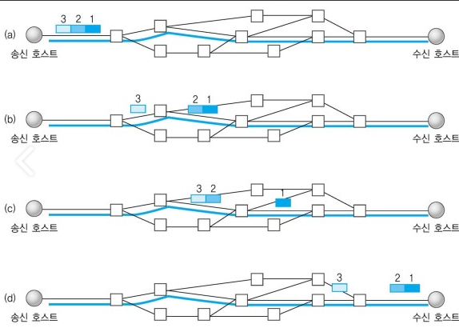

## 1. TCP와 UDP
----------

| 프로토콜 종류  | **TCP** | **UDP** |
|---|:---:|---:|
| `연결방식` | 연결형 서비스 | 비연결형 서비스 |
| `패킷 교환 방식` | 가상 회선 방식 | 데이터그램 방식 |
| `수신 여부 확인` | 전송 순서 보장 | 전송 순서가 바뀔 수 있음 |
| `통신 방식` | 1:1 통신 | 1:1 OR 1:N OR N:N 통신 |
| `신뢰성` | 높다 | 낮다 |
| `속도` | 느리다 | 빠르다 |

* 가상 회선 방식과 데이터 그램 방식
    * 가상 회선 방식 : 데이터를 전송하기 전에 논리적 연결을 설정한다. 각 패킷에는 가상회선 식별 번호가 포함되고, 데이터그램 방식과 달리 한 번만 라우터가 경로를 설정한다.
    
    
    * 데이터그램 방식 : 데이터를 전송하기 전에 논리적 연결을 설정하지 않으며, 패킷이 독립적으로 전송된다. 패킷을 수신한 라우터는 최적의 경로를 선택하여 패킷을 전송하는데 하나의 메시지에서 분할된 여러 패킷은 서로 다른 경로로 전송될 수 있다. 즉, 송신 측에서 전송한 순서와 수신 측에서 도착한 순서가 다를 수 있다.
    

-----

### 2. TCP
* TCP 헤더

* TCP의 특징
        
        1. 양종단 호스트 내 프로세스 상호 간에 신뢰적인 연결지향성 서비스를 제공한다.
        2. 패킷 손실, 패킷 중복, 패킷 순서바뀜 등이 없도록 보장한다.
        3. 하위계층인 신뢰성 없는 IP 계층의 서비스에 대해 다병면으로 신뢰성을 제공한다.
        4. 연결지향적 통신 규약으로, 연결 설정을 해야 데이터 송수신이 가능하다.
        5. 신뢰성 있게 데이터 송수신이 가능하다 => Checksum, sequence number, ACK/NAK, 타이머

* TCP의 Connection contorl
    * 이 연결 설정을 통해 신뢰성을 높인다.
    1. 연결 설정 : **3 way handshake**
    

            1. client가 Server에게 연결 요청 메시지 SYN를 전송한다.
            2. Server가 이를 수락한다는 의미로 SYN+ACK를 전송한다.
            3. Client가 다시 ACK를 보내고 연결을 설정한다.

            * 만약 Client가 SYN+ACK를 못받았다면? 
                Client에서는 TIMEOUT이 발생해 다시 SYN를 서버에게 전송한다.

    2. 연결 해제 : **4 way handshake**
    

        1. client가 Server에게 연결 종료하겠다는 FIN 플래그를 전송한다.
        2. Server는 알겠다는 의미로 ACK를 보내고, 자신의 통신이 끝날때까지 기다린다. 
        3. Server가 통신이 끝나면, 연결이 종료됬다고 FIN 플래그를 전송한다.
        4. Client는 확인했다는 ACK를 보내고 종료한다.

        * 마지막 TIME WAIT : 이때 4번이 끝나고 나서 Client는 도착하지 않은 패킷이 있을까봐 넉넉하게 기다렸다가 연결을 완전히 종료한다.

        * Server에서는 왜 FIN 플래그를 보낼까요?
            서버에서 아직 전송할 데이터가 남아 있기 때문에 이를 다 보내고 난 다음 다 보냈다는 의미로 FIN 플래그를 전송하게 됩니다.

        * 연결 해제시 Client는 왜 ACK를 보낼까요?
            만약 Client가 Server로부터 FIN 플래그를 받지 못했을 경우에 Client는 이 상황을 모르고 계속 기다리면서 재전송하게 됩니다. 하지만, Server는 이미 종료되고 닫혔기 때문에 이에 대해 응답하지 않아 Client 측에서 불필요한 자원을 소요하게 됩니다 => 그래서 Server측에서는 Client의 ACK를 받고 연결을 해제합니다.

* TCP의 흐름 제어
    * 송신측과 수신측의 데이터 처리 속도 차이를 해결하기 위한 기법이다.
    * 수신측이 송신측보다 빠르면 문제되지 않지만, 송신측의 속도가 수신측보다 빠르다면 문제가 발생합니다 
     => 수신측에서 제한된 저장용량을 초과(오버플로우)가 발생하면 이후에 도착하는 데이터는 버리게 되어 손실하는 문제점이 발생합니다 
     => 손실이 발생하면 불필요한 응답(ACK/NAK)와 재전송이 수행됩니다

    * 해결 방법 : Stop and Wait / Sliding Window
    1. **Stop and Wait**
    
    * 매번 전송한 패킷에 대해 확인 응답을 받아야만 그 다음 패킷을 전송하는 방법
    * 하지만 하나를 주고 응답을 받기 때문에 속도가 느리고 비효율적

    2. **Sliding Window** => TCP에서 사용하는 방법
    
    * 수신 측에서 설정한 윈도우 크기만큼 송신 측에서 확인 응답 없이 세그먼트를 전송할 수 있게 하여 데이터 흐름을 동적으로 조절하는 제어 기법
    
        1. 그림에서 보면 송신측인 0~6까지의 프레임 부분이 전송이 가능하다.
        2. 그래서 먼저 0~6까지 윈도우에 포함시킨다. 
        3. 그림에서는 데이터0과 1을 전송합니다. 그러면 윈도우는 0과 1을 삭제해 2~6까지만 담고 있다.
        4. 이때 수신측에서 데이터를 정상적으로 수신했음을 알리는 ACK와 번호를 보내게되면, 송신측에서는 ACK의 프레임 수만큼 오른 쪽으로 윈도우의 경계를 확장시킨다.

        * 모든 TCP/IP를 사용하는 호스트들은 송신과 수신을 위해 2개의 윈도우를 지니고 있다.
        * 호스트들은 실제 데이터를 보내기 전에 '3 way handshaking'을 통해 수신 호스트의 receive window size에 자신의 send window size를 맞춘다.

* 혼잡 제어
    * 송신 측의 데이터 전달과 네트워크의 데이터 처리 속도 차이를 해결하기 위한 기법이다.
    * (예시 상황) 송신 측의 데이터는 지역망이나 인터넷으로 연결된 대형 네트워크를 통해 데이터를 전달하는데, 만약 하나의 라우터에 데이터가 몰릴 경우 (혼잡할 경우) 자신에게 온 데이터를 모두 처리할 수 없게 된다. 
     =>이렇게 되면 송신측은 다시 라우터로 재전송하게 되어 혼잡한 데이터가 더욱 가중되어 오버플로우나 데이터 손실이 발생한다.
     이러한 위험을 줄이기 위해, 송신측에서 보내는 데이터의 전송 속도를 강제로 줄이기 되는데 이를 혼잡 제어라고 한다.

    
            
        * Slow Start mode 
            - 초기 cwnd(congestion window-sender window) = 1
            - 패킷이 문제없이 도착하면 ACK 패킷마다 window 크기를 1씩 늘린다 -> 즉, cwnd = cwnd*2
            - 3 duplicated ACKS로 loss가 발견되면 cwnd를 현재 window 크기의 반으로 줄인다
            - 만약 Timeout의 loss가 발견되면 cwnd = 1로 초기화 한다.
        
        * CA(congestion Avoidance) mode
            - ssthresh : loss가 발생하기 직전의 ssthresh = cwnd/2
            - cwnd가 ssthresh와 같아지면 CA모드로 바뀌는데, 1씩 Linear하게 증가한다.
            => 윈도우의 크기가 임계 값에 도달한 이후에 데이터의 손실이 발생할 확률이 높아지기 때문에 이를 조심하는 단계라고 생각하면 된다.

    * 빠른 재전송 => 현재 TCP가 사용하는 혼잡 제어

            * 소스 호스트는 전송된 패킷에 대하여 연속된3 개의 중복(duplicated) 패킷을 수신하는 경우에, 그 패킷이 네트워크 혼잡에의해 손실된 것으로 간주하고 빠르게 재전송
            * 중복된 Ack를 통하여 빠르게 재전송함으로써 전송 효율을 높임
    * 빠른 회복

            전송된 패킷의 손실이 발생할 경우, 혼잡 윈도우의 크기를 손실 발생 당시의 윈도우 크기의 반으로 줄인 후에 혼잡회피 과정을 통하여 패킷을 전송함으로, 보다 빠른 혼잡윈도우의 크기를 크게 함
    

### 3. UDP
* UDP 헤더

* UDP의 특징

        1. 비연결성, 비 신뢰성의 특징을 가진다. 
        2. UDP헤더의 Checksum 필드를 통해 최소한의 오류만 검출한다 => 헤더가 8바이트로 헤더 처리에 많은 시간을 쏟지 않는다.
        3. TCP에 비해 속도가 빠르다 => 데이터의 유실이 일어나도 큰 상관이 없는 스트리밍이나 화면전송에 사용된다.
        4. 흐름제어, 혼잡 제어와 같은 기능을 처리하지 않는다.
