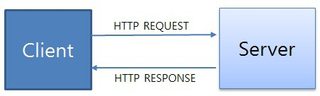
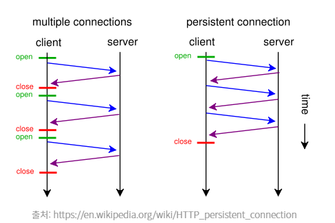
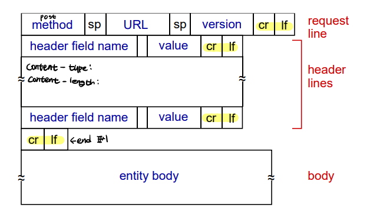
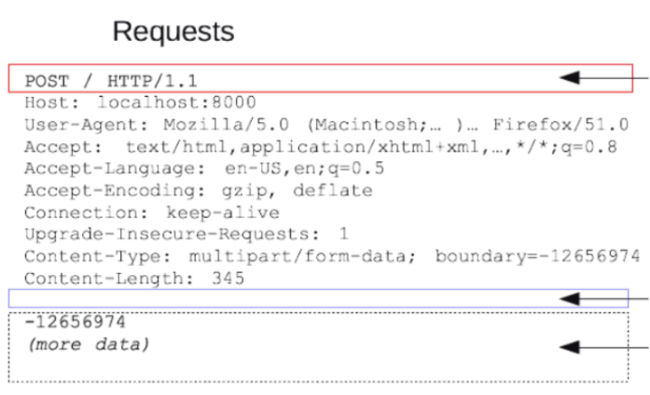
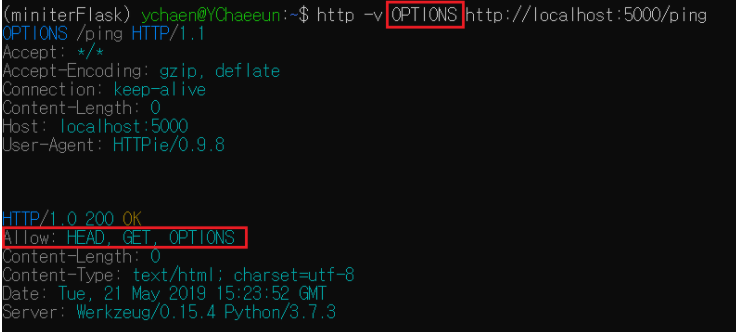
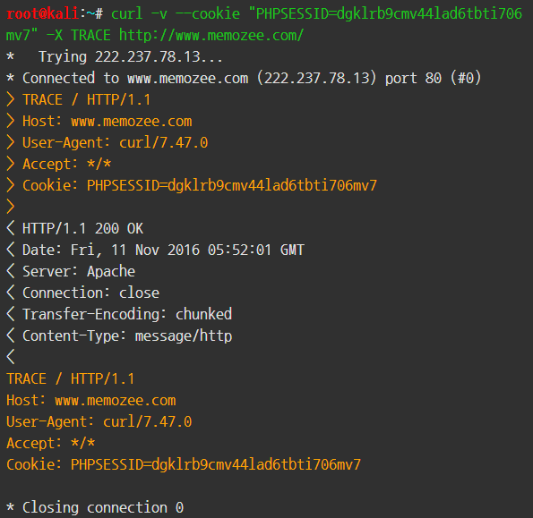

# HTTP 1
-----------------------

## **HTTP**
* **HTTP란?**<br>
<br>

        `Hyper Text Transfer Protocol`의 약자로 하이퍼텍스트 문서를 교환하기 위해 사용된 통산 규약입니다. 

        즉, 웹 서버와 클라이언트 간의 통신을 위한 통신 규약입니다. 

        HTTP는 웹에서만 사용하는 프로토콜로, TCP/IP 기반으로 서버와 클라이언트간 요청과 응답을 전송합니다.

* **Hyper Text란?**

        일반 텍스트와 달리 다른 텍스트에 연결될 수 있는 포인터를 가집니다. 즉, 한 문서에서 다른 문서로 링크시켜 따라갈 수 있게 만들어 줍니다.
        
        HTML로 만든 웹페이지 = Hyper Text

* **HTTP의 특징**

    1. **Connectionless** : HTTP 연결 상태를 유지하지 않는 비연결성 프로토콜입니다 -> 이러한 단점을 개선하기 위해 사용하는 것이 Cookie와 Session입니다.
    2. **Stateless** : HTTP는 연결을 유지하지 않는 프로토콜이기 때문에 요청/응답 방식으로 동작합니다. 즉, 과거의 요청/응답에 대한 내용을 알지 못한다는 뜻입니다. 그렇기 때문에 매 요청/응답마다 필요한 정보를 담아서 요청을 보내야 합니다<BR>
    (EX) 클라이언트가 브라우저를 통해 어떠한 서비스를 URL을 통하거나 다른 것을 통해 **요청**하면, 서버는 해당 요청사항에 맞는 결과를 찾아 클라이언트에게 **응답**하는 형태로 동작합니다.<BR>
    => 요청 = (클라이언트 -> 서버) / 응답 = (서버 -> 클라이언트)

        ✋ 왜 기억하지 않죠?<br>
            서버에서 다수의 클라이언트와의 연결을 계속 유지하려면 이에 따른 많은 리소스가 발생 합니다. 이 리소스를 줄이면 더 많이 클라이언트와 연결할 수 있기 때문에 비연결성 특징을 가집니다

    3. **80번 Port** : TCP와 UDP를 모두 지원한다. 
        <details>
        <summary>HTTP의 TCP 자세히!</summary>

        <br>
        
            * HTTP의 TCP는 Persistent Conntection과 Non-persistent Connection으로 나뉩니다. 

            💡 저번 시간에서 TCP는 데이터를 주고 받기전 연결을 설정한 후 데이터 전송한다고 배웠습니다.

                ✋ HTTP에서 TCP를 어떻게 이용하는가?
                    1. 클라이언트가 TCP 연결을 설정(소켓을 생성한다-이때 포트는 80번)
                    2. 서버는 TCP 연결을 받아들인다.
                    3. HTTP 메시지를 주고 받는다((EX)요청/응답 메시지)
                    4. TCP 연결을 해제한다.

                ✋ Non-persistent Connection이란?
                    서버에 요청을 보내고 응답을 받으면 바로 TCP Connection을 끝내는 방식

                    => 과거에는 웹을 통해 전달해야하는 사이트의 콘텐츠 수가 적었기 때문에 Non-persistent Connection 방식을 사용했습니다. 하지만, 웹 사이트의 콘텐츠 수가 증가함으로써 추가적인 오버헤드가 발생하는 문제점이 생겼습니다.
                
                ✋ Persistent Conntection이란?
                    위의 Non-persistent Connection의 문제점을 보완하기 위해 나온 기술이 Persistent Conntection입니다. 

                    Keep-Alive, Connection re-use라는 표현으로 사용되기도 합니다.

                    HTTP 1.0기반, 클라이언트가 서버에게 Persistent Conntection을 요청할 때 요청 메시지 내 헤더에 
                    'Conncection : keep-alive'를 추가하여 보냅니다!

                    이렇게 보내면, 서버는 TCP연결을 HTTP 응답 이후에도 끊지 않고 계속 사용합니다. 

                    👏 [참고]
                        HTTP 1.1 버전에서는 Connection 헤더를 사용하지 않더라도, 이미 기본적으로 Persistent Conntection을 사용하도록 세팅되어 있습니다.

                        => 그러므로 Persistent Conntection이 필요 없을 경우에만 'Conncection : close'를 추가하여 사용합니다.

                        => 필요 없을 경우? HTTP응답이 완료된 후 TCP연결을 끊어야 할 경우
        </details> 


### **요청/응답 메세지 구조**
#### **요청/응답 공통 헤더**
| 공통 헤더 목록 | 설명 |
|---|:---:|
|Date|HTTP 메시지가 만들어진 시각|
|**Cache-Control**|[다음주]진행 예정|
|Connection|클라이언트와 서버의 연결 방식 설정 HTTP/1.1은 kepp-alive 로 연결 유지하는게 디폴트 값|
|Content-Length|요청과 응답 메시지의 Body 크기를 바이트 단위로 표시한다|
|Content-Type|컨텐츠의 타입과 문자열 인코딩을 명시할 수 있다. Content-Type: text/html; charset=utf-8|
|Content-Language|본문을 이해하는데 가장 적절한 언어|
|Content-Encoding|본문의 리소스 압축 방식|
|Tranfer-Encoding|body 내용 자체 압축 방식 지정|
|Allow|사용이 가능한 HTTP 메소드 방식|

#### **요청 메세지 구조**

```HTTP 요청(Request)을 통해 클라이언트가 HTTP서버에게 특정 자원에 대한 접근이나 동작을 요구하게된다.```
```HTTP의 요청 메시지는 Request line, Header, Body로 구성되어 있다```

1. Request line
<br>
<br>

| request line | include |
|---|:---:|
|method|클라이언트가 서버에게 요청하는 방식에 대한 동작 -> 클라이언트가 서버에게 요청하는 방법 명시<BR> (EX) GET, POST, HEAD, PUT, DELETE, TRACE|
|URL|Request target으로, 해당 request가 전송되는 목표 URL|
|Version|HTTP 버전 -> 주로 HTTP 1.1 버전이 주로 널리 사용됨|

<details>
<summary> URL, URI </summary>
        
    👏 URI란?
    URI(Uniform Resource Identifier)은 식별자로, 인터넷에 있는 자료의 ID로 생각하면 된다. URI의 존재는 인터넷에서 요구되는 기본조건으로서 인터넷 프로토콜에 항상 붙어 다닌다. URI의 하위개념으로 URL, URN 이 있다.

    👏 URL이란?
    URL(Uniform Resource Locator)란 네트워크 상에서 자원이 어디 있는지를 알려주기 위한 규약이다. 즉, 컴퓨터 네트워크와 검색 메커니즘에서의 위치를 지정하는, 웹 리소스에 대한 참조이다.

    (EX)
    [예제]
        1. https://naver.com/이라는 주소 -> URL이면서 URI
        2. https://naver.com/skin -> skin이라는 인터넷 상의 자원 위치 -> URL이면서 URI이다
        3. https://localhost/best/of/good.html -> localhost 호스트 주소 하위/best/of라는 디렉터리 아래 good.html이라는 자원의 위치를 가리킴 -> URL+ URI이다

        4. https://tests.naver.com/132 -> URL은 https://tests.naver.com, URI는 https://tests.naver.com/132(132가 식별자로써 내가 원하는 정보까지 도달하기 위해서는 이 식별자가 필요하다)

        5. https://tests.naver.com/index.html -> URL+ URI이다.
            * https://tests.naver.com/index은?
                
</details>

<details>
<summary>Method</summary>

| method | 전송 형태 | 설명 |
|---|---|---|
|**GET**|GET URI?<u>query_string</u>|서버는 클라이언트으로부터 요청 받는 URI의 정보를 검색하여 응답한다. <BR>URI에 전송하는 데이터가 노출된다(단점)|
|**POST**|POST URI ... <BR><u>Content-Length: 11</u><br><u>Content-Type: text/xml</u><BR><u>Body</u>|서버는 클라이언트가 요청한 자료(Content-Type/Content-Length)정보를 기반으로 자원을 생성/수정한다<BR>URI에 자원을 넣는 것이 아니기 때문에 GET보다 많은 데이터를 다룰 수 있다|
|**DELETE**|DELETE URI|서버는 클라이언트으로부터 요청된 자원을 삭제한다(보안 문제로 대부분 서버에서는 이 함수를 비활성화 한다)|
|PUT|PUT URI ... <BR><u>Content-Length: 11</u><br><u>Content-Type: text/xml</u><BR><u>Body</u>|POST와 비슷하지만 기존에 있는 자원을 수정할때 사용한다. 내용 갱신을 위주로 하는 함수로 URI을 보내지 않아도 된다.|
|HEAD|HEAD URI|GET방식과 동일하지만, 응답에 Body가 없고 응답 코드+HEAD만 응답한다 (웹 서버 정보 확인, 버전 확인, 수정 일자 확인 등 용도)|
|PATCH]|PATCH URI ... <BR><u>Content-Length: 11</u><br><u>Content-Type: text/xml</u><BR><u>Body</u>|PUT과 유사하게 요청된 자원을 수정할 때 사용한다. PUT의 경우 자원 전체를 갱신하지만, PATCH는 해당 자웡늬 일부만 교체한다.|
|TRACE|TRACE URI|원격지 서버에 루프백 메시지를 호출하기 위해 테스트용으로 사용한다. 즉, TRACE 메소드는 웹 브라우저가 보내는 HTTP 통신을 반사하는 역할을 한다.|
|OPTIONS|OPTIONS URI|웹 서버에서 지원되는 메소드의 종류를 확인할 경우 사용한다|
|CONNECT|CONNECT URI|Client가 Proxy를 통해서 Server와 SSL통신을 하고자 할 때 사용된다.|

<details>
<summary> POST와 PUT의 차이 </summary>

    👏 두 함수의 차이는?
        1. POST는 클라이언트가 요청하는 메소드다. 리소스의 위치를 지정하지 않고 리소스를 생성하는 연산이다.

        PUT도 클라이언트가 요청하는 메소드다. 단, PUT함수는 리소스의 위치를 이미 알고 있는 상태이다. 그 위치에 리소스를 생성하거나 수정된다.

        (EX)
        POST /members HTTP/1.1
        { name: "홍길동", age: 26, favorite: "사과" }

        PUT /members/1 HTTP/1.1
        { name: "홍길동", age: 26, favorite: "사과" }

        2. 만약 위의 Json을 여러번 POST함수로 요청하게 된다면 계속해서 리소스가 생성된다. 즉, 같은 리소스들이 members/1, members/2, members/3으로 생성되는 것이다. 이와 달리 여러 요청에 PUT함수를 사용하면 생성되는 것이 아니라 이전 members/1에 있는 리소스와 현재 전송된 리소스가 교체하는 것이다.

            👌 위의 같은 경우에서 POST의 행위를 idempotent(멱등성-1번을 실행하든, 100번을 실행하든 결과가 같다)를 만족하지 못한다. PUT은 idempotent를 만족한다.
</details>

<details>
<summary> PUT과 PATCH의 차이 </summary>
        
    👏 두 함수의 차이는?
        PUT : 자원의 전체 교체, 자원교체 시 모든 필드 필요

        PATCH : 자원의 부분 교체, 자원교체시 일부 필드 필요

        => 예제를 통해 알아보자 <=
        DB에 두 개의 속성(이름, 나이)이 있는데
        딱 하나의 튜플만 존재한다
        { name: "홍길동", age : 20 }

        [요청]
        PUT /members/1 HTTP/1.1
        { name: "홍길동" }
        [응답]
        { name: "홍길동", age : null }
            -> 일부만 전달되어, 나머지 필드는 모두 NULL로 초기화된다.

        [요청]
        PATCH /members/1 HTTP/1.1
        { name: "홍길동" }
        [응답]
        { name: "홍길동", age : 20 }
</details>

<details>
<summary> OPTIONS 결과 예제 </summary>

```만약 GET 메소드 요청만 받게 되어있는 엔드포인트에 POST 요청을 보낼 경우, 405 Method Not Allowed 코드가 전송된다```<br>

</details>

<details>
<summary> TRACE의 문제점 </summary>


<BR>

```TRACE의 큰 단점은 HTTP 통신 상에는 클라이언트가 보내는 쿠키가 포함되므로 이 통신을 가로채면 HttpOnly로 선언된 쿠키값도 탈취를 할 수 있습니다. 이것을 자바스크립트로 읽어서 공격자에게 보내면 결국 세션탈취에 성공하게 됩니다 => 이를 XST(Cross site tracing) 공격이라 한다```

* 그래서 요즘은 잘 사용하지 않는다!
</details>

</details>

<br><br>
2. Header (lines)

    해당 요청에 대한 추가 정보(메타 데이터)를 담고 있는 부분이다.

| header | include |
|---|:---:|
|Host|서버의 도메인 네임 - 포트 포함|
|User-Agent|클라이언트가 어떤 OS 또는 브라우저를 이용해 요청을 보냈는가|
|Accept|클라이언트가 서버에게 이런 타입(MIME)의 데이터를 보냈으면 좋겠다고 명시할때 사용|
|Authorization|클라이언트가 인증 토큰(JWT 등)을 서버로 보낼때 사용|
|Origin| POST 요청을 보낼 때, 요청이 어느 주소에서 시작되었는지 나타낸다. 여기서 요청을 보낸 주소와 받는 주소가 다르면 CORS 문제가 발생|
|Referer|바로 직전에 머물렀던 주소 -> 특정 페이지에서 링크를 클릭하여 요청을 하였을 경우에 나타나는 필드로써 링크를 제공한 페이지를 나타냄|
|Cookie|웹서버가 클라이언트에 쿠키를 저장해 놓았다면 해당 쿠키의 정보를 이름-값 쌍으로 웹서버에 전송|

<details>
<summary>조금 자세히</summary>
        
        👏 Accept - 타입(MINE)
            1. Accept: text/html - HTML 형식으로 응답을 처리(전송)
            2. Accept: image/png, image/gif - ","를 사용해 여러 타입을 동시에 적어 주거나 "text/*"(와일드 카드)만 작성해 "텍스트 이기만 하면 된다"라고 적어 응답을 처리할 수 있다.
            3. Accept-Charset - utf-8
            4. Accept-Language - ko, en-US
            5. Accept-Encoding - gzip

</details>
<br><br>
3. Body

        해당 요청의 실제 내용들이 담겨 있다. 즉, 가져올 실제 데이터 콘텐츠/메시지 본문이다. 요청한 리소스에 따라 HTML, 이미지, CSS 스타일 시트, JavaScript파일이 포함될 수 있다.