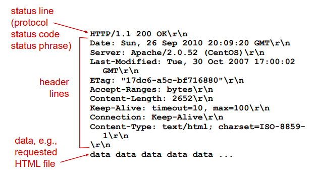
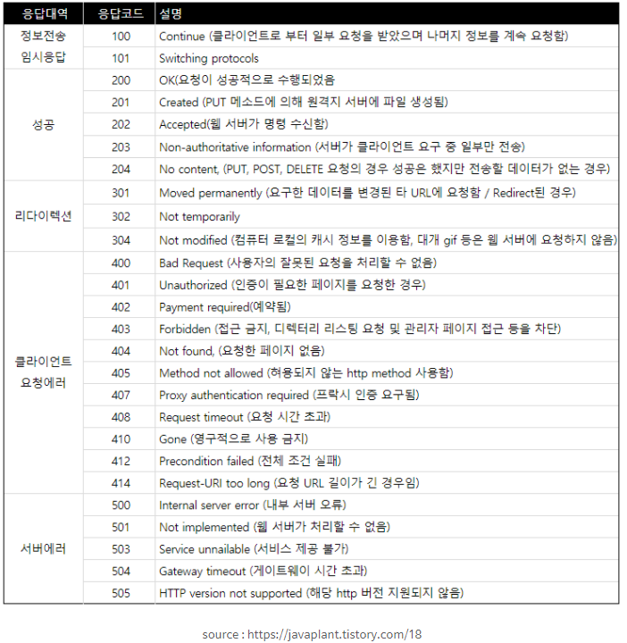
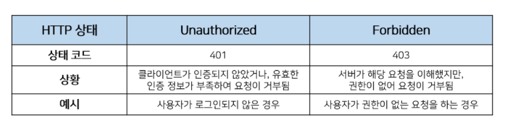
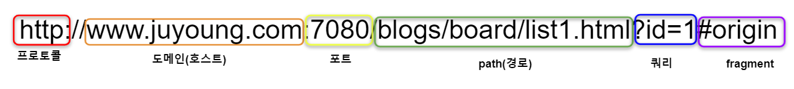
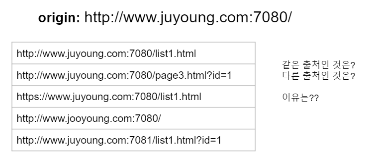
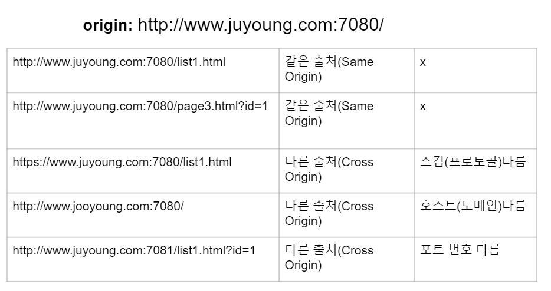
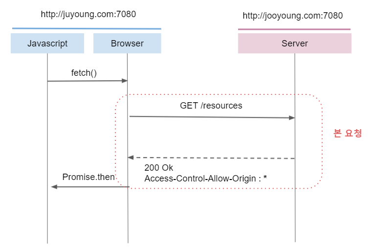
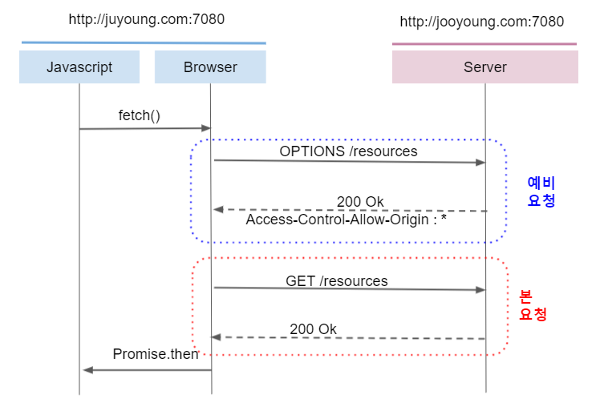
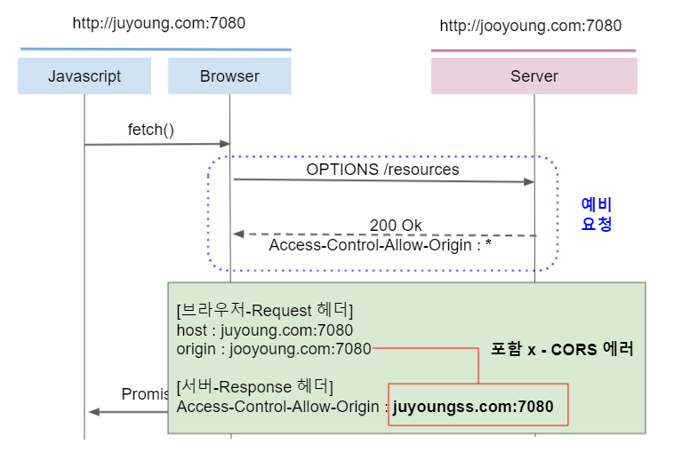

## [CH4] HTTP 2

```🙏  오늘 배울 내용 ```

    1. 응답 메시지 구조
    2. Origin - CORS에러

------------------------------------------------
## **1. 응답 메시지 구조**
<br>

```HTTP 응답(Response)을 통해 서버는 클라이언트의 요청에 대한 응답을 전송한다.```
```HTTP의 응답 메시지는 Status line, Header, Body로 구성되어 있다```

1. Status line<br>
    => HTTP version / Status Code / Status Text

    | Status line | 설명 |
    |---|:---:|
    |Version|HTTP 버전 -> 주로 HTTP 1.1 버전이 주로 널리 사용됨|
    |Status code|응답 상태를 나타내는 코드|
    |Status Text|응답 상태를 간략하게 글로 설명해줌|

    <details>
    <summary> Status code 참고 </summary>

    
    * 100번 대 : 정보를 확인할 때 사용한다,
    * 200번 대 : 통신이 성공했을 때 응답받는 코드이다. 보통, 200 응답을 받으면 API가 정상 동작한 경우이다.
    * 300번 대 : Redirect 시 응답받는 코드이다. Request URI의 내용, 위치에 따라 코드가 달라진다.
    * 400번 대 : 클라이언트에서 발생하는 오류가 많다. 대표적으로 400은 Bad request, 403은 Forbidden으로 권한 밖의 접근 시도한 경우, 404는 URI가 존재하지 않을때를 의미한다.
    * 500번 대 : 서버에서 발생하는 오류이다. 대표적으로 500은 서버 내부 오류, 502는 게이트웨이 오류, 504은 서비스 이용이 불가능한 상태(점검 또는 서버가 닫혔을 경우)이다.

    <details>
    <summary> 401과 403차이 </summary>
    
    
    * 401 대표적인 경우 : 로그인이 되어 있지 않은 상태에서 무언가 요청을 하는 경우이다. 예를 들어 어떤 쇼핑몰 사이트에 로그인을 하지 않았는데 나의 결제 내역과 같은 정보를 달라고 하면 401(Unauthorized)를 반환받게 될 것이다.
    * 403 대표적인 경우 : 로그인하여 인증되었지만 접근 권한이 없는 무언가를 요청하는 경우이다. 예를 들어 어떤 쇼핑몰에 접속하여 로그인까지 하였지만, 다른 사용자의 결제 내역을 달라고 하면 403(Forbidden)을 반환받게 될 것이다.
    </details>
    </details>

2. Header<br>
    | HEADER 항목 | 설명 |
    |---|---|
    |Server| 웹 서버 소프트웨어 정보|
    |Set-Cookie|(쿠키/캐시 관련) 서버측에서 클라이언트에게 세션 쿠기 정보를 설정한다|
    |Expires|(쿠키/캐시 관련)리소스가 지정된 일시까지 캐시로써 유효함을 나타낸다. 즉 응답 컨텐츠가 언제 만료되는지를 나타낸다<br> Cache-Control과 별개로 응답에 Expires 헤더를 제공할 수 있다. 단, Cache-control의 max-age가 있는 경우 이 헤더는 무시된다|
    |Age|(쿠키/캐시 관련) 캐시 응답으로, max-age 시간 내에서 얼마나 흘렀는지를 초 단위로 알려준다|
    |ETag|(쿠키/캐시 관련) HTTP 컨텐츠가 바뀌었는지를 검사할 수 있는 태그이다|
    |Allow|서버측에서 지원가능한 HTTP 메소드의 리스트를 나타낸다. <BR>때로는 HTTP 요청 메시지의 HTTP 메소드 OPTIONS에 대한 응답용 항목으로 사용한다.|
    |Access-Control-Allow-Origin|요청을 보내는 클라이언트 주소가 요청을 받는 백엔드 주소가 다르면 CORS 에러가 발생한다.<BR> 이때 서버에서 이 헤더에 프론트 주소를 적어주어야 에러가 나지 않는다.<BR> 유사한 헤더로 ```Access-Control-Request-Method, Access-Control-Request-Headers, Access-Control-Allow-Methods, Access-Control-Allow-Headers```등이 있다.|
    |Content-Disposition|Response 메시지의 Body를 브라우저가 어떻게 표시해야 할지 알려준다. <br> - inline : 웹 페이지 화면에 표시(웹에 전달되는 데이터)<br> - attachment : filename과 함께 주게 되면 Body에 오는 값을 다운받으라는 뜻이다|
    |Location|리다이렉트 헤더라고도 하며, 300번대 응답 or 201 Created 응답일 때 어느 페이지로 이동할지 알려주는 헤더이다|

    <br>
    

------------------------------------------------------------------
## **2. CORS(Cross Origin Resource Sharing)**
- 요청 헤더의 <u>Origin</u>
    * 클라이언트가 서버로 POST/GET/HEAD 요청 보낼 때, 요청이 어느 주소에서 시작되었는지 나타낸다.
    * 여기서 요청을 보낸 주소와 받는 주소가 다르면 **CORS**에러가 발생한다.
    * 응답 헤더의 Access-Control-Allow-Origin과 관련 있다.

- **Origin**이란?
    * 특정 페이지에 접근할때 사용되는 URL의 <span style="color:red">**프로토콜, 도메인, 포트**</span>를 의미한다.
    * 그러므로 <span style="color:red">**프로토콜, 도메인, 포트**</span> 중 하나라도 다르면 다른 출처(<u>Cross-Origin</u>)라 한다.
    <br>
    
    
    <br>
    <details>
    <summary> URL 구조 </summary>

    | 컴포넌트 | 설명 |
    |:---:|---|
    |스킴-프로토콜| 프로토콜 정보 기재 |
    |호스트|리소스를 제공하는 서버의 도메인 OR IP 주소 기재|
    |포트|서버가 해당 스킴(프로토콜)으로 접근 가능하도록 열어 놓은 포트 번호|
    |경로|서버 내 리소스의 위치 정보|
    |쿼리-질의|애플리케이션에 파라미터를 전달하는 용도<br> 다른 컴포넌트와는 "?"로 구분하고, 내부적으로 key/value구조로 "&" 특수문자로 나뉜다|
    |fragment|리소스의 일부분을 가리키는 이름으로, 클라이언트에서만 사용하는 용도<br> HTML과 같은 리소스는 이상적으로 내부의 특정 절을 가라킬 수 있어야 한다.| 
    </details>
<BR>

- **CORS**란?
    * 🔔 : <span style="color:green">웹 브라우저에서 외부 도메인 서버와 통신하기 위한 방식을 표준화한 스펙이다.</span>
    * 길게 정리 : 특정 헤더를 통해 브라우저에게 한 출처(Origin)에서 실행되고 있는 웹 애플리케이션이 다른 출처(Cross-Origin)에 원하는 리소스에 접근할 수 있도록 하는 메커니즘이다. 또한, 정책에 위반한 다른 origin을 리소스에 함부로 접근하지 못하게 하기 위해 사용한다.

        <details>
        <summary> 동일 출처 vs 다른 출처 </summary>

        <br>
            <details>
            <summary> 정답 </summary>
            <br>

            * Internet Explorer : 모든 브라우저 중 유일하게 출처 비교 시 포트 번호를 무시한다 -> 보안 안좋음!!
        </details> 
        </details>
        <details>
        <summary> [SOP] 동일 출처 정책 (Same-Origin Policy) </summary>

        * <span style="color:blue">**동일 출처 정책**</span> = 자바스크립트(XMLHttpRequest)로 다른 웹페이지에 접근하려면, 무조건 같은 출처(Same Origin)안에서만 접근이 가능하다!
        * 즉, 쉽게 말하면 웹 페이지의 스크립트는 그 페이지와 같은 **서버**에 있는 주소로만 ajax 요청을 할 수 있다.
        * 이 정책이 초기에는 웹 페이지 보안에는 좋았으나, 현재와 같이 여러 도메인에 걸쳐 구성되는 대규모 웹 프로젝트가 늘어가고 REST API 등을 이용한 외부 호출이 많아지는 상황에서는 좋지 않는 기술이다.
        * 그래서! 만들어진 추가 정책이 CORS(Cross-Origin Resource Sharing)이다 👉 이 정책의 특징은 <u>서버에서 **외부 요청**을 허용할 경우 ajax 요청이 가능해지는 방식이다.</u>
        </details>
    * 🔔 그럼 이런 출처는 누가 비교할까? 바로 클라이언트-브라우저가 구별한다. 

            만약 사용자가 서버에게 CORS 정책을 위반하는 리소스를 요청 하더라도 서버는 SOP와 같은 로직을 가지고 있지 않는 한 정상적으로 응답할 것이다. 응답을 받은 클라이언트(브라우저)가 이 응답을 분석(헤더 : Access-Control-Allow-Origin)해서 CORS 정책에 위반된다고 판단되면 그 응답을 버리게 된다. 즉, 이 에러가 발생하면 서버쪽 로그를 보는 것은 무용지물이 된다!
    * CORS 동작원리
        - CORS의 동작 방식은 Simple request와 Preflight request 두가지 방법이 있습니다.
        <details>
        <summary> Simple request(단순 요청 방법) </summary>

        <br>
        * CORS는 주로 Preflight 방식으로 규제하지만, 몇몇 요청들은 Simple request 방식을 사용한다.
        * Simple request 방법은 서버에게 <span style="color:orange">**바로**</span> 요청을 보내는 방법이다. 즉, 예비 요청(preflight request)을 보내지 않고 바로 서버에게 본 요청을 보내는 것이다
            * 이 방식은 브라우저는 서버에 API를 요청(요청 헤더에 Origin이라는 필드에 요청을 보내는 출처 담아 보낸다)하고, 서버는 ```Access-Control-Allow-Origin``` 헤더를 포함한 응답을 브라우저에게 보낸다. 브라우저는 ```Access-Control-Allow-Origin``` 헤더를 확인해서 CORS 동작을 수행할지 판단한다
            * 판단은? 브라우저는 자신이 보냈던 Request의 ```Origin```과 서버가 보낸준 응답의 ```Access-Control-Allow-Origin```를 비교한다.
            * Preflight와 Simple request의 큰 차이 :  <span style="color:green">예비 요청의 존재 유무</span>
        * 서버로 번달하는 요청(Request)헤더가 아래 **3가지 조건**을 충족해야 Simple Request방식으로 동작한다.
        
                ☝ Request method : GET, HEAD, POST 중 하나<br>
                ✌ 사용 가능한 헤더 목록 : Accept, Accept-Language, Content-Language, Content-Type, DPR, Downlink, Save-Data, Viewport-Width, Width (이 외에 헤더 사용 금지!!)
                🖐 Content-Type : application/x-www-form-urlencoded, multipart/form-data, text/plain 중 하나
        * 이 방식이 까다로운 조건을 포함하고 있다.
            * 사용 가능한 헤더 목록에 사용자 인증에 사용되는 Authorization 헤더도 포함되지 않는다.
            * REST API는 Content-Type으로 주로 application/json을 사용하기 때문에 지켜지기 까다로운 조건이다.
        </details>
        <details>
        <summary> Preflight request </summary>

        <br>
        * Simple Request 조건에 해당되지 않는다면 브라우저는 Preflight request 방식으로 요청한다.
        * Preflight request 방식은 서버에 <span style="color:orange">**예비 요청**</span>을 보내서 <u>안전한지</u> 판단한 후 요청을 보내는 방법입니다. 
            * Preflight request(예비 요청) : 실제 리소스를 요청하기 전에 ```OPIONS```라는 함수를 통해 실제 요청을 전송할지 판단합니다. 즉, 클라이언트측은 ```OPTIONS``` 함수로 서버에 예비 요청을 보내고, 서버는 이 예비 요청에 대한 응답으로 ```Access-Control-Allow-Origin``` 헤더를 포함한 응답을 브라우저에 보냅니다. 
            * 이후 브라우저는 자신이 보낸 Preflight request(예비 요청)과 서버가 보낸 응답 헤더에서 ```Access-Control-Allow-Origin```를 비교한 후, 만약 이 요청을 보내는 것이 안전하다고 판단되면 해당 서버로 다시 **본 요청**을 보낸다.
        </details>
    * CORS 관련 헤더(응답/요청)
        * Request 헤더
            <details>
            <summary> CORS 관련 HTTP Request Headers </summary>

            * 클라이언트가 서버에 CORS 요청을 보낼 때 사용하는 헤더로, 브라우저가 자동으로 지정하기 때문에 프로그래머가 직접 지정해 줄 필요 없다.

            * Origin : 다른 출처(Cross-site) 요청을 보내는 요청 도메인의 URI를 나타낸다(요청을 보내는 페이지의 출처(도메인-포트까지 포함))
                ```http
                    Origin: https://juyoung.com:7080
                ```

            * Access-Control-Request-Method : 본 요청이 어떤 HTTP 함수를 사용하는지 서버에게 알려주기 위해 사용된다.
                ```http
                    Access-Control-Request-Method: GET
                ```
            
            * Access-Control-Request-Headers : 브라우저가 본 요청에서 어떤 HTTP 헤더(헤더 이름)를 사용할지 서버에게  알려준다.
                ```http
                    Access-Control-Request-Headers: content-type
                ```
            </details>
        * Response 헤더

        * Access-Control-Allow-Origin : 헤더에 작성된 출처만 브라우저가 리소스를 접근할 수 있다고 말해준 것이다. 
            ```http
                Access-Control-Allow-Origin : * (출처에 상관없이 서버의 리소스 접근 권한 생김)
                Access-Control-Allow-Origin : http://juyoung.com:7080 (지정된 출처는 서버의 리소스 접근 권한 생김)
            ```
            <br>
            * 만약 브라우저가 요청한 Origin = https://jooyoung.com:7080 이였는데, Access-Control-Allow-Origin = https://juyoungss.com:7080 이면 서버가 허용해준 출처가 내가 요청한 출처가 다르기 때문에 CORS 에러가 발생한다(위반 했으므로)
            <details>
            <summary> CORS 에러 </summary>

            (ex) js 코드 / HTTP 요청 메시지 / HTTP 응답 메시지
            ```js
                const headers = new Headers({
                    'Content-Type': 'text/xml',
                });
                fetch('https://jooyoung.com/page:7080', { headers });
            ```

            ```http
                OPTIONS https://jooyoung.com/page:7080

                Accept: */*
                Accept-Encoding: gzip, deflate, br
                Accept-Language: en-US,en;q=0.9,ko;q=0.8,ja;q=0.7,la;q=0.6
                Access-Control-Request-Headers: content-type
                Access-Control-Request-Method: GET
                Connection: keep-alive
                Host: juyoung.com:7080
                Origin: https://jooyoung.com:7080
                Referer: https://juyoung.com/board/page/:7080
                Sec-Fetch-Dest: empty
                Sec-Fetch-Mode: cors
                Sec-Fetch-Site: cross-site
            ```

            ```http
                OPTIONS https://jooyoung.com:7080 200 OK

                Access-Control-Allow-Origin: https://juyoungss.com:7080  => https://jooyoung.com:7080(이면 CORS 에러 X)
                Content-Encoding: gzip
                Content-Length: 699
                Content-Type: text/xml; charset=utf-8
                Date: Sun, 24 May 2020 11:52:33 GMT
                P3P: CP='ALL DSP COR MON LAW OUR LEG DEL'
                Server: Apache
                Vary: Accept-Encoding
                X-UA-Compatible: IE=Edge
            ```


                🚨 Access to fetch at ‘https://jooyoung.com/page:7080’ from origin ‘https://jooyoung.com:7080’ has been blocked by CORS policy: Response to preflight request doesn’t pass access control check: The ‘Access-Control-Allow-Origin’ header has a value ‘https://juyoungss.com:7080’ that is not equal to the supplied origin. Have the server send the header with a valid value, or, if an opaque response serves your needs, set the request’s mode to ‘no-cors’ to fetch the resource with CORS disabled.
            </details>
        * Access-Control-Allow-Methods : 브라우저에서 보내는 요청 헤더에 포함된 Access-Control-Request-Method 헤더에 대한 응답 결과이다. 리소스 접근을 허용하는 HTTP 메서드를 지정해 주는 헤더입니다.
            ```http
                Access-Control-Allow-Methods : GET, PUT
            ```
        * Access-Control-Allow-Headers :브라우저에서 보내는 요청 헤더에 포함된 Access-Control-Request-Headers 헤더에 대한 응답 결과이다. 

        * 즉 브라우저에서 preflight request 서버에게 보내면, 서버에서는 요청 헤더에서 method, header을 받아 응답 헤더에 세팅하고 Access-control-Allow-Origin을 설정하고 응답 메시지를 브라우저에게 전달한다.
            ```js
                router.options('/cors', (req, res, next) => {
                    res.set('Access-Control-Allow-Origin', '*')
                    res.set('Access-Control-Allow-Methods', req.get('Access-Control-Request-Method'))
                    res.set('Access-Control-Allow-Headers', req.get('Access-Control-Request-Headers'))
                    res.send()
                })
            ```
- **CORS 기타 해결 방법**
    1. JSONP : ```<script>``` 요소가 외부 출처 리소스를 가져올 수 있는 특징을 사용하는 방법이다.
        ```HTML
            <!-- Frontend -->
            <!DOCTYPE html>
            <html>
            <script>
                function jsonpFn (data) {
                console.log(data) // beomy
                }
            </script>
            <script
                type="application/javascript"
                src="http://localhost:3001/cors?callback=jsonpFn"
            >
            </script>
            </html>
        ```

        ```js
            router.get('/cors', (req, res, next) => {
                res.send(`${req.query.callback}('beomy')`)
            })
        ```
    2. 프록시 서버 : Frontend와 Backend 사이에 Proxy 서버를 두는 방법으로 CORS 에러를 해결할 수 있다. 
        * 프록시 서버 : 브라우저와 서버를 통신하는 과정 중간에서 정보교환을 도와주는 중간 서버 ( 브라우저 - 프록시 서버 - 서버 )
        * 프록시 서버는 헤더를 추가하거나 요청을 허용/거부하는 역할을 중간에서 해줘서 Access-Control-Allow-Origin : *의 헤더를 담아 응답해준다!
-------------------------------------------------------------------


