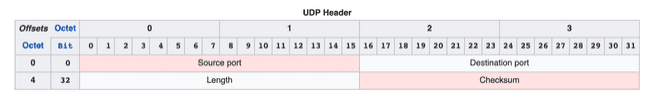

## [CH5] HTTP 3

```🙏  오늘 배울 내용 ```

    1. HTTP 버전 차이
    2. HTTP와 HTTPS
----------------------------
## **1. HTTP 버전 차이**

#### **[1] HTTP 0.9**
- 함수 : 유일하게 GET만 사용 가능
- 헤더 없음! => 오직 HTML 파일만 전송 가능
- 상태 확인(상태 코드) 존재하지 않는다.

#### **[2] HTTP 1.0**
- 모든 요청과 응답에 **헤더** 개념이 추가되었다.
    - 통신 응답 정보에 응답 결과(상태 코드)를 포함하기 시작 (200, 404 등)
    - 헤더의 'Content-Type'으로 HTML 파일 외 다른 문서들(이미지, CSS 등)도 전송이 가능해 졌다.
- 함수 : POST, HEAD가 추가되었다 => [GET, HEAD, POST 3가지 함수 사용]
- [Non-persistent Connection] Request 할때 마다 Connection을 새로 생성한다
<br>

    [📌 단점] : **성능 부하, 서버 부하**

#### **[3] HTTP 1.1**
*  HTTP 1.0 버전보다 클라이언트-서버 간 요청/응답 시간 줄이려고 노력함 =  <span style="color:red">**[persistent Connection / Pipelining]**</span><br>
    <br> 
            
    - [persistent Connection/Conncection 재사용] => 지정한 timeout 동안 커넥션을 닫지 않는 방식 👉 HTTP Request 시 Request 메세지 헤더 ```Connection : keep-alive``` 설정(사실  HTTP 1.1 버전에서는 Connection 헤더를 사용하지 않더라도, 이미 기본적으로 Persistent Conntection을 사용하도록 세팅되어 있다)
        * 장점 : CPU 메모리 자원 절약 및 네트워크 혼잡 줄임
        * 참고 : 지속 연결은 HTTP 1.0에도 지원한다 -> 차이점은? HTTP 1.1에서는 Keep-alive가 default로 들어 있어 따로 설정 X
        
            💡 만약 5개의 오브젝트를 가진 웹페이지가 있으면 ?
            [HTTP 1.0]
            클라이언트-서버 사이에서는 총 5번의 3-way handshake가 이루어진다 => 총 5번 연결을 끊었다가 다시 연결함
            [HTTP 1.1]
            클라이언트-서버 사이에서는 총 1번의 3-way handshake가 이루어진다 => 총 1번 연결을 끊었다가 다시 연결함
    
    <br>

    - [Pipelining] => HTTP 1.0에서는 연결 한 번할때 **요청 한 번 + 응답 한 번**만 가능했다. 이와 달리 HTTP 1.1에서는 파이프라이닝으로 하나의 연결에 **다수의 요청 + 다수의 응답**이 가능해졌다.
        * 참고 : Pipeling이 가능해졌긴한데, HTTP 1.1은 기본적으로 Connection 한 개당 하나의 요청을 처리한다!
        * 장점 : 응답 속도 높여 네트워크 지연 감소 -> 페이지 뷰의 속도 빠르게 가능
        * 단점 : 하지만 이 기법은 멀티플렉싱이 아니라 응답 처리를 미루는 방식으로, 각 응답의 처리는 순차적으로 처리되며 후 순위의 응답은 지연될 수 밖에 없다(HOL 문제)
        <details>
        <summary> 단점 사진 </summary>

        <br>
        </details>
- 함수 : OPTIONS, PUT, DELETE, TRACE 추가 => [GET, HEAD, POST, OPTIONS, PUT, DELETE, TRACE]
<br>

    [📌 단점] 느리다: <br>
        - HOL(Head of Line) Blocking - 파이프라인 문제점 (먼저 받은 요청이 끝나지 않으면 그 뒤에 있는 요청도 처리가 불가하다)<br>
        - RTT 증가 - HTTP/1.1의 경우 일반적으로 Connection 하나에 요청 한 개를 처리한다. 이렇다보니 매번 요청 별로 Connection을 만들게 되고 TCP 상에서 동작하는 HTTP의 특성상 3-way Handshake가 반복적으로 일어나며, 불필요한 RTT증가와 네트워크 지연을 초래하여 성능을 지연시킨다. <BR>
        - 헤더가 크다 - 만약 연속적인 데이터 일때 쪼개져서 보내지는데 이 경우 매 요청시 마다 중복된 헤더 값을 전송하게 되며 각 도메인에 설정된 쿠키 정보도 매 요청시 마다 헤더에 포함되어 전송된다.
<BR>

[HTTP 1.X에 대한 정리 그림]
<br>

<BR>

#### **[4] HTTP 2.0**
* HTTP 1.1의 속도와 성능을 보완했다.
* <span style="color:blue">**바이너리 프레임과 멀티 플렉싱**</span>
    * HTTP2의 핵심 = <U>바이너리 프레이밍 계층을 사용해 요청과 응답의 멀티플렉싱을 지원한다</U>
    * HTTP 1.1의 어느 부분을 개선시켰는가? HTTP/1.1의 connection keep-alive, pipelining 개선시킴 

    1. 바이너리 포맷 인코딩 - 메세지, 레임
        <br>
        * HTTP 1.X버전은 Plain Text(평문)를 사용하고, 개행으로 구별 했던것과 달리, HTTP 2.0은 HTTP 메시지를 바이너리 형태의 프레임(헤더-데이터)으로 나누고 이를 전송 후 받은 쪽에서 다시 조립한다 => 기계가 쉽게 파싱할 수 있다!
                
                    [용어 설명]
                    프레임 :  HTTP/2에서 통신의 최소 단위. 각 최소 단위에는 하나의 프레임 헤더가 포함된다. 이 프레임 헤더는 최소한으로 프레임이 속하는 스트림을 식별한다. HEADERS Type Frame, DATA Type Frame이 존재한다.
                    메시지: 다수의 프레임으로, 하나의 HTTP 요청/응답은 하나의 메세지에 해당된다.
                    스트림: 양방향 통신을 통해 전달되는 한 개 이상의 메시지
                    * 프레임이 여러개가 모여 메시지, 메시지가 여러개가 모여 스트림
    2. 멀티 플렉싱<BR>
        <br>
        <br>
        * HTTP/1.1 까지는 한번에 하나의 파일만 전송이 가능했다(즉, 1개의 TCP연결에 1개의 스트림만 이용 가능하다 - 하나의 메세지가 응답될 때까지 다른 메시지를 요청하지 못한다). 이로인해 여러 파일을 전송 할 경우, 선행하는 파일의 전송이 늦어지면, 전체 파일 전송의 시간이 늘어나는 문제가 발생하였다. HTTP/2에서는 여러 파일을 한번에 병렬 전송하여, 이러한 문제를 해결했다.
        * 위의 이미지 처럼, 하나의 커넥션에서 여러 병렬 스트림(3개)이 존재 할 수 있다.즉, 여러 요청과 응답들을 병렬적으로 보내기가 가능해져 웹사이트 로딩이 빨라졌다. stream이 뒤섞여서 전송 될 경우, stream number를 이용해 수신측에서 조립하도록 설계했기 때문에 **멀티플렉싱**이 가능해진 것이다.
        * 즉 <u>HTTP 2.0은 패킷을 Frame 단위로 세분화하여 순서에 상관없이 수신한 쪽에서 조립하도록 설계해 **요청과 응답을 병렬**로 전달하고 하나의 Connection에서도 **여러 요청/응답을 처리(여러 스트림 사용)**할 수 있게 되었다</u>
* Stream 우선 순위<br>
    HTTP 2.0에서 메시지가 많은 개별 프레임으로 분할될 수 있고 여러 스트림의 프레임을 다중화(Multiplexing)할 수 있게 되면서, 스트림들의 우선순위를 지정할 필요가 생겼다. 클라이언트는 우선순위 지정을 위해 ‘우선순위 지정 트리'를 사용하여 서버의 스트림처리 우선순위를 지정할 수 있다. 서버는 우선순위가 높은 응답이 클라이언트에 우선적으로 처리한다.<br>
* Header 압축 = HPACK<br>
    <br>
    HTTP 2.0은 Header의 정보를 압축하기 위해 Header Table과 Huffman Encoding 기법을 사용하여 처리한다. <br>
    위 그림처럼 만약 클라이언트가 2번 요청을 보낸다고 가정하면, HTTP 1.X의 경우에는 두개의 요청 Header의 중복 값이 존재하는데도 그냥 중복 전송한다. 하지만 HTTP 2.0경우에는 Header에 중복값이 존재할 경우 Header Table을 사용하여 중복 Header를 검출하고, 중복된 Header는 **index값**만 전송하고 중복되지 않은 Header의 값은 Huffman Encoding 기법으로 인코딩 처리하여 전송한다.
    <details>
    <summary> Huffman encoding </summary>
    
    * Huffman 코딩이란?
        데이터 문자의 등장 **빈도수**에 따라 다른 길이의 부호를 부여합니다.
        [주의!] 허프만 코딩은 각 문자에 부여된 이진 코드가 접두부가 되지 않도록 한다!
    * Encoding 과정<BR>
        [ex] AAABRBACARD => 00010010110001100101111(23비트)<BR>
        1. 각 문자의 등장 빈도수를 측정한다.
        2. 측정한 빈도수를 기준으로 정렬한다.
        3. 가장 작은 빈도수를 가진 2가지 문자를 같은 부모 노드를 가진 서브트리로 만든다(이때, 부모노드에는 자식 노드의 빈도수의 합을 저장한다)
        4. 이 과정을 하나의 트리가 남을때지 반복한다.
        5. 만들어진 트리에서 ROOT부터 왼쪽 자식노드는 '0'을 오른쪽 자식 노드는 '1'을 부여하여 각 문자를 인코딩한다.
        <br>
    * Decoding 과정<br>
        디코딩은 인코딩해서 나온 00010010110001100101111(23비트)에서 ROOT부터 시작하여 Leaf 노드를 찾을때까지 반복하여 문자열을 얻습니다.
    </details>

* Server Push
    <br>
    서버에서 클라이언트에서 요청하지 않은 리소스를 전송할 수 있다. <br>
    🔔 예를 들어서 클라이언트에서 HTML을 요청했고, 서버가 css, image.. 등 여러 리소스가 포함되어있는 HTML를 전송한다면 ??
        
            [HTTP 1.1 경우]
            클라이언트는 요청한 HTML 문서를 수신 후 해당 문서를 해석한 다음 필요한 리소스를 재 요청한다.
            [HTTP 2.0 경우]
            Server Push 기법을 통해, 클라이언트가 요청하지 않았지만 필요한 리소스(HTML 문서에 포함된 리소스)를 PUSH한다.
    
    * 이 방법을 통해 클라이언트의 요청을 최소화 해서 성능 향상을 이끌어 낸다.

* [🔔] HTTP 2.0의 모든 통신은 **단일 TCP**연결을 통해 이뤄진다.

<br>

[HTTP 2.0 버전 정리]


<br>

#### **[5] HTTP 3.0**
<br>
* HTTP3는 HTTP 버전 1 ~ 2와 달리 기반 프로토콜을 **UDP 프로토콜**로 사용한다. 정확하게는 UDP 기반으로 하는 **QUIC**를 사용한다. UDP를 사용한다고 해서 기존의 신뢰성 있는 통신을 버리는 것이 아니다.

##### **QUIC(Quick UDP Internet Connections)** 이란?
* QUIC이 생기게 된 배경

    <br>

    TCP의 신뢰성 있는 통신을 위해서는 시간이 오래 걸린다.<BR>
    3 Way Handshake, 4 Way Handshake, Sequence number

*  QUIC은 TCP가 가지고 있는 위와 같은 문제들을 해결하고자 구글이 개발한 UDP 기반의 프로토콜이다.

* 그렇다면 왜 TCP가 아닌 UDP일까?
    * TCP의 단점<BR>
        <br>
        <br>
        => TCP의 경우 헤더에서 보다시피 많은 기능이 포함된 프로토콜로 실질적으로 사용자가 커스텀 기능을 구현할 자리가 없다
        => UDP의 경우 헤더의 공간이 많이 있기 때문에 커스텀 기능을 구현하기 쉽다. 즉, UDP의 이 공간을 잘 활용하면 TCP와 비슷한 수준의 신뢰성을 제공할 수도 있다는 것이다.

        🎇 레이턴시를 줄이려면 프로토콜 외적인 것들을 건들여야한다. 그러므로 기존의 TCP를 수정하기 어렵다. 반면 UDP를 사용하면 QUIC의 기능을 확장하기 쉽다. 그래서 QUIC에서는 UDP를 기반으로 하는 것이다.

* QUIC의 장점
    1. Connection 설정 시 레이턴시 감소

        <br>
        - QUIC는 TCP를 사용하지 않기 때문에 3 Way handshake과정을 거치지 않아도 된다
        - 즉, 일반 TCP는 연결 설정하는데 기본적으로 **1 RTT**가 필요하다.
            <details>
            <summary> RTT란 </summary>

            *RTT란? 클라이언트가 보낸 요청을 서버가 처리한 후, 다시 클라이언트로 응답해주는 사이클
            </details>
        - 이 TCP연결에 TLS를 사용한 암호화까지 고려하게 된다면, TLS의 자체 핸드쉐이크까지 더해져 총 **3 RTT**가 필요하다.
        - 반면 QUIC는 첫 연결 설정에 **1 RTT**만 소요된다. 즉, 연결하는 속도가 확 줄어든다. 
            * 그렇다면 QUIC에서 어떻게 이것을 가능하게 했는가?<BR>
                📝 바로 첫번째 handshake를 거칠 때, 연결 설정에 필요한 정보 + 데이터를 보내는 것이다. 원래 TCP+TLS 경우에는 데이터를 보내기 전에 신뢰성 있는 연결과 암호화에 필요한 모든 정보를 교환하고 유효성을 검사한 뒤 데이터를 교환한다. 이와 달리 QUIC는 묻지도 따지지 않고 그냥 바로 데이터를 보낸다.
                * 그러면 보안에 문제는 ?!<BR>
                    📝 QUIC에서 암호화를 안하는 것이 아니다. QUIC은 클라이언트가 서버로 첫 요청을 보낼 때는 서버의 세션 키를 모르는 상태이다. 이 때문에 목적지인 서버의 Connection ID를 사용해 생성한 특별한 키 **초기화 키(initail key)** 를 이용해 통신을 암호화하는 것이다. <bR>
                    📝 그리고 한 번 연결에 성공했다면 서버는 이 설정을 **캐싱**해 두었다가 다음 연결 때 새로운 연결이 아닌 캐싱해둔 설정을 사용해 바로 연결시키기 때문에 **0 RTT**만으로 바로 통신이 가능하다.<br>
                    🎇 즉, <u>QUIC는 **1 RTT**와 **O RTT**를 필요로 한 것이다</u>
    2. HTTP 2.0 버전과 같이 멀티플렉싱을 지원한다.
        * 멀티플렉싱의 장점은 여러 개의 스트림을 사용해, 그 중 특정 스트림의 패킷이 손실되었다 해도 해당 스트림만 영향을 미치기 때문에 나머지 스트림은 그대로 사용할 수 있다.
    3. 클라이언트의 IP가 바뀌어도 연결이 유지됨
        * 요즘같이 Wifi를 사용하게 되면 클라이언트의 IP가 자주 변경된다. TCP의 경우 [출발지의 IP주소+PORT, 도착지의 IP주소+PORT]로 연결을 식별하기 때문에 IP가 변경되면 연결이 끊어져 버린다. 연결이 끊어졌기 때문에 다시 3 Way handshake를 겪어야 되서 시간이 오래 걸린다. 
        * QUIC는 Connection ID를 사용해 서버와 연결하기 때문에 클라이언트 IP와 비관한 데이터이다. 그러므로 클라이언트가 IP를 변경하더라도 3 Way handshake를 생략할 수 있어 시간이 절약된다.
    4. 패킷 손실 감지에 걸리는 시간 단축
        * QUIC도 TCP와 마찬가지로 전송하는 패킷에 대한 흐름 제어를 한다 => QUIC와 TCP 모두 ARQ를 사용하는 프로토콜이기 때문이다. <br>
            🎇 ARQ 방식 =  에러가 발생하면 재전송을 통해 에러를 복구하는 방식
        * TCP = Stop and Wait ARQ 방식(송신 측이 패킷을 보낸 후 타이머를 사용해 일정 시간이 경과해도 수신측에서 답변이 안오면 패킷이 손실된것으로 추정해 해당 패킷을 다시 보내는 방식)<BR>
            🔔 TCP 패킷 손실 감지의 대표적인 문제 : 타임 아웃의 시간 지정(동적 계산) -> 타임아웃이 발생해서 패킷 손실이 발생하게 되면 RTT 계산 애매해짐
                
                (EX) 패킷 전송 -> 타임 아웃 -> 패킷 재전송 -> ACK 받음
                
                1. 근데 이거 첫 번째로 보낸 패킷 ACK야?
                2. 두 번째로 보낸 패킷 ACK야?

                => 이 ACK의 주인을 아려면 타임스탬프를 패킷에 찍어 주는 등 별도의 방법 사용 + 패킷 검사 = 재전송 모호성 발생
        * QUIC = TCP의 문제점을 해결하고자 헤더에 별도의 **패킷 번호 공간** 부여함. 이 패킷 번호는 패킷의 전송 순서 자체만을 나타내며, 재전송시 동일한 번호가 전송되는 시퀀스 번호와는 다르게 매 전송마다 모노토닉하게 패킷 번호가 증가하기 때문에, 패킷의 전송 순서를 명확하게 파악할 수 있다.

--------------------------------
## **2. HTTP와 HTTPS**
### **HTTP란?**
``` 웹 브라우저와 웹 서버가 통신하기 위한 프로토콜 ```
* HTTP의 문제점은?
    * 서버에서 브라우저로 전송되는 정보가 암호화되어 있지 않아(평문 통신), **도청**이 가능하고 **변조**가 가능하다.

### **HTTPS(HTTP over Secure Socket Layer)**
### **HTTPS란?**

<br>

``` HTTP의 문제점인 보안을 방지한 프로토콜로, HTTP에 **SSL/TLS**기반의 Secure Socket을 활용한 프로토콜 ```

* 모든 웹 사이트가 HTTPS를 사용하지 않나요?

        쉽게 말하면, ‘모든 사이트가 다 https가 되면 좋겠네?’라고 말할 수도 있는데, 지극히 당연한 말이기는 하지만, 서버에 과부하가 걸릴 수 있다. 웹서핑을 하는데, 모든 사이트에서 텍스트를 암호화하여 주고 받으면, 속도가 현저하게 느려진다. 따라서, 중요한 사이트에서는 https로 관리하고, 그렇지 않은 사이트에서는 http로 세팅한다.

* 참고 : TLS(Transport Layer Security)는 과거 SSL에서 이름이 변경 된 것이다. 하지만 아직도 SSL이란 명칭이 많이 사용되고 있다.

* SSL의 동작방식