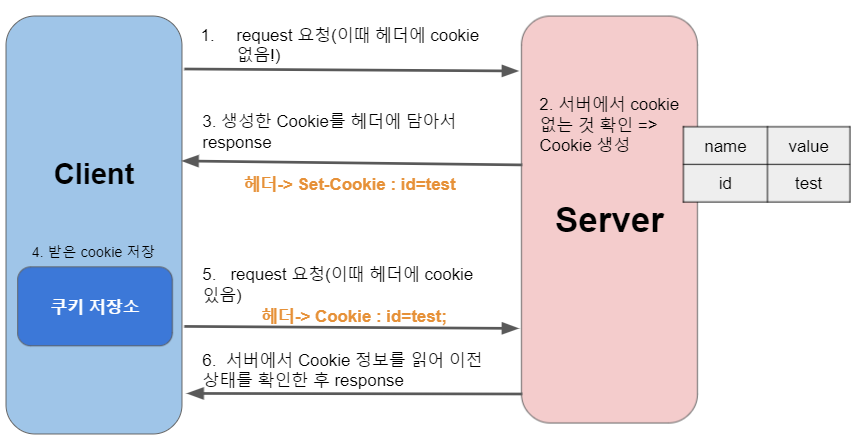
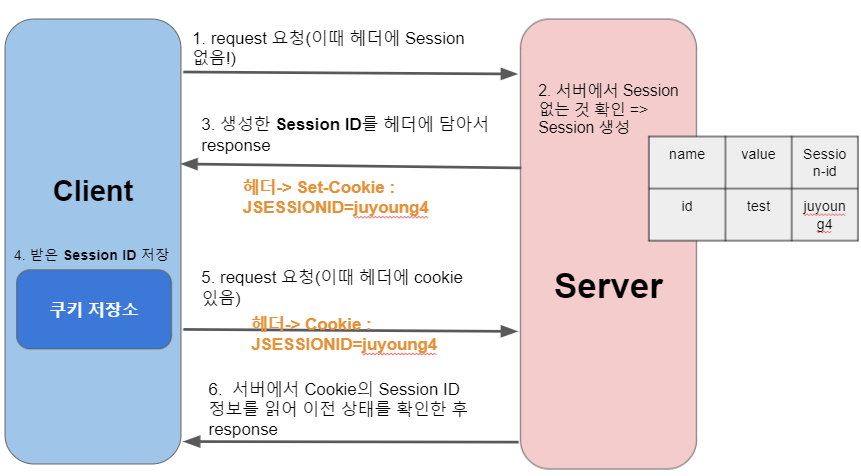

## [CH6] HTTP4

```🙏  오늘 배울 내용 ```

    1. Cookie와 Session이 필요한 이유
    2. Cookie와 Session이란?

----------------------------
## **1. Cookie와 Session이 필요한 이유**
<br>

<details>
<summary> HTTP의 특징은? </summary>

<br>
1. Stateless(무상태) - 클라이언트 서버와의 통신에서 서버는 클라이언트의 상태를 알 수 없다. 즉, 과거의 어떤 통신을 했는지 알 수 없다.
2. Connectionless(비 연결지향) - 서버에서 클라이언트의 상태를 알 수 없는 근복적인 원인이 "비연결 지향"이기 때문이다. 서버와 클라이언트간 request/response가 이루어 지면 연결이 끊긴다. 
</details>

* HTTP의 위와 같은 특징으로 서버는 클라이언트의 상태를 모른다. 하지만 문제점은 서버에서 (EX)유저 인증 과같은 상황에서는 클라이언트의 상태를 알아야 한다. 

* 이러한 HTTP의 **비 연결지향**의 단점을 극복하기 위해 나온 개념이 **쿠키(Cookie)** 와 **세션(Session)** 이다.

📝 [예시를 통해 필요성을 알아보자] <br>

**(예시)** 만약 쿠키와 세션을 사용하지 않으면, 쇼핑몰에서 옷을 구매하려고 로그인을 했는데도 불구하고 페이지 이동할때 마다(사용자가 요청을 여러번 했음에도) **새로운 사용자로 인식하기** 때문에 계속 로그인을 시도해야 한다. 👉 불필요한 통신 증가
<br>

**(해결)** 쿠키와 세션을 사용했을 경우, 한 번 로그인을 하면 어떠한 방식에 의해서 그 사용자에 대한 인증을 유지하게 된다. 👉 불필요한 통신 감소

📌 정리하면, **클라이언트와 정보 유지**를 하기 위해 사용하는 것이 쿠키와 세션이다.

-------------------------
## **2. Cookie와 Session이란?**

### **2.1 Cookie란?**
    쿠키는 서버를 대신해서 클라이언트 상태 정보들을 웹 브라우저에 저장하고,
    사용자가 요청을 할 때 그 정보를 함께 보내서 서버가 사용자를 식별할 수 있게 해준다.

    📌 즉, 서버와 클라이언트 지속 연결 기능을 수행한다.


#### **2.1.1 Cookie의 동작 과정**

<br> 

#### **2.1.2 Cookie의 특징**
1. 이름, 값, 만료일(저장 기간 설정), 경로 정보로 구성되어 있다.
2. 만료 기간 지정이 가능하며 브라우저 종료 시에도 유지 가능하다 👉 쿠키는 기본적으로 브라우저가 종료되도 유지된다.
3. 브라우저마다 저장되는 쿠키는 달라 서버에서 브라우저가 다르면 다른 사용자로 인식한다.
4. 쿠키는 저용량 데이터 파일이다.

    <details>
    <summary> Cookie 옵션 </summary>

    <br>
    * 쿠키명 = 쿠키값 : 기본적인 쿠키의 값. ( id = test )
    * **Expires** = 날짜 : **쿠키 만료 기한** 이 기한이 지나면 쿠키가 제거된다. 기본값은 클라이언트가 종료될 때까지 이다.
    * Max-age = 초 : Expires 와 비슷하지만 날짜 대신 초를 입력할 수 있다. 해당 초가 지나면 쿠키가 제거되고 Expires보다 우선 시 고려된다. 
    * Secure:  HTTPS일 경우에만 쿠키 전송
    * httpOnly : 설정 시 자바스크립트에서 쿠키에 접근할 수 없다. 쿠키 조작을 방지하기 위해 설정하는 것을 추천하고 있다.
    </details>

#### 2.1.3 Cookie 사용 목적
1. 세션 관리 : 로그인, 사용자 닉네임, 접속 시간, 장바구니 등 서버가 알아야할 정보들을 저장하고 있다.
2. 개인화 : 사용자마다 다르게 그 사람에 적절한 페이지를 보여줄 수 있다.
3. 트래킹 : 사용자의 행동과 패턴 분석하고 기록한다.

#### **2.1.4 Cookie의 단점**
1. 방문했던 웹 사이트에 대한 정보 및 개인정보가 기록되기 때문에, 사생활 침해 문제가 있다.
2. 접근 권한이 모두에게 주어지기 때문에 보안이 매우 약함 👉 서버에 저장되는 것이 아니라 웹 브라우저(클라이언트)에 저장되는 것이기 때문에 임의 수정이 가능해 보안에 취약하다. 

* 그래서 브라우저에서는 자체 쿠키 거부 기능이 있다. 하지만 이 거부 기능을 수용하면 쿠키의 본래 목적인 웹 브라우저와의 연결을 지속시키는 기능을 수행할 수 없는 경우가 발생한다.

* 📌 이런 쿠키의 단점을 보완한 방법이 **Session(세션)** 이다!
    <details>
    <summary> 그러면 Session만 쓰면 되는데 왜 Cookie도 ? </summary>

    <br>
    * 📌 미리 세션과 쿠키의 차이점을 말하자면 쿠키는 **클라이언트**에 상태 정보를 저장하는 것이고, 세션은 **서버**에 상태 정보를 저장한 것이다.

    * 여기서 왜 쿠키를 사용한지 알 수 있다. <br>
        📝 세션은 서버에 저장된다. 즉, 서버의 자원일 사용한다는 것이다. 그렇기 때문에 사용자가 많아지면 그 연결을 위해 사용되는 리소스(자원)이 상당하다.<br>
        📝 그렇기 때문에, *자원 관리* 차원에서 쿠키와 세션을 적절하게 사용해야 한다 👉 서버 자원의 낭비를 방지하며 웹사이트의 속도를 높이기 위해 쿠키와 세션 모두 사용하는 것이다.

    </details>

### **2.2 Session이란?**
        쿠키는 상태 데이터를 클라이언트에 저장했다면, 세션은 서버에 저장한다.
        세션은 기본적으로는 `쿠키`를 사용한다. 하지만 세션 id만 쿠키로 저장하고, 상태 데이터들은 세션 id를 id로하여 서버에 저장한다.

        📌 방문자가 웹 서버에 접속해 있는 상태를 하나의 단위로 보고 그것을 세션이라고 한다 
            👉 즉, 만약 로그인한 사용자가 로그아웃하면 같은 사용자로 인식하는 것이 아닌 새로운 세션을 생성한다. 
            👉 다른 사용자로 인식하다. 
        📌 [결론] 세션을 통해 클라이언트의 정보는 서버에 두고, 세션 아이디를 이용해서 인증받고 정보를 이용하는 방식이다.

#### **2.2.1 Session의 동작 과정**

<br> 

#### **2.2.2 Session의 특징**
1. 사용자를 Session ID를 통해 구분한다.
2. 브라우저를 닫거나, 서버에서 세션을 삭제했을때만 삭제가 되므로, 쿠키보다 비교적 보안이 좋다.
3. 저장 데이터에 제한이 없다 👉 쿠키의 경우에는 데이터의 제한이 있다. 하지만 세션은 서버 용량이 허용하는 한 데이터에 대한 제한이 없다.

#### **2.2.3 Session의 단점**
1. 상태 데이터를 서버에서 가지고 있는 만큼 부하가 늘어난다는 단점이 있다.
2. 서버에서 데이터를 바로 읽어 처리할 수 있는 쿠키에 반해, 세션은 세션 id를 통해 세션을 읽어온 다음 또 데이터를 읽어야 하기 때문에 속도가 상대적으로 느리다.

### **2.3 Cookie와 Session 사용 예시**

* 방문했던 사이트에 다시 방문 하였을 때 아이디와 비밀번호 자동 입력
* 팝업창을 통해 "오늘 이 창을 다시 보지 않기" 체크
* 최근 검색한 상품들을 광고에서 추천
* 쇼핑몰 장바구니 기능

🔔 Session은 로그인과 같이 보안상 중요한 작업을 수행할 때 사용
 
### **🎇 2.4 Cookie와 Session의 차이점 🎇**

| - | Cookie |Session|
|:---:|:---:|:---:|
|저장 위치|클라이언트|서버|
|저장 형식|text|Object|
|만료 시점(라이프 사이클/생명주기)|클라이언트에서 쿠키 저장시 설정한다(만료 시점 지정 가능 - 브라우저가 닫혀도 삭제되지 않는다)|브라우저 종료 시 삭제(기간 지정 가능)|
|용량 제한|총 300개|서버가 허용하는 한 용량 제한 X|
|속도|세션보다 빠름|쿠키보다 느림|
|보안|세션보다 보안 취약|쿠키보다 보안 강력|

-------------------------
