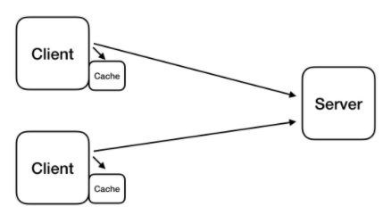
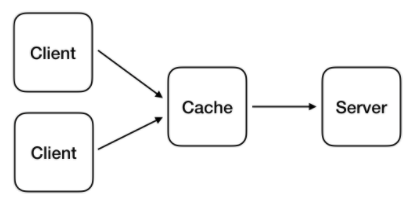
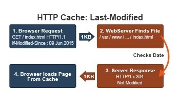
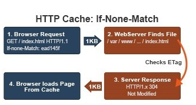
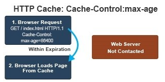

## [CH6] HTTP 5

```🙏  오늘 배울 내용 ```

    1. HTTP Cache란?
    2. Cache관련 Header = Cache Control, Expired
----------

## **1. HTTP의 Cache란?**

* 웹사이트를 통해 이미지 , js, html 파일 등의 데이터를 가지고 올 때 해당 데이터의 크기만큼의 통신 데이터 처리가 필요하다. 
* 동일한 이미지를 접속할 때 마다 받아온다면 클라이언트 입장에서도 부담이며 여러 클라이언트를 동시에 상대하는 서버에는 더더욱 부담이 된다.
* 이러한 문제점으로 HTTP에서는 **캐싱**을 지원한다.
* 📌 즉, Resource file 임시 저장하여 동일한 웹 사이트 접속 시 로딩 시간을 줄여준다

### **1.1 HTTP 캐싱이란?**
* 일반 적으로 캐싱은 GET 요청에서 처리한다.
* HTTP 캐싱은 *Browser Caches(사설 브라우저 캐시)*와 *공유 캐시* 두 가지 종류가 있다.

### **Browser Caches(사설 브라우저 캐시)**

<br> 
```각 Client의 로컬 캐시에 데이터를 저장하는 것으로 브라우저 캐시를 주로 이용```

* 사설 브라우저 캐시는 **개인 전용**으로 사용하는 캐시이다. 
* 저장된 캐시는 서버에서 추가로 데이터를 받아오지 않고 바로 사용할 수 있게 해준다.
* 브라우저의 Back버튼 또는 이미 방문한 페이지를 재 방문하는 경우 극대화

### **Proxy Caches(공유 프록시 캐시)**

<br> 
```브라우저와 서버 사이에 있는 캐시로 리버스 프록스, 게이트웨이, CDN 등등에 저장되는 캐시 👉즉, Client나 Server가아닌 네트워크 상에서 동작```

* 사설 브라우저 캐시는 캐싱하기 위해서 모든 Client가 한번씩은 실제 리소스를 접근해야 한다 👉 공유 프록시 캐시는 서버와 클라이언트 가운데 프록시 등을 통해 캐시를 하는 것이다.

* 📝 [예시를 들어 이해하기] <br>
    [사설 브라우저 캐시] 10만명이 접속하면, 실제 리소스에 10만번 접근 필요<br>
    [공유 프록시 캐시] 10만명 접속하면, 실제 리소스에는 1번 접근(프록시에 저장하기 위해), 나머지 9만 999번은 공유 캐시에서 처리

### **1.2 HTTP 캐싱의 장점**
1. 불필요한 데이터 전송을 줄여 네트워킹 비용을 줄여준다.
2. 거리로 인한 지연시간을 줄여 웹페이지를 빨리 불러올 수 있게 된다.
3. 서버에 대한 요청을 줄여 서버의 부하를 줄인다.

----------
## **2. Cache관련 Header**

👉 브라우저는 한번 요청한 파일은 그 이후부터 Cache에 저장해서 사용한다. 그렇다면 Cache되면 안되거나 캐쉬된 내용이 변경되면 어떻게 해야 될까?

🎇 Cache-Control을 이용해 Cache 컨트롤하면 된다.

### **2.1 Cacheability-Cache 제어**

| - | Cacheability |
|:---:|---|
|public|캐시 허용. 응답요소들은 자동으로 private이 된다.|
|private| 특정 유저(사용자의 브라우저)만 캐쉬 하도록 설정한다. 여러 사람이 사용하는 네트워크상의 중간자 역할을 하는 shared caches (예: proxy) 에는 경우 캐쉬되지 않습니다.|
|no-store|어떤 상황에서도 해당 reponse 데이터를 저장하지 않는다(부주의하게 공개되었거나 민감한 정보의 저장을 막는 것)|
|no-cache|캐시된 복사본을 사용자에게 보여주기 이전에, 항상 재검증을 위한 요청을 서버로 보내도록 한다(요청을 할때 마다 확인을 하고 수정되었을때만 다운로드를 진행하고 싶을때)|

[🔔 참고] public과 private는 사설 캐시에 저장할 지 or 공유 캐시로 저장할지 지정할 때 사용하는 옵션

### **2.2 Expire**

| - | Expire |
|:---:|---|
|max-age|캐시 생성시 캐시의 만료기간을 정해두는 것. 지정된 만료일이 지나면 캐시를 삭제하고 다시 캐시를 생성하는 옵션|

📝 Cache-Control : max-age=86500<br>
    => 응답을 최대 1일 (60 * 60 * 24 = 86500)동안 브라우저 및 중간 캐시가 캐시할 수 있다(public)

📝 Cache-Control : private, max-age=600<br>
=> 응답을 최대 10분 (60 * 10)동안 클라이언트의 **브라우저**만 캐싱 가능하다.

📝 Cache-Control : max-age=15<br>
=> 응답을 15초 동안 캐시에 저장한다. 이때 15초 동안 여러번 Request을 하더라도, request-response 동작 안한다 => 내부에 캐시된 데이터를 바로 응답으로 받았기 때문이다.

### **2.3 Cache 동작 과정**

#### **1. 첫 요청**
1. 브라우저는 서버에 Index.html 파일을 요청한다.
2. 서버는 index.html파일을 찾아보고 존재하는 파일이면 파일 내용과 헤더와 함께 브라우저에게 응답한다.
3. 브라우저는 응답 받은 내용에 따라 Cache 정책을 수행한다.<br>
   📝 응답 헤더에 Last-Modified, Etag, Expires, Cache-Control : max-age 항목이 존재하면 이를 복사해 값을 저장한다.

#### **2. 재요청**

##### [1] LAST-MODIFIED

<br>

1. 브라우저는 최초 응답 때 받은 Last-Modified 값을 If-Modified-Since라는 헤더에 포함시켜, 페이지를 요청한다.
2. 서버는 요청 파일의 수정 시간을 If-Modified-Since값과 비교한다. 
3. 이때 동일하면 **304 Not Modified**로 응답하고, 만약 다르다면 **200 OK**와 함께 새로운 Last-Modified 값을 응답 헤더에 전송한다.
4. 브라우저는 응답 코드가 **304**이면 Cache에서 페이지를 load하고, **200**이면 새로 다운 받은 후 Last-Modified 값을 갱신한다.

##### [2] ETag

* ETag : HTTP 컨텐츠가 바뀌었는지를 검사할 수 있는 태그(이건  LAST-MODIFIED처럼 시간을 기반이 아니라 Token 값을 이용한 것이다)

[🔔 참고] 사실, 위 LAST-MODIFIED만 가지고 유효성을 체크하기에는 충분하지 않는 경우가 존재한다.

        1. 문서가 주기적으로 업데이트는 되었는데, 바뀐 내용이 없음
        2. 변경된 내용은 있는데, 응답상으로 의미가 크지 않는 경우 (주석 변경, 철자 변경)
        3. 유효한 시간을 정하기 어려운 경우
        (어떤 서버는 자신이 가지고 있는 페이지에 대한 최근 변경일을 잘 모른다)

이럴 경우에, ETag가 같지 않을 경우에만  새 객체를 달라고 요청한다.

<br>

1. 브라우저는 최초 응답 시 받은 ETag 값을 If-None-Match라는 헤더에 포함시켜 페이지를 요청한다.
2. 서버는 요청 파일의 ETag값을 서버 리소스의 ETag값과 비교한다. 
3. 이때 동일하면 **304 Not Modified**로 응답하고, 만약 다르다면 **200 OK**와 함께 새로운 Last-Modified 값을 응답 헤더에 전송한다.
4. 브라우저는 응답 코드가 **304**이면 Cache에서 페이지를 load하고, **200**이면 새로 다운 받은 후 ETag 값을 갱신한다.

##### [3] Cache-Control

<br>

1. 브라우저는 최초 응답 시 받은 Cache-Control 중 max-age값(초 단위)를 GMT와 비교하여 기간 내라면 서버를 거치지 않고 캐쉬에서 페이지를 로드 한다. 만약 기간이 만료되었다면 validation 작업을 수행한다.
