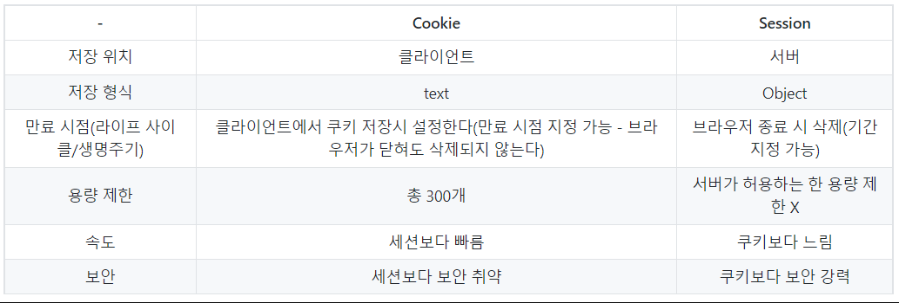

## **Part 1**

### **❓ OSI 7계층에 대해 간략 설명해주세요**

 📌 Answer 

|계층|계층 이름|
|:---:|---|
|[1] 물리 계층|➕ 데이터를 전기적인 신호로 변환해서 주고 받는 기능 (BIT) |
|[2] 데이터 링크 계층|➕ MAC 주소를 이용해 물리계층에서 받은 정보 전달 (Frame) ➕ 에러 제어, 흐름 제어 담당|
|[3] 네트워크 계층|➕ IP 주소와 라우팅을 통해 최적의 경로 제공 (Packet) |
|[4] 전송 계층|➕ 송신 측과 수신 측의 논리적인 연결을 설정하고 유지하는 역할(데이터 전송을 위해) (Segment/Datagram)) ➕ 오류제어, 흐름제어, 중복 검사 수행|
|[5] 세션 계층|➕ 상호 간의 세션이 유효한지 확인하고 설정(동기화)  |
|[6] 표현 계층|➕ 데이터 형식 정의  |
|[7] 응용 계층|➕ 사용자가 사용하는 응용 서비스 or 프로세스 동작하는 계층  |

 

### **❓ OSI 7계층을 나눈 이유는?**

 📌 Answer 

통신이 일어나는 과정을 단계별로 쉽게 파악하고 이해할 수 있기 때문이다.

 

### **❓ TCP/IP 계층에 대해 간략 설명해 주세요**

 📌 Answer 

|계층|계층 이름|
|:---:|---|
|[1] 네트워크 접근 계층|➕ 송신 측과 수신 측의 데이터 전송을 위해 논리적인 링크 생성  |
|[2] 인터넷 계층|➕ 데이터 전송을 위한 주소지정, 경로설정을 제공  |
|[3] 전송 계층|➕ 호스트들 간의 신뢰성 있는 통신을 제공 |
|[4] 응용 계층|➕ 응용프로그램 간의 데이타 송수신  |

 

### **❓ TCP와 IP를 사용하는 이유는?**

 📌 Answer 

IP만 있으면 상호간에 통신은 가능하지만, 패킷 전달 여부를 보증하지 않고 ➕ 패킷을 보낸 순서와 받는 순서가 다를 수 있다.

신뢰적인 데이터 전송을 위해 TCP를 사용한 것이다.

 

### **❓ 아래와 같이 여러 프로토콜이 있는데 TCP/IP에서 각 맞는 계층을 선택해주세요**

    SSH, RTP, WiFi, PPP, DNS, TCP, ARP, ICMP, UDP, SMTP, IP

 📌 Answer 

* SSH, DNS, SMTP : [4] 응용 계층
* TCP, UDP, RTP : [3] 전송 계층
* IP, ICMP, ARP : [2] 인터넷 계층
* WiFi, PPP : [1] 네트워크 연결 계층

 

### **❗❓ IPV4 vs IPV6 을 설명해주세요**

 📌 Answer 

* IPv4 : 32 bit로 (4개의 8bit) 구성됩니다. 
* IPv6 : IPv4의 주소 부족 문제를 해결하기 위해 만들어졌습니다. 128 bit로(8개의 16bit) 구성됩니다. 주소 유형은 유니캐스트, 멀티캐스트, 애니캐스트가 있습니다.

 

------------------
## **Part 2**

### **❓ TCP와 UDP를 특징을 기준으로 3가지 이상 차이점을 설명해주세요**

 📌 Answer 

* 연결 방식 : TCP(연결형 서비스) / UDP(비연결형 서비스)
* 패킷 교환 방식 : TCP(가상 회선 방식) / UDP(데이터 그램 방식)
* 수신 여부 확인 : TCP(전송 순서 보장) / UDP(전송 순서 바뀔 수 있음)
* 신뢰성 : TCP(높다) / UDP(낮다)
* 속도 : TCP(느리다) / UDP(빠르다)

 

### **❓ 3-Way handshake란?**

 📌 Answer 

=> 서버-클라이언트는 통신을 위해 연결 설정할때 3 way-handshake를 수행한다.

1. client가 Server에게 연결 요청 메시지 SYN를 전송한다.
2. Server가 이를 수락한다는 의미로 SYN+ACK를 전송한다.
3. Client가 다시 ACK를 보내고 연결을 설정한다.

=> 이 방식을 통해 TCP는 신뢰성 있는 통신이 가능하다.

 ➕  만약 Client가 SYN+ACK를 못받았다면? 

Client에서는 TIMEOUT이 발생해 다시 SYN를 서버에게 전송한다.

 

### **❓ 4-Way handshake란?**

 📌 Answer 

=> 서버-클라이언트는 통신을 종료 하기 위해 4way-handshake를 수행한다.
1. client가 Server에게 연결 종료하겠다는 FIN 플래그를 전송한다.
2. Server는 알겠다는 의미로 ACK를 보내고, 자신의 통신이 끝날때까지 기다린다.
3. Server가 통신이 끝나면, 연결이 종료됬다고 FIN 플래그를 전송한다.
4. Client는 확인했다는 ACK를 보내고 종료한다.

 ➕  Server에서는 왜 FIN 플래그를 보낼까요?r 

서버에서 아직 전송할 데이터가 남아 있기 때문에 이를 다 보내고 난 다음 다 보냈다는 의미로 FIN 플래그를 전송하게 됩니다.

 ➕  연결 해제시 Client는 왜 ACK를 보낼까요? 

만약 Client가 Server로부터 FIN 플래그를 받지 못했을 경우에 Client는 이 상황을 모르고 계속 기다리면서 재전송하게 됩니다. 하지만, Server는 이미 종료되고 닫혔기 때문에 이에 대해 응답하지 않아 Client 측에서 불필요한 자원을 소요하게 됩니다.

 그래서 Server측에서는 Client의 ACK를 받고 연결을 해제합니다.

 

### **❓ TCP의 흐름제어란?**

 📌 Answer 

송신측과 수신측의 데이터 처리 속도 차이를 해결하기 위한 기법이다. 수신측이 송신측보다 빠르면 문제되지 않지만, 송신측의 속도가 수신측보다 빠르다면 문제가 발생합니다. 이를 해결하기 위한 기법이 흐름제어다.

 

### **❓ TCP의 혼잡 제어란?**

 📌 Answer 

송신 측의 데이터 전달과 *네트워크*의 데이터 처리 속도 차이를 해결하기 위한 기법이다.

 

------------------
## **Part 3**

### **❓ HTTP란 무엇이며, HTTP의 특징은 무엇인가요?**

 📌 Answer 

* HTTP는 웹에서만 사용하는 프로토콜로, TCP/IP 기반으로 서버와 클라이언트간 요청과 응답을 전송합니다.
* HTTP의 특징은?

    1. Connectionless : HTTP 연결 상태를 유지하지 않는 비연결성 프로토콜이다.
    2. Stateless : HTTP는 연결을 유지하지 않는 프로토콜이기 때문에 과거의 요청/응답에 대한 내용을 알지 못한다.

 ➕ 왜 해당 특징을 가지죠? 

서버에서 다수의 클라이언트와의 연결을 계속 유지하려면 이에 따른 많은 리소스가 발생 합니다. 이 리소스를 줄이면 더 많이 클라이언트와 연결할 수 있기 때문에 비연결성 특징을 가집니다.

 

### **❓ TCP의 Non-persistent와 Persistent에 대해 설명해주세요**

 📌 Answer 

* Non-Persistent : 서버에 요청을 보내고 응답을 받으면 바로 TCP Connection을 끝내는 방식 => 과거에는 웹을 통해 전달해야하는 사이트의 콘텐츠 수가 적었기 때문에 Non-persistent Connection 방식을 사용함.

* Persistent : 서버는 TCP연결을 HTTP 응답 이후에도 끊지 않고 계속 사용합니다.

 ➕ HTTP에서 Persistent를 사용하는 방법은? 

클라이언트가 서버에게 Persistent Conntection을 요청할 때 요청 메시지 내 헤더에 '**Conncection : keep-alive**'를 추가하여 보냅니다

 

### **❓ URI와 URL의 차이에 대해 설명해주세요**

 📌 Answer 

* URI(Uniform Resource Identifier) : 인터넷에 있는 자료의 ID로 생각하면 된다. URI의 하위개념으로 URL, URN 이 있다.

* URL(Uniform Resource Locator) : 네트워크 상에서 자원이 어디 있는지를 알려주기 위한 규약이다. 즉, 웹 리소스에 대한 참조이다.

 

### **❓ POST와 GET의 차이는 무엇인가요?**

 📌 Answer 

* GET : 클라이언트가 서버로 데이터를 요청할 때 사용하는 함수이다. URI에 쿼리 스트링을 포함시켜 보내기 때문에 보안에 취약하다. 빠르다.

* POST : 클라이언트가 서버로 데이터를 전송하는데, 이때 서버는 이 데이터를 생성, 수정한다. URI에 자원을 넣는것이 아니다 보니 GET보다 많은 데이터를 다룰 수 있고 보안에 강하다. 대신, 느리다.

 

### **❓ POST와 PUT의 차이에 대해 설명해주세요**

 📌 Answer 

* POST : 리소스의 위치를 지정하지 않고 리소스를 생성하는 연산이다. 단 POST는 멱등성을 만족하지 못한다.

* PUT : 리소스의 위치를 이미 알고 있는 상태에서, 그 위치에 리소스를 생성하거나 수정한다. 단 PUT은 멱등성을 만족한다.

 ➕ 멱등성이란? 

1번을 실행하든, 100번을 실행하든 결과가 같다. 

예를 들어, JSON을 여러번 POST 함수로 요청하면 계속해서 리소스가 생성된다. JSON을 여러번 PUT 함수로 요청하면 생성이 아닌 해당 리소스를 수정하는 것이다.

 

### **❓ PUT과 PATCH의 차이에 대해 설명해주세요**

 📌 Answer 

* PUT : 자원의 전체 교체, 자원교체 시 모든 필드 필요

* PATCH : 자원의 부분 교체, 자원교체시 일부 필드 필요

 

### **❓ Status code 각각에 대해 어떤 기능인지 말해주세요?**

    1. 200 
    2. 204
    3. 300
    4. 304
    5. 400
    6. 401
    7. 403
    8. 404
    9. 500
    10. 503
    11. 504

 📌 Answer 

1. 200 : 요청이 성공적으로 수행 되었다(OK)
2. 204 : PUT, POST, DELETE 요청의 경우 성공 했는데 보낼 데이터 없는 경우(No content)
3. 300 : 리다이렉션
4. 304 : 로컬 캐시의 정보 업데이트 할게 없다고 알려줌(Not modified)
5. 400 : 클라이언트의 잘못된 요청(Bad Request)
6. 401 : 인증되지 않은 클라이언트가 인증이 필요한 페이지를 요청한 경우 (Unauthorized)
7. 403 : 서버가 해당 요청은 이해했지만, 권한이 없는 클라이언트인 경우 요청 거부 (Forbidden)
8. 404 : 요청한 페이지 없음 (Not found)
9. 500 : 내부 서부 오류 (Internal Server error)
10. 503 : 서버가 일시적으로 서비스 제공 불가 (Service Unavailable)
11. 504 : 서버 시간 초과됨 (Gateway timeout)

 

### **❓ CORS란 무엇인가요?**

 📌 Answer 

CORS란 서로 다른 Origin끼리 자원을 공유할 수 있는 방식입니다.

HTTP 헤더를 사용해서 한 origin에서 실행중인 웹앱이 다른 origin의 자원에 접근할 수 있는 권한을 부여할 수 있는 방식입니다.

 ➕ 서로 다른 Origin이란? 

Protocol, Host, Port 중 하나라도 다른 것을 의미합니다.

 ➕ CORS와 관련된 HEADER는 무엇인가요(Request, Response 구분해서 말해주세요)? 

* Request : Origin, Access-Control-Request-Method, Access-Control-Request-Headers
* Response : Access-Control-Allow-Origin, Access-Control-Allow-Methods, Access-Control-Allow-Headers

=> Origin : 다른 출처(Cross-site) 요청을 보내는 요청 도메인의 URI를 나타낸다(요청을 보내는 페이지의 출처(도메인-포트까지 포함))

=> ccess-Control-Allow-Origin : 헤더에 작성된 출처만 브라우저가 리소스를 접근할 수 있다고 말해준 것이다.

 

### **❓ Preflight request 동작 방식에 대해 설명해주세요**

 📌 Answer 

Preflight request 방식은 서버에 예비 요청을 보내서 안전한지 판단한 후 요청을 보내는 방법입니다.

1. Preflight request(예비 요청) : 실제 리소스를 요청하기 전에 OPIONS라는 함수를 통해 실제 요청을 전송할지 판단합니다.  클라이언트측은 OPTIONS 함수로 서버에 예비 요청을 보낸다.
2. 서버는 이 예비 요청에 대한 응답으로 Access-Control-Allow-Origin 헤더를 포함한 응답을 브라우저에 보낸다.
3. 브라우저는 자신이 보낸 Preflight request(예비 요청)과 서버가 보낸 응답 헤더에서 Access-Control-Allow-Origin를 비교한 후, 만약 이 요청을 보내는 것이 안전하다고 판단되면 해당 서버로 다시 본 요청을 보낸다.

 

### **❓ HTTP 1.0과 HTTP 1.1의 차이점은 무엇인가요?**

 📌 Answer 

* [ HTTP 1.0 ]
    * GET, HEAD, POST 3가지 함수 사용 가능하다.
    * [Non-persistent Connection] Request 할때 마다 Connection을 새로 생성한다.

* [ HTTP 1.1 ]
    * GET, HEAD, POST, OPTIONS, PUT, DELETE, TRACE 함수 사용 가능하다.
    * Persistent Connection / Pipelining 개념을 도입해 클라이언트-서버 간 요청/응답 시간을 줄이려고 노력했다.

 ➕ Pipelining은 무엇인가요? 

하나의 커넥션에서 응답을 기다리지 않고 순차적인 여러 요청을 연속적으로 보내 그 순서에 맞춰 응답을 받는 방식으로 지연 시간을 줄이는 방법. 

 

### **❓ HTTP 1.1의 문제점은 무엇이 있나요?**

 📌 Answer 

1. HOL(Head of Line) Blocking : 먼저 받은 요청이 끝나지 않으면 그 뒤에 있는 요청도 처리가 불가합니다.

2. RTT 증가 : 일반적으로 Connection 하나에 요청 한 개를 처리하기 때문에, 매번 요청 별로 Connection을 만들어 3-way handshake가 수행되기 때문에 불필요한 RTT증가와 네트워크 지연을 초래하여 성능을 지연시킵니다.

3. 헤더가 크다 : 쿠키가 큼. 연속적인 데이터일때, 헤더가 동일하더라도 또 보내게됨.

 

### **❓ HTTP 2.0의 특징은?**

 📌 Answer 

1. 메시지 전송 방식 변화(바이너리 프레임) + 멀티 플렉싱 : 한 연결에 여러 메시지를 동시에 처리 가능 (WHY? 요청들이 프레임 단위로 쪼개졌기 때문에 메시지 전송과 응답 순서가 중요하지 않아졌다) => HOL Blocking 해결

2. Stream 우선 순위 

3. Header 압축 : Header 정보를 HPACK 압축 방식을 이용하여 압축 전송 -> 페이지 로드 시간 감소

4. Server Push : 서버에서 클라이언트에서 요청하지 않은 리소스를 전송할 수 있다.

 

### **❓ HTTP 3(QUIC)의 특징은?**

 📌 Answer 

* HTTP3는 HTTP 버전 1 ~ 2와 달리 기반 프로토콜을 UDP 프로토콜로 사용한다.

 ➕ 왜 TCP가 아닌 UDP를 사용하나요? 

⇒ [👉 TCP의 경우] 헤더에서 보다시피 많은 기능이 포함된 프로토콜로 실질적으로 사용자가 커스텀 기능을 구현할 자리가 없다 

=> [👉 UDP의 경우] 헤더의 공간이 많이 있기 때문에 커스텀 기능을 구현하기 쉽다. 즉, UDP의 이 공간을 잘 활용하면 TCP와 비슷한 수준의 신뢰성을 제공할 수도 있다.

 ➕ QUIC 장점에 대해서 설명해주세요 

1. Connection 설정 시 레이턴시 감소(첫 연결 설정에 1 RTT만 소요, 이후부터는 0 RTT 소요)
2. HTTP 2.0 버전과 같이 멀티플렉싱을 지원한다.
3. 클라이언트의 IP가 바뀌어도 연결이 유지됨(Connection ID를 사용)
4. 패킷 손실 감지에 걸리는 시간 단축(QUIC도 TCP와 마찬가지로 전송하는 패킷에 대한 흐름 제어를 한다)

 

### **❓ HTTP와 HTTPS의 차이는 무엇인가요?**

 📌 Answer 

HTTPS는 HTTP의 문제점인 보안을 방지한 프로토콜로, HTTP에 **SSL/TLS**기반의 Secure Socket을 활용한 프로토콜입니다.

 ➕ 모든 웹 사이트가 HTTPS를 사용하지 않나요? 

‘모든 사이트가 다 HTTPS가 되면 좋겠네?’라고 말할 수도 있는데, 서버에 과부하가 걸릴 수 있습니다. 모든 사이트에서 텍스트를 암호화하여 주고 받으면, 속도가 현저하게 느려집니다. 따라서, 중요한 사이트에서는 HTTPS로 관리하고, 그렇지 않은 사이트에서는 HTTP로 세팅합니다.

 ➕ TLS는 어느 계층에 속하나요? 

전송 계층

 ➕ 비대칭키 또는 공개키 암호화 방식은 무엇인가요? 

사용자는 공개된 키로 암호화해서 서버에게 보내면 서버는 본인만 가지고 있는 개인키로 복화화하여 볼 수 있도록 암호화하는 방식입니다.

 

### **❓ HTTP의 비 연결성을 해결하는 방법은 무엇인가요?**

 📌 Answer 

쿠키(Cookie) 와 세션(Session)

 ➕ 쿠키와 세션의 차이는 무엇인가요? 

 ➕ 쿠키의 경우 왜 보안에 좋지 않나요? 

접근 권한이 모두에게 주어지기 때문에 보안이 매우 약함 👉 서버에 저장되는 것이 아니라 웹 브라우저(클라이언트)에 저장되는 것이기 때문에 임의 수정이 가능해 보안에 취약하다

 ➕ Session만 쓰면 되는데 왜 Cookie도 사용하나요? 

세션은 서버에 저장된다. 즉, 서버의 자원일 사용한다는 것이다. 그렇기 때문에 사용자가 많아지면 그 연결을 위해 사용되는 리소스(자원)이 상당하다. 

그렇기 때문에, 자원 관리 차원에서 쿠키와 세션을 적절하게 사용해야 한다 👉 서버 자원의 낭비를 방지하며 웹사이트의 속도를 높이기 위해 쿠키와 세션 모두 사용하는 것이다.

 ➕ Cookie와 Session과 관련있는 Header는 무엇인가요(Request/Response 각각 설명해주세요)? 

* Request : Cookie
* Response : Set-Cookie

 
