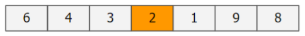
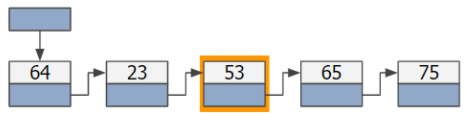
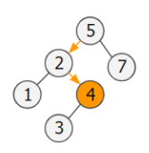
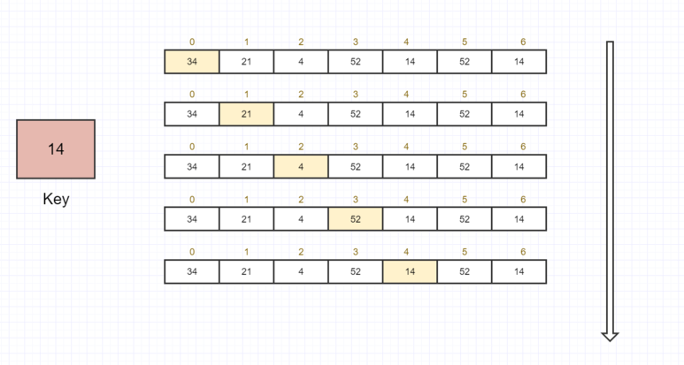
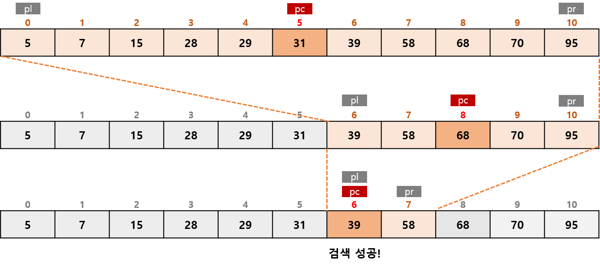

# CH.03 검색

## 1. 검색 알고리즘

```
💡 검색 알고리즘은 데이터 집합에서 원하는 값을 가진 요소를 찾아내는 알고리즘
```

### 검색 종류
1. 배열 검색 <br/> 
2. 선형 리스트 검색 - 9장 <br/> 
3. 이진검색트리 검색 - 10장 <br/> 

> 이 장에서는 `배열 검색`에 대해 정리되어 있음

### 배열 검색 알고리즘
1. 선형 검색 : 무작위로 늘어놓은 데이터 모임에서 검색 수행
2. 이진 검색 : 일정한 규칙으로 늘어놓은 데이터 모임에서 아주 빠른 검색 수행
3. 해시법 : 추가, 삭제가 자주 일어나는 데이터 모임에서 아주 빠른 검색 수행
   - 체인법 : 같은 해시 값의 데이터를 선형 리스트로 연결하는 방법
   - 오픈 주소법 : 데이터를 위한 해시 값이 충돌할 때 재해시하는 방법

<br/>

## 2. 선형 검색

### 선형 검색
- 요소가 직선으로 늘어선 배열에서의 검색
- 원하는 키 값을 갖는 요소를 만날 때까지 맨 앞부터 `순서대로` 요소 검색
- `순차 검색`이라고도 함



- 선형 검색의 검색 종료 조건
  1. 검색할 값을 발견하지 못하고 배열의 끝이 지나간 경우
  2. 검색할 값과 같은 요소를 발견한 경우

- 배열의 요솟수가 n개일 때 조건1, 2를 판단하는 횟수는 평균 `n/2회`

### 보초법
- 선형 검색의 **종료 조건을 검사하는 비용**을 `반으로 줄이는 방법`
- 배열의 맨 끝 요소에 `보초`로 키 값과 동일한 값을 저장한 후 검색 진행 <br/> => `종료 조건2`만으로 수행 가능하기 때문에 종료 판단 횟수를 2회에서 1회로 줄여줌

```java
import java.util.Scanner;

class SeqSearchSen {

    static int seqSearchSen(int[] a, int n, int key) {
        int i = 0;

        a[n] = key; // 보초 추가

        while (true) { // 순서대로 검색
            if (a[i] == key) break; // 검색 성공
            i++;
        }

        return i == n ? -1 : i; // 보초인지 아닌지 판단
    }

    public static void main(String[] args) {
        Scanner stdIn = new Scanner(System.in);

        int num = stdIn.nextInt(); // 요솟수
        int[] x = new int[num+1]; // 보초를 저장하기 위해 요솟수 + 1만큼 배열 생성

        for (int i = 0; i < num; i++) {
            x[i] = stdIn.nextInt(); // 요소 추가
        }

        int ky = stdIn.nextInt(); // 검색할 값

        int idx = seqSearchSen(x, num, ky); // 배열 x에서 값이 ky인 요소 검색
        
        if (idx == -1)
            System.out.println("요소가 존재하지 않음")
        else
            System.out.println("요소는 x[" + dix + "]에 존재함")
    }
}
```

<br/>

## 3. 이진검색

### 이진 검색
- 요소가 오름차순 또는 내림차순으로 `정렬된 배열에서 검색`하는 알고리즘
- 검색 범위를 좁혀가는 방법
  1. a[pc] < key일 때 <br/> a[pl]부터 a[pc]는 key보다 작으므로 검색 대상에서 제외하고 검색 범위를 `a[pc+1]부터 a[pr]`로 좁힘
  2. a[pc] > key일 때 <br/> a[pc]부터 a[pr]은 key보다 크므로 검색 대상에서 제외하고 검색 범위를 `a[pl]부터 a[pc-1]`로 좁힙
- 39를 검색한 예 <br/> 
- 종료 조건
  1. a[pc]와 key가 일치하지 않는 경우
  2. 검색 범위가 더 이상 없는 경우

```java
import java.util.Scanner;

class BinSearch {
    static int binSearch(int[] a, int n, int key) {
        int pl = 0; // 검색 범위의 첫 인덱스
        int pr = n - 1; // 검색 범위의 끝 인덱스

        do {
            int pc = (pl + pr) / 2; // 중앙 요소의 인덱스
            if (a[pc] == key) return pc; // 검색 성공!
            else if (a[pc] < key) pl = pc + 1; // 검색 범위를 뒤쪽 절반으로 좁힘
            else pr = pc - 1; // 검색 범위를 앞쪽 절반으로 좁힘
        } while (pl <= pr);

        return -1; // 검색 실패
    }

    public static void main(String[] args) {
        Scanner stdIn = new Scanner(System.in);
        
        int num = stdIn.nextInt(); // 요솟수
        int[] x = new int[num]; // 요솟수가 num인 배열

        x[0] = stdIn.nextInt(); // 첫 요소 입력

        for (int i = 1; i < num; i++) {
            do {
                x[i] = stdIn.nextInt();
            } while (x[i] < x[i-1]); // 바로 앞의 요소보다 작으면 다시 입력
        }

        int ky = stdIn.nextInt() // 키 값
        int idx = binSearch(x, num, ky); // 배열 x에서 키 값이 ky인 요소 검색

        if (idx == -1) System.out.println("요소 존재 X");
        else System.out.println(ky + "은(는) x[" + idx + "]에 존재");
    }
}
```

### 복잡도
- 복잡도 요소
  1. 시간 복잡도 : 실행에 필요한 시간을 평가한 것
  2. 공간 복잡도 : 기억 영역과 파일 공간이 얼마나 필요한가 평가한 것
- 선형 검색의 시간 복잡도 : O(n)
- 이진 검색의 시간 복잡도 : O(log n)

---
### 🎨 이미지 출처
- https://senalyst.com/algo/34/
- https://rumor1993.tistory.com/38