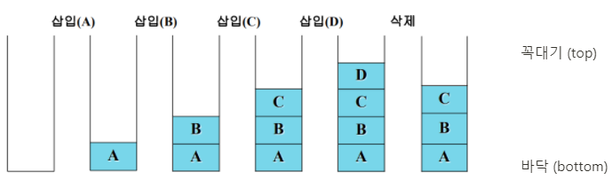
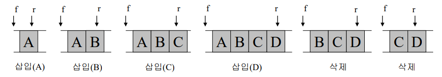
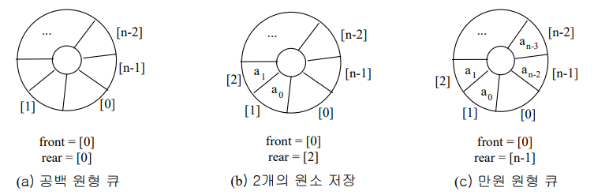

# CH.04 스택과 큐

```
💡 스택과 큐는 데이터를 일시적으로 저장하기 위해 사용하는 자료구조!!
```

## 1. 스택

- 후입선출 (LIFO : Last In First Out) ⇒ 겹겹이 쌓은 접시
- 푸시 (push) : 스택에 데이터를 넣는 작업
- 팝 (pop) : 스택에서 데이터를 꺼내는 작업
- 꼭대기 (top) : 푸시와 팝하는 위치
- 바닥 (bottom) : 스택의 가장 아랫 부분



## 2. 큐

- 선입선출 (FIFO : First In First Out) ⇒ 은행 창구나 마트 계산 대기열
- 인큐(enqueue) : 큐에 데이터를 넣는 작업
- 디큐(dequeue) : 큐에서 데이터를 꺼내는 작업
- 프런트(front) : 데이터를 꺼내는 쪽
- 리어(rear) : 데이터를 넣는 쪽




### Queue 순차 표현의 문제점

- rear = n - 1로 만원이지만 반드시 n개의 원소가 큐에 있지는 않음
- 큐에서 데이터를 꺼냈을 경우, 삭제로 인한 빈 공간이 존재할 수 있음
- 빈 공간 활용을 위해 front와 rear 재설정 필요.
- 실제로 큐가 만원인 경우 크기를 확장해야 함

### 원형 큐 (Circular Queue)

- 순차 표현의 문제를 해결하기 위해 배열을 원형으로 운형
- 링 버퍼(ring buffer)로 큐를 만들었다고 표현하기도 함
- `오래된 데이터를 버리는 용도`로 사용할 수도 있음



## +) Deque
- Stack과 Queue의 성질을 종합한 순서 리스트
- 삽입과 삭제가 리스트의 양끝에서 임의로 수행될 수 있는 자료구조
- Stack이나 Queue에서 지원하는 연산은 모두 지원

> ✅ **참고** <br/> Python의 경우, Deque의 연산 속도가 Queue보다 더 빠름. <br/> Deque은 각 명령을 O(1)으로 지원하는데, Queue는 멀티쓰레드를 지원하기 때문에 Queue의 연산 속도가 느릴 수 밖에 없음.