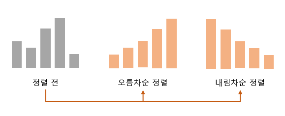
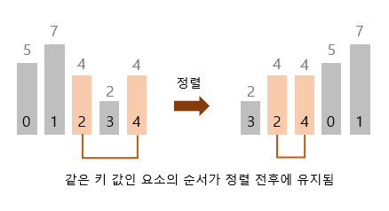
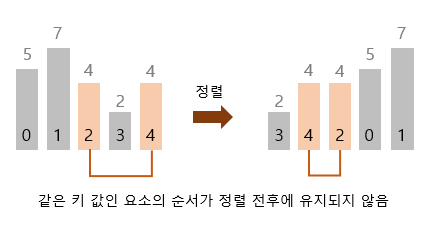

# CH.06 정렬

## 1. 정렬

- 대소 관계에 따라 데이터 집합을 일정한 순서로 줄지어 늘어서도록 바꾸는 작업
- 데이터를 정렬하면 검색을 더 쉽게 할 수 있음
- 아래 그림처럼 키 값이 작은 데이터를 앞쪽에 놓으면 `오름차순 정렬`, 그 반대로 놓으면 `내림차순 정렬` 이라고 함

    

### 정렬 알고리즘의 안정성
- 안정된 정렬 : 같은 값의 키를 가진 요소의 순서가 정렬 전후에도 유지되는 것 <br/> 
- 안정되지 않은 정렬 : 같은 값의 키를 가진 요소의 순서가 정렬 전후에 유지되지 않는 것 <br/> 

### 내부 정렬과 외부 정렬
- 내부 정렬 : 정렬할 모든 데이터를 하나의 배열에 저장할 수 있는 경우에 사용하는 알고리즘
- 외부 정렬 : 정렬할 데이터가 너무 많아서 하나의 배열에 저장할 수 없는 경우에 사용하는 알고리즘

### 정렬 알고리즘의 핵심 요소
```
👉 교환, 선택, 삽입
```
<br/>

## 2. 버블 정렬

이웃한 두 요소의 대소 관계를 비교하여 교환을 반복

<br/>

## 3. 단순 선택 정렬

<br/>

## 4. 단순 삽입 정렬

<br/>

## 5. 셸 정렬

<br/>

## 6. 퀵 정렬

<br/>

## 7. 병합 정렬

<br/>

## 8. 힙 정렬

<br/>

## 9. 도수 정렬