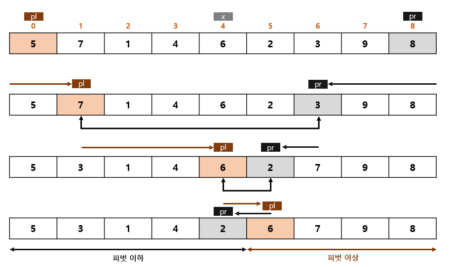

# CH.06 정렬

`05.28`

## 1. 정렬

- 대소 관계에 따라 데이터 집합을 일정한 순서로 줄지어 늘어서도록 바꾸는 작업
- 데이터를 정렬하면 검색을 더 쉽게 할 수 있음
- 아래 그림처럼 키 값이 작은 데이터를 앞쪽에 놓으면 `오름차순 정렬`, 그 반대로 놓으면 `내림차순 정렬` 이라고 함

    

### 정렬 알고리즘의 안정성
- 안정된 정렬 : 같은 값의 키를 가진 요소의 순서가 정렬 전후에도 유지되는 것 <br/> 
- 안정되지 않은 정렬 : 같은 값의 키를 가진 요소의 순서가 정렬 전후에 유지되지 않는 것 <br/> 

### 내부 정렬과 외부 정렬
- 내부 정렬 : 정렬할 모든 데이터를 하나의 배열에 저장할 수 있는 경우에 사용하는 알고리즘
- 외부 정렬 : 정렬할 데이터가 너무 많아서 하나의 배열에 저장할 수 없는 경우에 사용하는 알고리즘

### 정렬 알고리즘의 핵심 요소
```
👉 교환, 선택, 삽입
```
<br/>

## 2. 버블 정렬

이웃한 두 요소의 대소 관계를 비교하여 교환을 반복

    

위의 그림을 코드로 표현하면 다음과 같음

```java
import java.util.Scanner;

class BubbleSort {
    static void swap(int[] a, int idx1, int idx2) { // a[idx1]과 a[idx2] 값 변경
        int t = a[idx1]; 
        a[idx1] = a[idx2];
        a[idx2] = t;
    }

    static void bubbleSort(int[] a, int n) { // 버블 정렬
        for (int i = 0; i < n-1; i++)
        for (int j = n-1; j > i; j--)
            if (a[j-1] > a[j])
                swap(a, j-1, j);
    }

    public static void main(String[] args) {
        Scanner sc = new Scanner(System.in);

        int nf = sc.nextInt(); // 요솟수
        int[] x = new int[n];

        for (int i = 0; i < n; i++) {
            x[i] = sc.nextInt(); // 정렬해야하는 배열의 숫자를 입력 받음
        }

        bubbleSort(x, n); // 배열 x 버블 정렬
    }
}
```

이러한 형태로 코드를 작성하면 중간에 정렬이 끝난 경우에도 계속 검사를 진행하게 되어 불필요한 비교 연산 시간이 발생하게 됨

이러한 문제를 해결하려면 다음과 같은 형태로 버블 정렬을 구현

```java
static void bubbleSort(int[] a, int n) {
    for (int i = 0; i < n-1; i++) {
        int exchg = 0; // 교환 횟수 기록
        for (int j = n-1; j > i; j--)
            if (a[j-1] > a[j]) {
                swap(a, j-1, j);
                exchg++;
            }
        if (exchg == 0) break; // 교환이 이루어지지 않았으므로 종료
    }
}
```

하지만 위의 코드는 일부분이 이미 정렬이 되어 있는 경우에도 코드 검사를 진행하게 됨

일부분이 이미 정렬되어 있는 상황에서 불필요한 검사를 줄이기 위해서는 마지막 교환 위치부터 정렬을 진행하면 됨

위와 같은 형태로 코드를 수정하면 다음과 같음

```java
static void bubbleSort(int[] a, int n) {
    int k = 0;
    while(k < n-1) {
        int last = n-1;
        for (int j = n-1; j > k; j--)
        if (a[j-1] > a[j]) {
            swap(a, j-1, j);
            last = j;
        }
        k = last;
    }
}
```

<br/>

## 3. 단순 선택 정렬

 - 가장 작은 요소부터 정렬하는 알고리즘
 - 교환 과정
   1. 아직 정렬하지 않은 부분에서 가장 작은 키의 값(a[min]) 선택
   2. a[min]과 아직 정렬하지 않은 부분의 첫 번째 요소 교환
- n-1회 반복

    

```java
static void selectionSort(int[] a, int n) {
    for (int i = 0; i < n-1; i++) {
        int min = i; // 아직 정렬되지 않은 부분에서 가장 작은 요소의 인덱스 기록
        for (int j = i+1; i < n; j++) 
            if (a[j] < a[min]) min = j;
        swap(a, i, min); // 아직 정렬되지 않은 부분의 첫 요소와 가장 작은 요소 교환
    }
}
```

<br/>

## 4. 단순 삽입 정렬

- 선택한 요소를 그보다 더 앞쪽의 알맞은 위치에 `삽입하는` 작업을 반복하여 정렬하는 알고리즘
- n-1회 반복하면 정렬을 마치게 됨

    

```java
static void insertionSort(int[] a, int n) {
    for (int i = 1; i < n; i++) {
        int j;
        int tmp = a[i]; // a[i] 위치의 값을 저장
        for (j = i; j > 0 && a[j-1] > tmp; j--) // tmp 값이 더 작으면 앞의 인덱스로 이동
            a[j] = a[j-1]; // 값이 뒤로 1칸씩 이동
        a[j] = tmp; // j에 기존의 a[i] 값 대입
    }
}
```

<br/>

```
💡 지금까지 나온 버블, 선택, 삽입 정렬과 같은 단순 정렬의 시간 복잡도는 모두 O(n^2) (효율이 좋지 않음)
```

`06.10`

## 5. 셸 정렬

 - 단순 삽입 정렬의 장점은 살리고 단점은 보완하여 좀 더 빠르게 정렬하는 알고리즘
   - 단순 삽입 정렬 특징
        ```
        장점 : 정렬을 마쳤거나 정렬을 마친 상태에 가까우면 정렬 속도가 매우 빨라짐
        단점 : 삽입할 위치가 멀리 떨어져 있으면 이동(대입)해야 하는 횟수가 많아짐
        ```
- 정렬할 배열의 요소를 그룹으로 나눠 각 그룹별로 단순 삽입 정렬을 수행한 후, 그 그룹을 합치면서 정렬을 반복하여 요소의 이동 횟수를 줄이는 방법
- 퀵 정렬이 고안되기 전까지는 가장 빠른 알고리즘으로 알려져 있었음

    

- 위와 같은 형태로 증분값을 선택하면 그룹을 나누었음에도 불구하고 요소들이 충분히 섞이지 않아 처음 상태에서 정렬을 진행하는 것과 큰 차이가 없게 됨 <br/> => `증분값이 배수가 되지 않도록 해야함`

- 다음의 수열을 사용하면 셸 정렬 알고리즘을 간단하게 만들 수 있을 뿐만 아니라 효율적인 결과를 얻을 수 있음 (h는 증분값)
    ```
    h = ... , 121, 40, 13, 4, 1
    ```

``` java
static void shellSort(int[] a, int n) {
    int h; // 증분값
    for (h = 1; h < n/9; h = h*3 + 1) // h의 초기값을 구하는 부분
        ;
    for (; h > 0; h/=3) {
        for (int i = h; i < n; i++) {
            int j;
            int tmp = a[i];
            for (j = i - h; j >= 0 && a[j] > tmp; j-=n)
                a[j+h] = a[j];
            a[j+h] = tmp;
        }
    }
}
```

- 시간 복잡도는 O(n^1.25)

<br/>

## 6. 퀵 정렬

- 일반적으로 사용되고 있는 아주 빠른 정렬 알고리즘
- 각 그룹에 대해 피벗(pivot) 설정과 그룹 나눔을 반복하며 모든 그룹이 1명이 되면 정렬을 마침
- 피벗은 마음대로 선택할 수 있으며, 오른쪽 그룹과 왼쪽 그룹 중 어디에 들어가든 상관 X

    

### 배열을 두 그룹으로 나누기
- 피벗을 x, 왼쪽 끝 요소의 인덱스를 pl, 오른쪽 끝 요소의 인덱스를 pr이라고 지정하고 다음과 같은 작업 수행
  ```
  1. a[pl] >= x가 성립하는 요소를 찾을 때까지 pl을 오른쪽으로 스캔
  2. a[pr] <= x가 성립하는 요소를 찾을 때까지 pr을 왼쪽으로 스캔
  ```
    

- 위와 같이 pl과 pr이 교차하게 되면 피벗 이하인 그룹과 피벗 이상인 그룹으로 나누고 위의 과정을 다시 실행함
  
    

```java
class QuickSort {

    // 배열 요소 a[idx1]과 a[idx2]의 값을 바꿔줌
    static void swap(int[] a, int idx1, int idx2) {
        int t = a[idx1];
        a[idx1] = a[idx2];
        a[idx2] = t;
    }

    // 퀵 정렬
    static void quickSort(int[] a, int left, int right) {
        int pl = left;            // 왼쪽 커서
        int pr = right;           // 오른쪽 커서
        int x = a[(pl + p1) / 2]; // 피벗

        do {
            while (a[pl] < x) pl++;
            while (a[pr] > x) pr--;
            if (pl <= pr)
                swap(a, pl++, pr--);
        } while(pl <= pr);

        if (left < pr) quickSort(a, left, pr);
        if (pl < right) quickSort(a, pl, right);
    }

    public static void main(String[] args) {
        //생략
    }
}
```

> 퀵 정렬의 시간 복잡도는 O(n log n) <br/>최악의 경우 O(n^2)

### 비재귀적인 퀵 정렬
- 스택을 사용하면 비재귀적인 퀵 정렬 구현 가능

```java
static void quickSort(int[] a, int left, int right) {
    IntStack lstack = new IntStack(right - left + 1); // 왼쪽 끝 요소의 인덱스를 저장하는 스택
    IntStack rstack = new IntStack(right - left + 1); // 오른쪽 끝 요소의 인덱스를 저장하는 스택

    lstack.push(left);
    rstack.push(right);

    while (lstack.isEmpty() != true) {
        int pl = left = lstack.pop();  // 왼쪽 커서
        int pr = right = rstack.pop(); // 오른쪽 커서
        int x = a[(left + right) / 2]; // 피벗

        do {
            while (a[pl] < x) pl++;
            while (a[pr] > x) pr--;
            if (pl <= pr)
                swap(a, pl++, pr--);
        } while (pl <= pr);

        if (left < pr) { // 왼쪽 그룹 범위의 인덱스 푸시
            lstack.push(left);
            rstack.push(pr);
        }

        if (pl < right) { // 오른쪽 그룹 범위의 인덱스 푸시
            lstack.push(pl);
            rstack.push(right);
        }
    }
}
```

<br/>

## 7. 병합 정렬

- 배열을 앞부분과 뒷부분으로 나누어 각각 정렬한 다음 병합하는 작업을 반복하여 정렬을 수행하는 알고리즘
- 병합 정렬 알고리즘의 순서
    ```
    배열의 요소가 2개 이상인 경우
    1. 배열의 앞부분을 병합 정렬로 정렬
    2. 배열의 뒷부분을 병합 정렬로 정렬
    3. 배열의 앞부분과 뒷부분 병합
    ```

    

```java
class MergeSort {

    static int[] buff; // 작업용 배열

    // a[left] ~ a[right]를 재귀적으로 병합 정렬
    static void __mergeSort(int[] a, int left, int right) {
        if (left <right) {
            int i;
            int center = (left + right) / 2;
            int p = 0;
            int j = 0;
            int k = left;

            __mergeSort(a, left, center); // 배열의 앞부분을 병합 정렬
            __mergeSort(a, center+1, right); // 배열의 뒷부분을 병합 정렬

            for (i = left; i <= center; i++) // 배열 앞부분을 buff로 복사
                buff[p++] = a[i];
            
            while (i <= right && j < p) // 배열 뒷부분과 buff로 복사한 배열의 앞부분 p개를 병합한 결과를 a에 저장
                a[k++] = (buff[j] <= a[i]) ? buff[j++] : a[i++];
            
            while (j < p) // bufff에 남아있는 요소를 배열 a에 복사
                a[k++] = buff[j++];
        }
    }

    // 병합 정렬
    static void mergeSort(int[] a, int n) {
        buff = new int[n]; // 작업용 배열 생성

        __mergeSort(a, 0, n-1); // 배열 전체 병합 정렬

        buff = null; // 작업용 배열 해제
    }

    public static void main(String[] args) {
        // 생략
    }
}
```
- 배열 병합의 시간 복잡도는 O(n)이고 데이터 요소가 n개일 때 병합 정렬의 단계는 log n만큼 필요하므로 전체 시간 복잡도는 **`O(n log n)`**
- 떨어져있는 요소를 교환하는 것이 아니므로 안정적인 정렬 방법

<br/>

## 8. 힙 정렬

### 힙이란
- 부모와 자식의 관계가 일정한 조건을 만족하는 완전이진트리
- 일정한 조건 → 부모는 자식보다 `항상 크다` 또는 부모는 자식보다 `항상 작다`

    

- 부모와 자식의 인덱스 관계
  ```
  1. 부모는 a[(i-1)/2]
  2. 왼쪽 자식은 a[i*2 + 1]
  3. 오른쪽 자식은 a[i*2 + 2]
  ```

### 힙정렬
- `가장 큰 값이 루트에 위치`하는 특징을 이용하는 정렬 알고리즘
- 가장 큰 값인 루트를 꺼내는 작업을 반복하며 정렬시키는 방식
- 루트를 꺼내기 전에 힙 상태로 만들어야 함
- 시간 복잡도 : `O(n log n)`

    

```java
import java.util.Scanner;

class HeapSort {
    // 배열 요소 a[idx1]과 a[idx2]의 값을 바꿈
    static void swap(int[] a, int idx1, int idx2) {
        int t = a[idx1];
        a[idx1] = a[idx2];
        a[idx2] = t;
    }

    // a[left] ~ a[right]를 힙으로 만들기
    static void dwonHeap(int[] a, int left, int right) {
        int temp = a[left]; // 루트
        int child; // 큰 값을 가진 노드
        int parent; // 부모

        for (parent = left; parent < (right + 1) / 2; parent = child) {
            int cl = parent * 2 + 1; // 왼쪽 자식
            int cr = parent * 2 + 2; // 오른쪽 자식
            child = (cr <= right && a[cr] > a[cl]) ? cr : cl; // 큰 값을 가진 노드를 자식에 대입
            if (temp >= a[child]) break;
            a[parent] = a[child];
        }

        a[parent] = temp;
    }

    // 힙 정렬
    static void heapSort(int[] a, int n) {
        for (int i = (n-1) / 2; i >= 0; i--) // a[i] ~ a[n-1]을 힙으로 만들기
            downHeap(a, i, n-1);

        for (int i = n - 1; i > 0; i--) {
            swap(a, 0, i); // 가장 큰 요소와 아직 정렬되지 않은 부분의 마지막 요소 교환
            downHeap(a, 0, i - 1); // a[0] ~ a[i-1]을 힙으로 만들기
        }
    }

    public static void main(String[] args) {
        // 생략
    }
}
```

<br/>

## 9. 도수 정렬