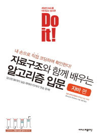

# 🎲 알고리즘
> 📅 2021.05.17 ~ 

 

|[Do it! 자료구조와 함께 배우는 알고리즘 입문 : 자바편](https://books.google.co.kr/books/about/Do_it_%EC%9E%90%EB%A3%8C%EA%B5%AC%EC%A1%B0%EC%99%80_%ED%95%A8%EA%BB%98_%EB%B0%B0%EC%9A%B0%EB%8A%94.html?id=UMB9DwAAQBAJ&source=kp_book_description&redir_esc=y)|
|---|
|보요 시바타 지음, 강민 옮김|
|이지스퍼블리싱|

 

## 책 목차
|날짜|목차|
|:---:|---|
|05.17|[Chapter.01 기본 알고리즘](./CH.01.md)|
|05.21|[Chapter.02 기본 자료구조](./CH.02.md)|
|05.21|[Chapter.03 검색](./CH.03.md)|
|05.24|[Chapter.04 스택과 큐](./CH.04.md)|
|05.24|[Chapter.05 재귀 알고리즘](./CH.05.md)|
|05.28 06.10|Chapter.06 정렬|
|`예정`|Chapter.07 집합|
|`예정`|Chapter.08 문자열 검색|
|`예정`|Chapter.09 리스트|
|`예정`|Chapter.10 트리|
|`예정`|Chapter.11 해시|

---

@Copyright [김수빈](https://github.com/Kim-SuBin)
