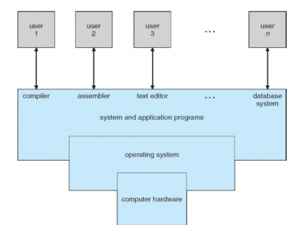
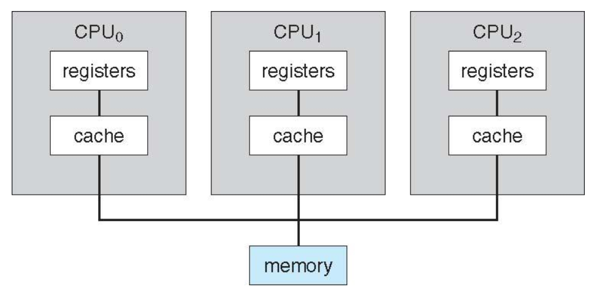
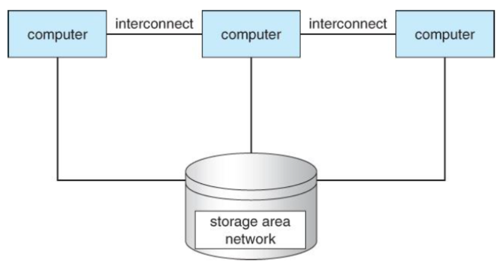
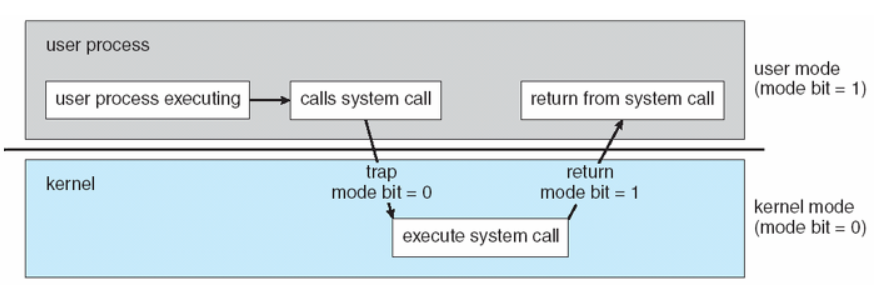

## 운영체제의 기능

컴퓨터 시스템에서 운영체제가 수행하는 역할에 대해 살펴보자

- 컴퓨터 시스템
  1. 하드웨어: 중앙 처리 장치(CPU), 메모리 및 입출력(I/O) 장치로 구성  
     => 기본 계산용 자원을 제공
  2. 응용 프로그램: 워드 프로세서, 스프레드시트, 컴파일러, 웹 브라우저 등을 말함  
     => 사용자의 계산 문제를 해결하기 위해 자원의 사용 방법 정의
  3. 운영체제: 컴퓨터 하드웨어를 관리하는 프로그램
     - 다양한 사용자를 위해 여러 응용프로그램간의 하드웨어 사용을 제어하고 조정하는 역할 담당
     - 컴퓨터 시스템이 동작할 때 이들 자원을 적절하게 사용하는 방법을 제공
  4. 사용자
    
           
    
운영체제의 역할을 사용자와 시스템 관점에서 살펴보자

### 사용자 관점(User View)        
사용되는 인터페이스에 다르게 설계
  1. 일반적인 사용자(PC)
        - 성능에만 신경 쓰고 자원의 이용(하드웨어와 소프트웨어 자원이 어떻게 공유되는지)에는 신경 안씀      
    
        => 운영체제는 한 사용자가 사용하기 적합하도록 최적화
  2. 대형 컴퓨터나 미니 컴퓨터에 연결된 터미널 사용자(ex>유닉스 사용자)     
        * 유닉스(Unix): 범용 다중 사용자 방식의 대화식, 시분할(interactive time-sharing) 운영체제 
        - 사용자들은 자원을 공유하며 정보 교환할 수 있음  
        
        => 운영체제는 자원 이용을 극대화하도록 설계되어 모든 가용 CPU시간과 메모리 및 입출력은 효율적으로 사용됨
  3. 워크스테이션-서버 사용자(웹 서버) 
        - 각 사용자들은 전용 자원을 가짐 
        - 네트워킹과 서버-파일, 계산 및 프린트 서버 공유  
        
        => 운영체제는 개인의 사용 편이성과 자원 이용 간에 적절한 조화를 이루도록 설계

### 시스템 관점(System View)
  1. 자원 할당자(Resource Allocator)
     - 모든 자원(CPU 시간, 메모리 공간, 파일 저장 공간, 입출력 장치 등)을 관리
     - 컴퓨터 시스템을 효율적이고 공정하게 운영하는 방향으로 자원 할당
  2. 제어 프로그램(Control Program)
     - 컴퓨터의 부적절한 사용을 방지하기 위해 사용자 프로그램의 수행을 제어
     - 특히, 입출력 장치의 제어와 작동에 깊이 관여

### 운영체제의 정의
운영체제에 대해 완벽한 정의는 없음.     
컴퓨터 시스템의 근본 목적은 사용자 프로그램을 실행하고, 사용자 문제의 해결을 쉽게 해주는 것      
이를 위해 하드웨어 제작, 응용 프로그램도 개발       
=> 다양한 프로그램들은 `공통적인 연산`을 필요로 함        
=> 여기에 자원을 제어하고 할당하는 공통 기능을 하나의 소프트웨어로 통합한 것이 `운영체제` 

운영체제는 컴퓨터에서 항상 수행되는 프로그램        
=> 일반적으로 `커널`(운영체제의 핵심적인 부분)이라고 불림       
=> `커널`은 좁은 의미의 운영체제, 일반적으로 넓은 의미의 운영체제는 다음과 같은 프로그램들을 포함
1. 시스템 프로그램: 운영체제와 연관되어 있지만 커널에 반드시 포함될 필요는 없는 프로그램
2. 응용 프로그램: 시스템의 작동과 관계없는 모든 프로그램 포함(이게 무슨 의미일까...)

## 컴퓨터 시스템의 구성
### 컴퓨터 시스템 연산
- 현대의 컴퓨터
    1. 공유 메모리에 접근을 제공하는 공통 버스에 의해 연결된 여러 개의 장치 제어기와 하나 이상의 CPU로 구성
    2. 각 장치 제어기는 특정 장치를 관리
    3. CPU와 장치 제어기는 메모리 사이클을 얻기 위해 병렬 수행될 수 있음
    4. 메모리 제어기는 공유 메모리에 대한 질서 있는 접근을 위해 메모리 접근을 동기화함

    

- 컴퓨터 구동 과정
    1. 구동을 위한 `초기 프로그램(bootstrap program)`을 가지고 있어야 함
        - 보통 읽기 전용 메모리(ROM, Read-Only Memory, 펌웨어라고 알려져 있음)나 EEPROM에 저장됨
        - CPU 레지스터로부터 장치 제어기, 메모리 내용 등을 포함한 시스템을 모두 초기화
        - 운영체제를 적재하는 방법과 수행 시작하는 방법 알기 위해 운영체제의 커널을 찾아 메모리에 적재
    2. 커널이 적재되고 수행이 시작되면 시스템과 사용자에게 서비스 제공
        - 일부 서비스는 시스템 프로그램에 의해 제공     
        => boot 시에 메모리에 적재돼 커널이 수행되는 동안 계속 수행되는 시스템 프로세스나 시스템 디먼이 됨
        - 완전히 boot되면 사용자로부터 event가 발생하길 기다림
    3. event가 발생하면 하드웨어나 소프트웨어로부터 발생한 인터럽트(interrupt)에 의해 신호 보내짐
        - 하드웨어는 언제든 시스템 버스 통해 CPU에 신호 보내서 인터럽트 발생시킬 수 있음
        - 소프트웨어는 시스템 호출 통해서만 인터럽트 발생시킬 수 있음
    4. CPU가 인터럽트 되면, 하던 일 중단하고 고정된 위치로 실행 옮김
        - 고정된 위치는 인터럽트 서비스 루틴(interrupt Service Routine, ISR)이 위치한 시작 주소를 가지고 있음       
        => 인터럽트 서비스 루틴: 인터럽트 접수에 의해 발생되는 인터럽트에 대응하여 특정 기능을 처리하는 기계어 코드 루틴
        - 인터럽트 서비스 루틴 실행
        - 인터럽트 완료 되면 CPU는 기존 연산 재개
        - 최근에는 시스템 스택에 복귀 주소를 저장한 후 인터럽트 완료된 후에 pop하여 바로 기존 연산을 실행하는 방식
        
### 저장 장치 구조(Storage Structure)
1. 컴퓨터는 대부분의 프로그램을 주 메모리(Random-Access Memory, RAM, 재기록 가능)에서 가져옴
2. ROM(읽기 전용 메모리)과 EEPROM(전기적으로 데이터를 쓰고 지울 수 있는 비휘발성 메모리)도 있음
    - ROM: 데이터를 변경할 수 없으므로 정적 프로그램만 저장
    - EEPROM: 데이터 변경 가능하나 자주는 못 바꿔서 대부분 정적 프로그램 저장
3. 모든 메모리는 byte 배열 제공 => 각 바이트는 주소값을 가짐
4. 특정 메모리 주소들에 대한 적재(load), 저장(store)명령을 통해 상호작용 이뤄짐
    - 적재: RAM에서 CPU 내부의 레지스터로 1 byte 또는 1 word를 옮기는 것
    - 저장: 레지스터의 내용을 RAM으로 옮김
5. 명시적인 명령(적재, 저장) 외에, CPU는 실행을 위해 자동으로 RAM으로부터 명령 적재

- 폰 노이만 구조 시스템에서 실행되는 명령-실행 사이클
    1. 메모리부터 명령 인출해 명령 레지스터(instruction register)에 저장하고 명령 해독      
    2. 이때, 메모리로부터 피연산자를 가져와 내부 레지스터에 저장할 수도 있음
    3. 명령 실행 후 결과가 다시 메모리에 저장될 수 있음

* 메모리 장치는 메모리 주소만을 인식      
=> 메모리는 주소(명령 카운터(instruction counter), 색인(indexing), 간접 주소(indirection), 리터럴 주소(literal ad-dresses) 등)의 생성 과정도 모르고, 무엇인지도 모름!!      
=> 생성된 메모리 주소에만 신경쓰면 됨

- 컴퓨터 저장 장치
    1. RAM은 영구 저장이 불가능
        - 모든 프로그램과 데이터를 영구 저장하기에는 용량이 너무 작음
        - 전원이 공급되지 않으면 내용이 삭제되는 휘발성 저장장치
    2. 대부분의 컴퓨터 시스템은 보조 저장 장치 제공
        - 보조 저장 장치는 대량의 데이터를 영구 보존할 수 있어야 됨
        - 일반적인 장치는 프로그램과 데이터 모두 저장 가능한 자기 디스크       
        => 대부분의 프로그램은 메모리에 적재될 때까지 디스크에 저장됨
    3. 이외에도 저장 장치에는 캐시 메모리, CD-ROM, 자기 테이프 등이 있음
    4. 모든 저장 장치 시스템은 데이터 저장 기능과 보관 기능 제공
    5. 속도, 가격, 크기, 휘발성에서 차이가 있음
    6. 컴퓨터 시스템에서 저장 장치 시스템은 속도와 가격에 따라 하나의 계층으로 구성됨

                 
        
        => 컴퓨터 시스템은 각 저장장치의 성능과 비용을 고려해 가장 효율성이 높은 방향으로 구성됨

### 입출력 구조
- 저장 장치는 컴퓨터 내의 입출력 장치 중의 하나!        
(컴퓨터 시스템 = 메모리 <--메모리 제어기--> 각종 장치 제어기 + CPU)
- 장치 제어기
    1. 장치 제어기에 여러개의 장치가 부착될 수 있음     
        => 예) SCSI(Small Computer Systems Interface)제어기에는 7개 이상의 장치 부착 가능
    2. 로컬 버퍼 저장 장치와 특수 목적용 레지스터 집합으로 이뤄짐
    3. 자신이 제어하는 주변 장치와 자신의 로컬 버퍼 저장 장치 사이의 데이터 전송 담당
    4. 디바이스 드라이버 모두 갖고 있음        
- 입출력 연산 방법
    1. 인터럽트 구동 방식
        - 디바이스 드라이버는 장치 제어기의 적절한 레지스터에 필요한 값 적재
        - 장치 제어기는 취할 동작("키보드에서 문자를 읽어라" 이런 것처럼)을 결정하기 위해 이들 레지스터의 내용 조사
        - 제어기는 장치로부터 자신의 로컬 버퍼로 데이터 전송
        - 데이터 전송 완료되면 인터럽트를 이용해 디바이스 드라이버에게 알림
        - 디바이스 드라이버는 제어를 운영체제에게 반환     
            => 입력 완료인 경우에는 데이터나 데이터에 대한 포인터를 같이 반환할 수 있음     
            => 다른 동작이면 상태 정보 반환     

        => `한 바이트`마다 인터럽트가 발생하기 때문에 대량의 데이터를 전송할 경우에는 높은 오버헤드가 발생 

    2. `직접 메모리 접근(DMA, Direct Memory Access)` 장치 사용 방식
        * DMA는 주변장치들이 메모리에 직접 접근하는 것을 가능하게 함       
            => CPU의 개입 없이 입출력 장치와 기억장치 사이의 데이터를 전송
        - 장치에 대한 버퍼 및 포인터, 입출력 카운트를 세팅
        - 장치 제어기는 CPU의 개입 없이 메모리로부터 자신의 버퍼 장치로 or 버퍼로부터 메모리로 `데이터 블록 전체`를 전송       
        - 블록 전송이 완료될 때마다 인터럽트가 발생        
            => 장치 제어기가 전송하는 동안 CPU는 다른 작업 수행할 수 있음
        
- 몇몇 고가의 시스템은 버스 대신에 스위치 구조 사용     
    => 다수의 구성요소들이 다른 구성요소들과 동시에 통신하는 것이 가능      
    => DMA의 사용이 더욱 효과적     
     

## 컴퓨터 시스템 구조
컴퓨터 시스템은 사용된 범용 처리기의 수에 따라 분류됨
### 단일 처리기 시스템(Single-Processor Systems)
1. 하나의 주 CPU를 가짐 => 이 CPU는 사용자 프로세스의 명령어를 포함해 범용 명령어 집합을 수행할 수 있음
2. 대부분 특수 목적의 `전용 처리기`를 가지고 있음
    - 특정 장치 처리기(ex> 디스크, 키보드, 그래픽 제어기)나 입출력 처리기와 같은 범용 처리기 형태
    - 제한된 명령어 집합을 실행, 사용자 프로세스는 실행하지 않음 => 역할이 제한적
    - 운영체제에 의해 관리되기도 함, 운영체제가 처리기들이 수행할 다음 업무에 대한 정보를 전송하고 처리기들의 상태를 감시       
    - 예시      
        1. 디스크 제어기 마이크로프로세서는 주 CPU로부터 요청 받아들여 자기 고유의 디스크 큐와 `스케줄링 알고리즘` 구현 (CPU의 오버헤드 감소)  
        2. PC의 키보드는 키스트로크를 CPU에 전송할 코드로 변환하는 마이크로프로세서를 가지고 있음
    - 운영체제는 이 처리기들과 통신할 수 없음, 처리기들은 독립적으로 자신의 작업 처리
3. `전용 마이크로프로세서`의 사용은 일반적임, 이거 있다고 단일 처리기 시스템이 다중 처리기 시스템으로 변환되진 않음

### 다중 처리기 시스템(Multiprocessor Systems) 
1. `다중 처리기 시스템`(`병렬 시스템` or `멀티코어 시스템`이라고도 함)은 하나 이상의 처리기들을 가짐        
    => 처리기들은 컴퓨터 버스, 클락, 메모리와 주변 장치 등을 공유
2. 장점
    - 처리량 증가
        1. 처리기 수가 증가됨에 따라 짧은 시간 내에 더 많은 작업을 수행할 수 있음
        2. 하지만 N개의 처리기를 사용한다고  속도 증가율이 N배가 되는 것은 아님
        3. 하나의 업무를 위해 처리기들이 협력한다면 정확히 동작하기 위해 약간의 오버헤드 발생
    - 비용 감소
        1. 여러 개의 단일 시스템에 비해 비용 절약 가능      
        2. 처리기들이 주변 장치, 대용량 저장 장치, 전원 공급 장치를 공유하기 때문
    - 신뢰도 증가
        1. 기능들이 적절히 분산된다면 처리기 하나가 고장나더라도 시스템 전체가 정지되지 않음        
        2. 단지, 처리 속도가 조금 느려짐
3. 하드웨어의 수준에 따라 연속적인 서비스를 제공하는 능력을 `우아한 퇴보(graceful degra-dation)`라고 함
4. 시스템의 한 구성요소가 고장나더라도 동작을 계속할 수 있다면 우아한 퇴보를 넘어 `결함 허용(fault tolerant)`이라고 함      
    (고장나도 이전과 같은 속도로 동작이 계속 수행되는 경우를 뜻하는 거 같음)        
    => 결함 허용 시스템은 오류를 탐지하고 진단하는 기법 필요, 가능하다면 오류 교정도 할 수 있어야 함
5. 다중 처리기 시스템의 형태
    - 비대칭적 다중 처리(Asymmetric Multiproccessing)      
        1. 하나의 주 처리기가 시스템을 제어
        2. 주 처리기는 작업을 스케줄하고 종속 처리기에 작업을 할당
        3. 다른 처리기들은 주 처리기의 명령을 수행하거나 미리 정의된 업무를 수행
        4. 주종 관계를 가짐
    - 대칭적 다중 처리(Symmetric Multiproccessing, SMP)
        1. 가장 일반적인 형태
        2. 각 처리기는 운영체제 내의 모든 작업을 수행
        3. 각 처리기는 자신의 레지스터 집합과 캐시를 가짐
        4. 모든 처리기는 메모리를 공유
        5. 주종 관계가 없음
        6. 위험한 성능 저하를 일으키지 않고 많은 프로세스들이 동시에 수행될 수 있음
        7. 하지만 데이터가 해당 처리기로 올바르게 전달되기 위해 입출력 제어를 신중하게 해야함
        8. CPU가 분리되어 있기에 CPU간 수행되는 작업의 양이 달라 비효율이 야기될 수 있음        
            => 처리기들이 일부 자료 구조를 공유한다면 비효율 없앨 수 있음       
            => 처리기 간에 프로세스와 자원(메모리 같은)이 동적으로 공유되어 처리기 간의 불균형을 줄일 수 있음

         
6. 최근에는 CPU를 설계할 때 하나의 칩에 여러 개의 코어를 포함시킴 => `멀티코어`
    - 단일 코어를 가진 여러 개의 칩보다 효율적      
        => 칩 내의 통신이 칩 사이의 통신보다 빠르기 때문
    - 전력도 적게 소모
    - 멀티코어 시스템은 모두 다중 처리기 시스템이지만 다중 처리기 시스템이 모두 멀티코어인 것은 아님!!

### 클러스터형 시스템(Clustered Systems)
1. 2개 이상의 독자적 시스템의 LAN연결로 구성되어 있으며, 데이터 저장공간을 공유    
    => 이 시스템들은 `약결합` 시스템(프로세스마다 독립된 메모리를 가지는 시스템)
    => 각 시스템은 단일 처리기 시스템 or 멀티코어 시스템일 수 있음
2. `높은 가용성`을 제공하기 위해 사용       
    => 하나 이상의 컴퓨터 시스템이 고장나도 서비스는 계속 제공됨
3. 동작 과정
    - 각 컴퓨터가 응용 프로그램 실행
    - 각 컴퓨터는 연결되어 있는 다른 컴퓨터들을 감시
    - 만일, 감시하던 컴퓨터가 고장 나면 해당 컴퓨터의 저장 장치에 대한 소유권을 넘겨받음
    - 해당 컴퓨터에서 실행하던 응용 프로그램 마저 실행      
    => 클라이언트는 일시적인 서비스 중단만을 경험하게 됨
4. 클러스터형 시스템의 형태
    - `비대칭형 클러스터링 모드` 
        1. 다른 컴퓨터들이 응용 프로그램을 실행하는 동안 한 컴퓨터만 `긴급 대기(hot-standby)모드` 유지
        2. 해당 컴퓨터는 활성된 컴퓨터들을 감시하는 작업만 함
        3. 다른 컴퓨터가 고장나면 긴급 대기 모드의 컴퓨터가 활성 상태가 됨
    - 대칭형 클러스터링 모드
        1. 둘 이상의 컴퓨터가 응용 프로그램 실행하고 서로 감시
        2. 가용한 하드웨어를 모두 사용하기 때문에 비대칭형보다 효율적       
            => 하나 이상의 응용 프로그램들이 실행 가능해야 효율적으로 동작 가능
5. `고성능 계산환경`을 제공     
    => 네트워크로 연결된 다수의 컴퓨터 시스템을 병렬 수행할 수 있기 때문

     

## 운영체제의 구조
1. 운영체제는 프로그램이 수행될 환경을 제공
2. 운영체제는 `다중 프로그래밍(multiprogramming)`이 가능      
    => 다중 프로그래밍은 CPU가 수행할 작업을 항상 한개는 가지도록 작업을 구성함으로써 CPU 이용률 증가시킴
3. 기본 프로그래밍 과정
    - 시스템에 들어오는 모든 작업은 일단 디스크 내 작업 풀에 적재됨
    - 운영체제는 이 중에서 선택한 것을 메모리에 탑재
    - 운영체제는 메모리 내 작업 중 하나를 선택해 실행
    - 해당 작업은 어떤 일(입출력의 종료와 같은)을 기다려야 하게 됨      
4. `비다중 프로그래밍`: 기다리는 동안 CPU가 쉼
5. `다중 프로그래밍`: 운영체제가 다른 작업으로 전환해 CPU를 실행시킴        
    => 수행될 작업이 하나라도 있다면 CPU는 쉬지 않음
6. `시분할`(또는 `멀티태스킹`(multi-tasking)): 다중 프로그래밍의 논리적 확장
    - 시분할 시스템
        1. CPU가 다수의 작업들을 매우 빈번하게 교대하며 수행     
            => 프로그램이 실행되는 동안 사용자들은 자신의 프로그램과 상호 작용할 수 있음
        2. 사용자와 시스템 간에 직접적인 통신을 제공하는 대화식 컴퓨터 시스템 필요 (키보드, 마우스 입력과 같이)
        3. 시스템의 응답 시간은 짧아야 함
    - 시분할 운영체제
        1. 동시에 많은 사용자가 컴퓨터를 공유하도록 함
        2. 각 사용자는 짧은 시간동안만 CPU시간이 필요함 (시분할 시스템에서 각 동작이나 명령은 짧음)     
            => 시스템이 다른 사용자로 빠르게 전환됨     
            => 각 사용자는 자기 혼자 전체 컴퓨터를 사용하는 것처럼 느끼지만, 실제로는 다수가 공유함
        3. 각 사용자에게 시분할 되는 컴퓨터의 작은 부분을 제공하기 위해 `CPU스케줄링`과 `다중 프로그래밍`을 사용
        4. 각 사용자는 메모리에 최소한 하나의 독립된 프로그램을 가지고 있음
7. `프로세스`: 메모리에 적재되어 실행되고 있는 프로그램 
8. `작업 스케줄링`: 메모리 공간의 여유가 없을 때 적재할 작업을 결정하는 것
9. `CPU 스케줄링`: 동시에 실행 준비된 작업이 여러 개일 때 그 중 하나를 선택하는 것
10. `스와핑`: 프로세스를 주 메모리에서 디스크로 스왑인(swap-in) 또는 스왑아웃(swap-out)시킴
11. `가상 메모리(virtual memory)`: 각 프로그램에 실제 메모리 주소가 아닌 가상의 메모리 주소를 주는 방식     
    - 프로그램이 `물리 메모리`의 크기보다 커도 됨
    - 가상 메모리는 주 메모리를 크고 균등한 저장 장치의 배열로 추상화 => 논리 메모리를 물리 메모리로부터 분리시킴

## 운영체제 연산
1. 현대의 운영체제는 `인터럽트 구동식(interrupt driven)`임
2. event가 발생하면 `인터럽트`나 `트랩(or 오류)`을 발생시켜 신호를 보냄
3. 트랩은 오류 또는 사용자 프로그램의 운영체제 서비스 수행 요청에 의해 발생된 소프트웨어가 생성한 인터럽트임
4. 각 타입의 인터럽트에 대해 취할 행동은 운영체제 내의 서로 다른 코드 세그먼트가 결정
5. 하나의 인터럽트를 처리하기 위해 하나의 인터럽트 서비스 루틴이 제공됨
6. 운영체제와 사용자는 시스템의 하드웨어와 소프트웨어 자원을 공유       
    => 사용자 프로그램의 오류가 다른 프로그램에 영향을 끼쳐선 안됨 (아주,,중요)

### 이중 연산 모드
운영체제가 적절하게 동작하기 위해 운영체제 코드와 사용자 정의 코드의 실행은 구분돼야 함
1. 두 개의 독립된 연산 모드 필요 => 사용자 모드, 커널 모드(수퍼바이저 모드, 시스템 모드, 혹은 특권 모드-privileged mode)
2. 모드 비트로 현재 모드 확인 => 커널 모드(0), 사용자 모드(1)
3. 컴퓨터 시스템이 사용자 응용을 위해 실행되면 시스템은 사용자 모드가 됨
4. 사용자 응용이 운영체제에 서비스를 요청하면 커널 모드로 전환됨
5. 시스템 부트 시, 하드웨어는 커널 모드에서 시작
6. 운영체제 적재되고 사용자 모드에서 사용자 프로세스 시작
8. 트랩이나 인터럽트, 시스템 호출이 발생할 때마다 하드웨어는 사용자 모드에서 커널 모드로 전환        
    => 운영체제가 컴퓨터의 제어를 얻을 때마다 커널 모드에 있게 됨
9. 시스템과 사용자를 보호하기 위해 악영향을 끼칠 수 있는 명령은 `특권 명령`으로 지정
    - 특권 명령의 예: 커널 모드로 전환, 입출력 제어, 타이머 관리, 인터럽트 관리 위한 명령어 등   
    => 하드웨어는 커널 모드에서만 특권 명령을 수행함        
    => 사용자 모드에서 특권 명령 수행하려고 하면 하드웨어는 운영체제로 트랩을 검
10. 시스템 호출     
    - 사용자 프로세스가 운영체제에게 작업을 요청할 수 있는 방법 제공
    - 일반적으로 인터럽트 벡터(여러 인터럽트 상황에 대해 해당 인터럽트 발생 시 처리해야 할 루틴의 주소를 담고 있는 테이블)의 특정 위치로 트랩을 검      
        => 해당 트랩은 보통 trap 명령어를 수행하지만 몇몇 시스템은 syscall이라는 특정 명령어를 가지기도 함
    1. 시스템 호출 수행되면 얘는 소프트웨어 인터럽트로 취급됨
    2. 제어가 인터럽트 벡터 통해 운영체제 내 서비스 루틴으로 전달
    3. 모드비트 커널 모드로 설정
    4. 커널은 인터럽트 발생시킨 명령어 검사해 시스템 호출 발생 종류 결정
    5. 커널은 같이 전달된 인수가 정확한지 검증, 요청 수행 후 제어를 시스템 호출 다음의 명령어로 복귀시킴

     

=> 사용자 모드에서 커널 모드로 전환되는 과정

### 타이머
1. 사용자 프로그램이 무한 루프에 빠지거나 시스템 서비스 호출에 실패해 제어가 운영체제로 복귀되지 않는 경우를 방지하기 위해 사용
2. 지정된 시간 후 컴퓨터를 인터럽트 하도록 설정할 수 있음
3. 시간은 고정(1/60s), 가변(1ms~1s)일 수 있음
4. 가변 타이머는 고정 비율 시계(fixed-rate clock)와 counter로 구현      
5. 타이머 사용 과정
    1. 운영체제는 counter값을 설정
    2. 시계가 똑딱(tick)할 때마다 counter 감소
    3. counter가 0이 되면 입터럽트 발생
6. 사용자에게 제어를 넘기기 전에 운영체제는 타이머가 설정되었는지 확인
7. 타이머가 인터럽트 발생하면 제어는 자동적으로 운영체제에게 넘어감
8. 타이머의 값을 변경하는 명령은 `특권 명령`

## 프로세스 관리
1. 프로세스는 일 수행하기 위해 CPU 시간, 메모리, 파일, 입출력 장치 등의 자원을 필요로 함        
    => 자원은 프로세스 생성될 때 받거나 실행되는 동안 할당됨
2. 프로그램은 수동적 개체이지만, 프로세스는 프로그램 카운터(program counter)를 가지는 능동적 개체
3. 프로세스의 수행은 무조건 순차적임        
    => CPU는 프로세스 끝날 때까지 명령들을 차례대로 수행
4. 다중 스레드 프로세스는 여러개의 프로그램 카운터를 가짐       
    => 이 카운터들은 각 스레드가 실행할 다음 명령어를 가리킴
5. 한 프로세스는 한 시스템 내의 작업 단위
6. 모든 프로세스는 하나의 CPU를 멀티플렉싱(multiplexing)함으로써 병행 수행될 수 있음
7. 운영체제는 다음과 같이 프로세스 관리
    - CPU에 프로세스와 스레드를 스케줄
    - 사용자 프로세스와 시스템 프로세스의 생성 및 제거
    - 프로세스의 일시 중지와 재수행
    - 프로세스 동기화를 위한 기법 제공
    - 프로세스 통신을 위한 기법 제공

## 메모리 관리
1. 메모리는 바이트(byte)의 대용량 배열
2. 각 바이트는 자신의 주소를 가짐
3. 주 메모리는 CPU와 입출력 장치에 의해 공유되는 빠른 접근이 가능한 데이터 저장소
4. 폰 노이만 방식 컴퓨터에선 CPU가 명령어 인출 주기(instruction fetch-cycle) 동안 주 메모리로부터 명령어 읽고, 자료 인출 주기(data fetch-cycle) 동안 주 메모리로부터 데이터 읽고 씀         
    => 주 메모리는 CPU가 직접 주소 지정하고 접근할 수 있는 유일한 대량 메모리       
    => CPU가 데이터 처리하거나 명령 수행하려면 데이터나 명령이 주 메모리에 있어야 함
5. 프로그램이 수행되려면 절대 주소로 매핑(mapping)되고 메모리에 적재돼야 함
6. 메모리에 여러 프로그램 적재하려면 `메모리 관리 기법` 필요
7. 운영체제는 다음과 같이 메모리 관리
    - 메모리의 어느 부분이 사용되고 있는지 누가 사용하고 있는지 추적
    - 어떤 프로세스들을 메모리에 적재하고 제거할 건지 결정
    - 필요에 따라 메모리 공간 할당하고 회수

## 저장장치 관리
운영체제는 저장 장치의 물리적 특성을 추상화해 논리적인 저장 단위인 `파일`을 정의        
운영체제는 파일을 물리적 매체로 맵하며, 저장 장치를 통해 파일에 접근
### 파일 시스템 관리
1. 파일: 파일 생성자에 의해 정의된 관련 정보의 집합체       
    => 일반적으로 프로그램과 데이터를 나타냄
2. 운영체제 다음과 같이 파일 관리
    - 파일 생성 및 제거
    - 디렉토리 생성 및 제거
    - 파일과 디렉토리 조작하기 위한 프리미티브(원어)의 제공
    - 파일을 보조 저장 장치로 매핑
    - 안정적인(비휘발성) 저장 매체에 파일 백업

### 대용량 저장장치 관리
1. 주 메모리는 용량이 작고 휘발성이기 때문에 보조 저장 장치가 꼭 있어야 함
2. 대부분의 컴퓨터 시스템은 디스크를 온라인 저장 매체로 사용
3. 대부분의 프로그램은 메모리에 적재되기 전에 디스크에 저장됨
4. 운영체제는 다음과 같이 디스크 관리
    - 자유 공간(free-space)의 관리
    - 저장 장소 할당
    - 디스크 스케줄링
5. 보조 저장 장치는 자주 사용되니까 효율적으로 써야 함      
    => 컴퓨터의 전체 동작 속도는 디스크 서브시스템과 이걸 조작하는 알고리즘 속도에 의해 결정될 수 있음
