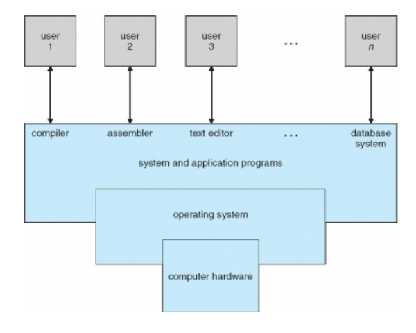
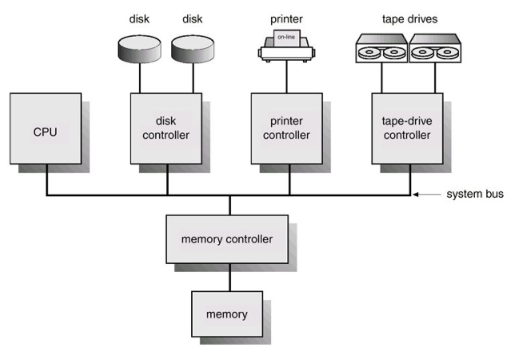
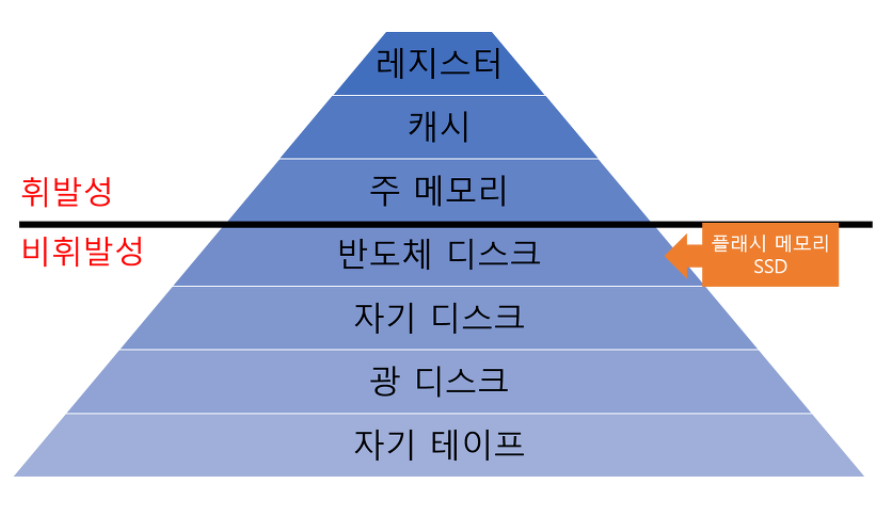
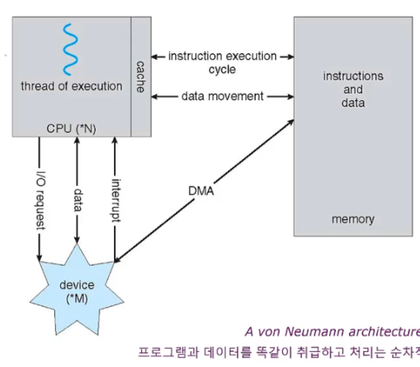

## 운영체제의 기능

컴퓨터 시스템에서 운영체제가 수행하는 역할에 대해 살펴보자

- 컴퓨터 시스템
  1. 하드웨어: 중앙 처리 장치(CPU), 메모리 및 입출력(I/O) 장치로 구성  
     => 기본 계산용 자원을 제공
  2. 응용 프로그램: 워드 프로세서, 스프레드시트, 컴파일러, 웹 브라우저 등을 말함  
     => 사용자의 계산 문제를 해결하기 위해 자원의 사용 방법 정의
  3. 운영체제: 컴퓨터 하드웨어를 관리하는 프로그램
     - 다양한 사용자를 위해 여러 응용프로그램간의 하드웨어 사용을 제어하고 조정하는 역할 담당
     - 컴퓨터 시스템이 동작할 때 이들 자원을 적절하게 사용하는 방법을 제공
  4. 사용자
    
           
    
운영체제의 역할을 사용자와 시스템 관점에서 살펴보자

### 사용자 관점(User View)        
사용되는 인터페이스에 다르게 설계
  1. 일반적인 사용자(PC)
        - 성능에만 신경 쓰고 자원의 이용(하드웨어와 소프트웨어 자원이 어떻게 공유되는지)에는 신경 안씀 
        => 운영체제는 한 사용자가 사용하기 적합하도록 최적화
  2. 대형 컴퓨터나 미니 컴퓨터에 연결된 터미널 사용자(ex>유닉스 사용자)     
        * 유닉스(Unix): 범용 다중 사용자 방식의 대화식, 시분할(interactive time-sharing) 운영체제 
        - 사용자들은 자원을 공유하며 정보 교환할 수 있음  
        => 운영체제는 자원 이용을 극대화하도록 설계되어 모든 가용 CPU시간과 메모리 및 입출력은 효율적으로 사용됨
  3. 워크스테이션-서버 사용자(웹 서버) 
        - 각 사용자들은 전용 자원을 가짐 
        - 네트워킹과 서버-파일, 계산 및 프린트 서버 공유  
        => 운영체제는 개인의 사용 편이성과 자원 이용 간에 적절한 조화를 이루도록 설계

### 시스템 관점(System View)
  1. 자원 할당자(Resource Allocator)
     - 모든 자원(CPU 시간, 메모리 공간, 파일 저장 공간, 입출력 장치 등)을 관리
     - 컴퓨터 시스템을 효율적이고 공정하게 운영하는 방향으로 자원 할당
  2. 제어 프로그램(Control Program)
     - 컴퓨터의 부적절한 사용을 방지하기 위해 사용자 프로그램의 수행을 제어
     - 특히, 입출력 장치의 제어와 작동에 깊이 관여

### 운영체제의 정의
운영체제에 대해 완벽한 정의는 없음.     
컴퓨터 시스템의 근본 목적은 사용자 프로그램을 실행하고, 사용자 문제의 해결을 쉽게 해주는 것      
이를 위해 하드웨어 제작, 응용 프로그램도 개발       
=> 다양한 프로그램들은 `공통적인 연산`을 필요로 함        
=> 여기에 자원을 제어하고 할당하는 공통 기능을 하나의 소프트웨어로 통합한 것이 `운영체제` 

운영체제는 컴퓨터에서 항상 수행되는 프로그램        
=> 일반적으로 `커널`(운영체제의 핵심적인 부분)이라고 불림       
=> `커널`은 좁은 의미의 운영체제, 일반적으로 넓은 의미의 운영체제는 다음과 같은 프로그램들을 포함
1. 시스템 프로그램: 운영체제와 연관되어 있지만 커널에 반드시 포함될 필요는 없는 프로그램
2. 응용 프로그램: 시스템의 작동과 관계없는 모든 프로그램 포함(이게 무슨 의미일까...)

## 컴퓨터 시스템의 구성
### 컴퓨터 시스템 연산
- 현대의 컴퓨터
    1. 공유 메모리에 접근을 제공하는 공통 버스에 의해 연결된 여러 개의 장치 제어기와 하나 이상의 CPU로 구성
    2. 각 장치 제어기는 특정 장치를 관리
    3. CPU와 장치 제어기는 메모리 사이클을 얻기 위해 병렬 수행될 수 있음
    4. 메모리 제어기는 공유 메모리에 대한 질서 있는 접근을 위해 메모리 접근을 동기화함

    

- 컴퓨터 구동 과정
    1. 구동을 위한 `초기 프로그램(bootstrap program)`을 가지고 있어야 함
        - 보통 읽기 전용 메모리(ROM, Read-Only Memory, 펌웨어라고 알려져 있음)나 EEPROM에 저장됨
        - CPU 레지스터로부터 장치 제어기, 메모리 내용 등을 포함한 시스템을 모두 초기화
        - 운영체제를 적재하는 방법과 수행 시작하는 방법 알기 위해 운영체제의 커널을 찾아 메모리에 적재
    2. 커널이 적재되고 수행이 시작되면 시스템과 사용자에게 서비스 제공
        - 일부 서비스는 시스템 프로그램에 의해 제공     
        => 부트 시에 메모리에 적재돼 커널이 수행되는 동안 계속 수행되는 시스템 프로세스나 시스템 디먼이 됨
        - 완전히 적재되면 사용자로부터 event가 발생하길 기다림
    3. event가 발생하면 하드웨어나 소프트웨어로부터 발생한 인터럽트(interrupt)에 의해 신호 보내짐
        - 하드웨어는 언제든 시스템 버스 통해 CPU에 신호 보내서 인터럽트 발생시킬 수 있음
        - 소프트웨어는 시스템 호출 통해서만 인터럽트 발생시킬 수 있음
    4. CPU가 인터럽트 되면, 하던 일 중단하고 고정된 위치로 실행 옮김
        - 고정된 위치는 인터럽트 서비스 루틴(interrupt Service Routine, ISR)이 위치한 시작 주소를 가지고 있음       
        => 인터럽트 서비스 루틴: 인터럽트 접수에 의해 발생되는 인터럽트에 대응하여 특정 기능을 처리하는 기계어 코드 루틴
        - 인터럽트 서비스 루틴 실행
        - 인터럽트 완료 되면 CPU는 기존 연산 재개
        - 최근에는 시스템 스택에 복귀 주소를 저장한 후 인터럽트 완료된 후에 pop하여 바로 기존 연산을 실행하는 방식
        
### 저장 장치 구조(Storage Structure)
1. 컴퓨터는 대부분의 프로그램을 주 메모리(Random-Access Memory, RAM, 재기록 가능)에서 가져옴
2. ROM(읽기 전용 메모리)과 EEPROM(전기적으로 데이터를 쓰고 지울 수 있는 비휘발성 메모리)도 있음
    - ROM: 데이터를 변경할 수 없으므로 정적 프로그램만 저장
    - EEPROM: 데이터 변경 가능하나 자주는 못 바꿔서 대부분 정적 프로그램 저장
3. 모든 메모리는 byte 배열 제공 => 각 바이트는 주소값을 가짐
4. 이 특정 메모리 주소에 대해서 일련의 적재(load) 또는 저장(store)명령을 통해 상호작용 이뤄짐
    - 적재: RAM에서 CPU 내부의 레지스터로 1 byte 또는 1 word를 옮기는 것
    - 저장: 레지스터의 내용을 RAM으로 옮김
5. 명시적인 명령(적재, 저장) 외에, CPU는 실행을 위해 자동으로 RAM으로부터 명령 적재

- 폰 노이만 구조 시스템에서 실행되는 명령-실행 사이클
    1. 메모리부터 명령 인출해 명령 레지스터(instruction register)에 저장하고 명령 해독      
    2. 이때, 메모리로부터 피연산자를 가져와 내부 레지스터에 저장할 수도 있음
    3. 명령 실행 후 결과가 다시 메모리에 저장될 수 있음

* 메모리 장치는 메모리 주소만을 인식      
=> 메모리는 주소(명령 카운터(instruction counter), 색인(indexing), 간접 주소(indirection), 리터럴 주소(literal ad-dresses) 등)의 생성 과정도 모르고, 무엇인지도 모름!!      
=> 생성된 메모리 주소에만 신경쓰면 됨

- 컴퓨터 저장 장치
    - RAM은 영구 저장이 불가능
        1. 모든 프로그램과 데이터를 영구 저장하기에는 용량이 너무 작음
        2. 전원이 공급되지 않으면 내용이 삭제되는 휘발성 저장장치
    - 대부분의 컴퓨터 시스템은 보조 저장 장치 제공
        1. 보조 저장 장치는 대량의 데이터를 영구 보존할 수 있어야 됨
        2. 일반적인 장치는 프로그램과 데이터 모두 저장 가능한 자기 디스크
            => 대부분의 프로그램은 메모리에 적재될 때까지 디스크에 저장됨
    - 이외에도 저장 장치에는 캐시 메모리, CD-ROM, 자기 테이프 등이 있음
    - 모든 저장 장치 시스템은 데이터 저장 기능과 보관 기능 제공
    - 속도, 가격, 크기, 휘발성에서 차이가 있음
    - 컴퓨터 시스템에서 저장 장치 시스템은 속도와 가격에 따라 하나의 계층으로 구성됨

                 
        
        => 컴퓨터 시스템은 각 저장장치의 성능과 비용을 고려해 가장 효율성이 높은 방향으로 구성됨

### 입출력 구조
- 저장 장치는 컴퓨터 내의 입출력 장치 중의 하나!        
(컴퓨터 시스템 = 메모리 <--메모리 제어기--> 각종 장치 제어기 + CPU)
- 장치 제어기
    1. 장치 제어기에 여러개의 장치가 부착될 수 있음     
        => 예) SCSI(Small Computer Systems Interface)제어기에는 7개 이상의 장치 부착 가능
    2. 로컬 버퍼 저장 장치와 특수 목적용 레지스터 집합으로 이뤄짐
    3. 자신이 제어하는 주변 장치와 자신의 로컬 버퍼 저장 장치 사이의 데이터 전송 담당
    4. 디바이스 드라이버 모두 갖고 있음        
- 입출력 연산 방법
    - 인터럽트 구동 방식
        1. 디바이스 드라이버는 장치 제어기의 적절한 레지스터에 필요한 값 적재
        2. 장치 제어기는 취할 동작("키보드에서 문자를 읽어라" 이런 것처럼)을 결정하기 위해 이들 레지스터의 내용 조사
        3. 제어기는 장치로부터 자신의 로컬 버퍼로 데이터 전송
        4. 데이터 전송 완료되면 인터럽트를 이용해 디바이스 드라이버에게 알림
        5. 디바이스 드라이버는 제어를 운영체제에게 반환     
            => 입력 완료인 경우에는 데이터나 데이터에 대한 포인터를 같이 반환할 수 있음     
            => 다른 동작이면 상태 정보 반환     

        => `한 바이트`마다 인터럽트가 발생하기 때문에 대량의 데이터를 전송할 경우에는 높은 오버헤드가 발생 

    - 직접 메모리 접근(DMA, Direct Memory Access) 장치 사용 방식
        - DMA는 주변장치들이 메모리에 직접 접근하는 것을 가능하게 함       
            => CPU의 개입 없이 입출력 장치와 기억장치 사이의 데이터를 전송
        1. 장치에 대한 버퍼 및 포인터, 입출력 카운트를 세팅
        2. 장치 제어기는 CPU의 개입 없이 메모리로부터 자신의 버퍼 장치로 or 버퍼로부터 메모리로 `데이터 블록 전체`를 전송       
        3. 블록 전송이 완료될 때마다 인터럽트가 발생        
            => 장치 제어기가 전송하는 동안 CPU는 다른 작업 수행할 수 있음
        
- 몇몇 고가의 시스템은 버스 대신에 스위치 구조 사용     
    => 다수의 구성요소들이 다른 구성요소들과 동시에 통신하는 것이 가능      
    => DMA의 사용이 더욱 효과적     
     