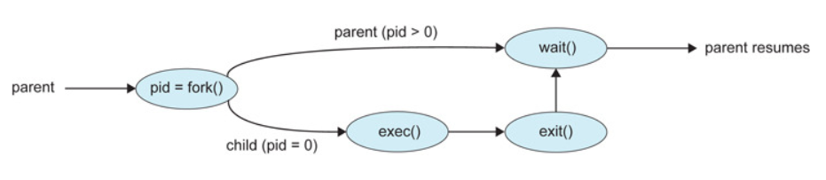
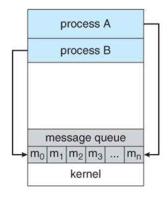
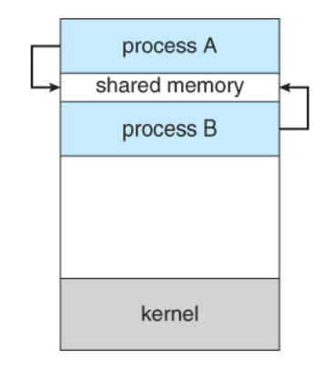
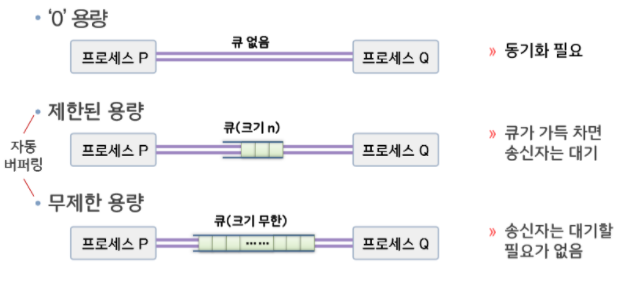

## 프로세스 개념
### 프로세스
1. 프로세스: 메모리에 적재 되어 `실행` 중인 프로그램 => `능동적`
    - 프로그램: 디스크에 저장되어 있는 명령어 리스트를 가진 파일(실행 파일이라고도 함) => `수동적`
2. 프로세스의 구조
    - 텍스트: 프로그램 코드
    - 스택: 함수 매개변수, 복귀 주소와 로컬 변수 같은 임시 자료
    - 데이터: 전역 변수
    - 힙: 실행 중에 동적으로 할당되는 메모리 (C의 malloc 같은) => 코드에서 동적으로 만들어지는 데이터

       

### 프로세스 상태(Process State)
프로세스는 실행되면서 상태가 변함

1. 새로운(new): 프로세스가 생성 중
2. 준비완료(ready): 프로세스가 메모리에 적재되고 Ready Queue에 들어와서 CPU 할당을 기다리는 중
3. 실행(running): CPU를 할당받아 명령어들이 실행 중     
    => CPU 스케줄러에 의해 Ready Queue에 있던 프로세스가 CPU 할당받음
4. 대기(waiting): 프로세스가 어떤 사건(입출력 완료 or 신호 수신 같은)이 일어나기를 기다림       
    => 직역하면 사건이 일어나기를 기다리는 상태이긴 한데 지금 수행되고 있는게 완료되기를 기다린다고 생각하면 됨
5. 종료(terminated): 프로세스 실행 종료     
- 단일 처리기에서는 하나의 프로세스만 실행될 수 있음      
- 많은 프로세스들이 준비완료 및 대기 상태에 있을 수 있음

### 프로세스 제어 블록(Process Control Block)
PCB는 운영체제가 프로세스를 표현한 것       
=> PCB에 프로세스에 대한 정보가 담겨있음
- PCB

    
- PCB에 포함된 프로세스 정보
1. 프로세스 상태: new, ready, running, waiting, terminated 등
2. 프로세스 번호: 프로세스의 고유 번호
3. 프로그램 카운터(Program Counter, PC): 프로세스가 다음에 실행할 명령어의 주소를 가리킴
4. CPU 레지스터들 (레지스터 정보): 컴퓨터의 구조에 따라 다양한 수와 타입을 가짐     
    => 레지스터는 누산기, 인덱스 레지스터, 스택 레지스터, 범용 레지스터들과 상태 코드 정보 포함
5. CPU 스케줄링 정보: 프로세스 우선순위, 스케줄 큐에 대한 포인터와 다른 스케줄 매개변수 등 포함
6. 메모리 관리 정보: 메모리 위치 정보, 메모리 보호를 위해 사용하는 경계 레지스터와 한계 레지스터의 값 포함
    - 경계 레지스터: 사용자 영역에 존재하는 프로그램이 운영체제 영역을 침범하지 못하도록 함
    - 한계 레지스터: 각 사용자 프로그램이 다른 프로그램의 영역을 침범하지 못하도록 함
7. 회계(accounting) 정보: CPU 사용량과 실제 실행 시간, 프로세스 사용 시간 제한, 계정 번호, 프로세스 번호 등을 포함
8. 입출력 상태 정보: 프로세스에게 할당된 입출력 장치들과 열린 파일의 목록 등을 포함
- 한 프로세스에서 다른 프로세스로 CPU 전환되는 과정(context switching)

    

## 프로세스 스케줄링
- 다중 프로그래밍: `항상` 프로세스가 실행되도록 하여 CPU 이용을 최대화함        
=> CPU 절대 못 쉬어, 노예처럼 일해라
- 시분할(Time-Sharing): 다중 프로그래밍을 논리적으로 확장한 개념, 프로세서가 다중 작업을 교대로 수행        
=> 각 프로그램에 일정한 프로세서 사용시간(Time Slice) 또는 Quantum을 할당해 사용자가 `주어진 시간` 동안 컴퓨터와 대화하는 형식으로 실행     
=> 프로세스들 사이에서 CPU를 빈번하게 교체      
=> 이를 위해 `프로세스 스케줄러`가 CPU에서 실행 가능한 프로세스들 중에서 하나를 선택
- 다중 프로그래밍과 시분할의 차이: 다중 프로그래밍은 CPU의 사용을 최대화하는 것이 목표, 시분할은 응답 시간을 최소화하는 것이 목표

### 스케줄링 큐(Scheduling Queues)
1. Job Queue: 시스템 내의 모든 프로세스들이 저장
2. Ready Queue: RAM에 적재되어 준비 완료(ready) 상태에 있는 프로세스들이 저장
3. Device Queue: 특정 입출력 장치(ex> 디스크)의 작업을 대기하는 프로세스들이 저장    
    - 각 장치는 자신의 Device Queue를 가짐
4. 프로세스 스케줄링 과정
    
    
   
    - 프로세스는 처음에 CPU를 할당받을(dispatch)때까지 Ready Queue에서 대기
    - 프로세스에 CPU 할당
    - CPU 할당받은 후 발생할 수 있는 일들
        1. 프로세스가 입출력 요청해서 입출력 큐(I/O Queue)에 들어감
        2. 프로세스에 할당된 시간이 초과됨
        3. 프로세스가 새로운 자식 프로세스 생성하고 자식 프로세스 종료 기다림
        4. 프로세스가 인터럽트에 의해 강제로 CPU 반환되고 Ready Queue에 놓일 수 있음

### 스케줄러
프로세스는 다양한 스케줄링 큐들 사이를 돌아다님     
운영체제는 큐에 있는 프로세스들 중 하나를 선택해야함        
=> 스케줄러란 어떤 프로세스에게 자원을 할당할지를 결정하는 운영체제 커널의 모듈
1. 장기 스케줄러(또는 잡 스케줄러)
    - 디스크와 같은 저장 장치에 저장된 프로세스들을 선택해서 실행하기 위해 메모리에 적재
    - 실행 빈도수가 적음
    - 다중 프로그래밍 정도(메모리에 있는 프로세스들의 수)를 제어
    - 실행할 프로세스를 신중하게 선택해야 함
    - 장기 스케줄러는 입출력 중심과 CPU 중심 프로세스를 적절히 섞어서 선택해야 함
        1. 입출력 중심 프로세스: 연산보다 입출력 실행에 많은 시간을 소요
        2. CPU 중심 프로세스: 입출력보다 연산에 많은 시간을 소요
2. 단기 스케줄러(또는 CPU 스케줄러)
    - Ready Queue에 있는 프로세스 중 하나를 선택해 CPU 할당
    - CPU를 위해 `자주` 새로운 프로세스를 선택해야 함       
        => 속도가 매우 빨라야 함
3. 중기 스케줄러   
    - 너무 많은 프로세스가 메모리에 올라가지 않도록 메모리에서 프로세스를 제거
    - 차후에 다시 프로세스를 메모리로 불러와 중단 시점부터 실행 재개함 (스와핑(Swapping) 기법)  
        => 중기 스케줄러는 프로세스를 메모리에서 swap-out 시켰다가 다시 메모리로 swap-in 시킴

### 문맥 교환(Context Switch)
1. 프로세스가 실행되다 인터럽트가 발생해 운영체제가 개입하여 CPU에 할당된 프로세스를 바꾸는 것
2. 문맥 교환 과정
    - 현재 실행중인 프로세스의 상태(`문맥`)를 PCB에 저장
    - 다음에 실행할 프로세스의 상태를 레지스터에 적재해 작업 수행
2. 문맥 교환이 일어나는 동안 CPU는 아무런 작업도 하지 못하기 때문에 효율을 위해서 실행 시간을 최소화해야함

## 프로세스에 대한 연산
### 프로세스 생성
1. 프로세스는 트리 구조로 되어 있음     
    => 부모 프로세스가 자식 프로세스를 만듬 
2. PCB에 저장된 pid 값으로 프로세스 식별
3. 부모 프로세스가 자식 프로세스를 생성할 때, 자식 프로세스가 자원을 얻는 방법
    - 운영체제로부터 직접 자원을 얻음
    - 부모 프로세스가 가진 자원의 일부를 얻음       
        1. 자신의 자원을 분할해 자식들에게 나눠줌
        2. 자원을 자식이랑 같이 공유
4. 부모 프로세스가 자식 프로세스를 생성할 때, 프로세스들의 실행 방법
    - 부모 프로세스와 자식 프로세스가 동시에 실행된다
    - 부모가 일부 또는 모든 자식이 종료할 때까지 기다림
5. 주소 공간 측면에서 본 새로운 자식 프로세스
    - 자식 프로세스는 부모 프로세스의 복사본임      
        => 자식 프로세스는 부모와 똑같은 프로그램과 데이터를 가짐
    - 자식 프로세스가 자신에게 적재될 새로운 프로그램을 갖고 있음
6. 프로세스 생성 과정

    
    
    * fork(), exec(), wait(), exit() => 시스템 호출의 함수
    - fork() 함수 호출하면 부모 프로세스가 자신과 똑같은 자식 프로세스 생성       
        => 자식 프로세스는 부모 프로세스의 주소 공간의 복사본으로 구성되어 프로세스간 통신이 쉽게 이루어짐 
    - 이후 두 프로세스 중 한 프로세스가 exec() 함수 호출해 자신의 메모리 공간을 새로운 프로그램으로 교체     
        => 각자 수행하는 일이 달라짐
    - 부모 프로세스는 자식 프로세스가 실행되는 동안 할 일이 없으면 wait() 함수 호출 함        
        => 자식 프로세스 종료될 때까지 ready queue에서 자신을 제거하기 위해
    - 자식 프로세스 끝나면 exit() 함수 호출 해 종료시킴. 부모 프로세스는 wait() 함수 호출해 작업 마저 재개, 이후 exit() 호출해 종료

### 프로세스 종료
1. 프로세스 종료 과정
    - 프로세스가 exit() 함수 호출해 운영체제에게 자신의 삭제를 요청하면 종료됨
    - 이때, 프로세스는 wait() 함수 호출 통해 자신의 부모 프로세스에게 상태 값을 반환함
    - 종료되면 프로세스의 모든 자원이 운영체제로 반납됨
2. 부모 프로세스가 자식 프로세스를 종료하는 경우        
    => 종료하려면 자식 pid 알고 있어야 됨 (자식 생성될 때 자식의 identity 부모에게 전달됨)
    - 자식이 자신에게 할당된 자원을 초과해 사용할 때
    - 자식에게 할당된 태스크(task)가 더 이상 필요 없을 때
    - 부모가 exit를 하는데, 운영체제는 부모가 exit한 후에 자식이 계속 실행되는 것을 허용하지 않을 때        
        => 부모가 종료되면 운영체제가 자식들도 다 종료함 => `연쇄적 종료(cascading termination)`
3. 좀비 프로세스: 종료된 후 부모 프로세스가 wait() 함수 호출을 하지 않아 아직 정보가 반환되지 않은 상태의 프로세스
4. 고아 프로세스: 부모 프로세스가 먼저 종료된 프로세스      
    => Linux와 UNIX에서는 고아 프로세스의 새 부모 프로세스로 init(프로세스 트리의 루트 노드)를 지정

## 프로세스간 통신(Interprocess Communication, IPC)
1. 독립적인 프로세스: 시스템에서 실행 중인 다른 프로세스들에게 영향을 주거나 받지 않음      
    => 다른 프로세스와 데이터 공유하지 않음
2. 협력적인 프로세스: 시스템에서 실행 중인 다른 프로세스들에게 영향을 주거나 받음       
    => 다른 프로세스와 데이터 공유함
3. 프로세스간 통신이 필요한 이유
    - 정보 공유(Information Sharing): 여러 사용자가 동일한 정보를 필요로 할 수 있음         
        => 정보에 병행적으로 접근할 수 있어야 함
    - 계산 가속화(Computation Speedup): 특정 task를 빨리 계산하고 싶으면 subtask로 나눠 병렬로 실행해야 함      
        => 이를 위해선 여러 개의 CPU나 I/O 채널 등 처리 장치가 있어야 함
    - 모듈성(Modularity): 시스템 기능을 프로세스들 또는 스레드들로 나눠, 모듈식 형태의 시스템을 구성해야 할 수도 있음
    - 편의성(Convenience): 한 사용자가 동시에 많은 task를 수행할 수 있음        
        => 여러 task를 병렬로 수행해야 함
4. 협력적인 프로세스들은 프로세스간 통신(IPC)를 통해 정보 주고받음
5. IPC에는 두 가지 모델이 있음
    - 메시지 전달(Message Passing)
        
        
        
        1. 프로세스들은 메시지를 통해 정보 교환
        2. 충돌을 회피할 필요가 없기 때문에 적은 양의 데이터를 교환하는데 유용
        3. 분산 시스템에서 공유메모리 보다 구현하기 쉬움
        4. 시스템 호출을 통해 커널을 거쳐야하므로 시간이 조금 걸림
    - 공유 메모리(Shared Memory)

        
        
        1. 협력 프로세스들이 공유 메모리 영역 구축함
        2. 프로세스들은 공유 메모리를 통해 정보 교환
        3. 메모리 영역을 구축할 때만 시스템 호출이 필요함 => 평소에는 커널을 거치지 않기 때문에 메시지 전달보다 빠름
        4. 자원 충돌 문제를 처리해줘야 함       
    
        => 시스템의 코어 개수가 증가할수록 메시지 전달 방법의 성능이 더 좋음

### 공유 메모리 시스템(Shared Memory)
1. 통신하는 프로세스들이 공유 메모리 영역을 구축
2. 공유 메모리 영역은 공유 메모리 세그먼트를 생성하는 프로세스의 주소 공간에 위치       
    - 세그먼트: 프로세스를 고정되고 균일한 크기로 분할하지 않고 논리적 특성을 고려하여 연관성이 높은 부분끼리 나눠 분할한 조각, 프로그램에 정의된 특정 영역
3. 통신하려는 프로세스들은 공유 메모리 세그먼트를 자신의 주소 공간에 추가함     
4. 프로세스들은 공유 영역에 읽고 씀으로써 정보 교환     
    => 일반적으로 운영체제는 한 프로세스가 다른 프로세스의 메모리에 접근하는 것을 금지하기 때문에 공유 메모리는 프로세스들이 이 제약 조건을 제거하는 것에 동의해야 함
5. 데이터의 형식과 위치는 프로세스들이 결정
6. 생산자-소비자 문제
    - 협력하는 프로세스 중 정보를 생산하는 프로세스를 `생산자` 프로세스, 정보를 소비하는 프로세스를 `소비자` 프로세스라고 함
    - 두 프로세스가 동시에 동작할 때 둘이 `동기화`되어 있어야 생산되지도 않은 항목을 소비자가 소비하려고 하지 않을 것 
    - 동기화 문제를 해결하기 위해 공유메모리를 사용     
        => 공유 메모리 영역에 생산된 데이터를 담아두는 버퍼(Buffer)가 존재해야 함 
    - 버퍼에는 두 가지 유형이 존재
        1. 무한 버퍼: 크기에 실질적인 한계가 없는 버퍼, 항상 버퍼에 빈자리가 존재      
            => 버퍼가 비어 있으면 소비자는 대기, 생산자는 항상 새로운 항목을 생산할 수 있음
        2. 유한 버퍼: 크기가 고정된 버퍼        
            => 버퍼가 비어 있으면 소비자는 대기, 버퍼가 차 있으면 생산자가 대기

### 메시지 전달 시스템(Message-Passing Systems)
1. 메시지 전달 방식은 프로세스들이 주소 공간 공유하지 않고도 통신하고, 프로세스들의 동작 동기화 기법을 제공
2. 통신하는 프로세스들이 네트워크에 의해 연결된 다른 컴퓨터들에 존재할 수 있는 분산 환경에서 특히 유용함
3. 최소 두 가지 연산 제공 => send(message), receive(message)
4. 프로세스가 보낸 메시지는 고정이나 가변 길이임       
5. 두 프로세스가 통신하려면 통신 연결(communication link)가 설정되어야 함        
    => 직접 또는 간접 통신, 동기식 또는 비동기식 통신, 자동 또는 명시적 버퍼링 방법이 있음

#### 명명(Naming)
프로세스는 `간접 통신`이나 `직접 통신`을 사용해 서로를 가리키게 됨
1. 직접 통신
    - 주소 지정할때 `대칭`, `비대칭` 방식이 있음
        1. 대칭: 송신자, 수신자 프로세스 모두 상대방의 이름을 명시
            - send(P, message): 프로세스 P에게 메시지 전송
            - receive(Q, message): 프로세스 Q로부터 메시지 수신
        2. 비대칭: 송신자만 수신자 이름 명시
            - send(P, message): 프로세스 P에게 메시지 전송
    - 통신을 원하는 각 프로세스의 쌍들 사이에 연결이 `자동적`으로 구축      
    - 연결은 두 프로세스들 사이에만 연관됨
    - 통신하는 프로세스들의 각 쌍 사이에 연결은 하나만 존재
    - 프로세스의 정의가 바뀌면 효율성이 떨어진다는 단점이 있음      
        => 프로세스의 이름이 바뀔 경우 예전 이름에 대한 참조를 찾아 이름 변경해줘야 함
2. 간접 통신
    - 메시지들은 메일박스(mailbox)나 포트(port)로 송신 및 수신      
        => 메일박스는 프로세스들에 의해 메시지가 삽입 및 삭제되는 추상적인 개체     
        => 각 메일박스는 고유의 id를 가짐
    - 두 프로세스들이 공유 메일박스를 가질 때만 통신할 수 있음
    - send, receive 프리미티비(원어, 원시적인이라는 뜻인데 기본 단위라고 생각하면 됨) 다음과 같음      
        1. send(A, message): 메시지를 메일박스 A로 송신
        2. receive(A, message): 메시지를 메일박스 A로부터 수신
    - 한 쌍의 프로세스들 사이의 연결은 이 프로세스들이 공유 메일박스를 가질 때만 구축됨
    - 연결은 두 개 이상의 프로세스들과 연관될 수 있음
    - 통신하고 있는 각 프로세스들 사이에 다른 연결이 있을 수 있고, 각 연결은 하나의 메일박스에 대응됨
    - 다수의 프로세스가 하나의 메일박스를 공유하는 상황에서 2개 이상의 프로세스가 receive를 실행한다면 누가 메시지를 받을까?        
        => 사용하는 기법에 따라 다름
        1. 연결은 최대 두 프로세스들 사이에만 연관됨
        2. 한번에 하나의 프로세스만 receive 연산 실행하도록 함
        3. 시스템이 임의로 수신 프로세스 선택하게 함. 선택 알고리즘 정의할 수 있음(ex> 라운드 로빈 방식에서는 프로세스가 돌아가며 메시지 수신). 시스템은 송신자에게 수신자 누군지 알려줌
    - 메일박스는 하나의 프로세스나 운영체제가 소유할 수 있음
    - 한 프로세스가 메일박스를 소유할 경우 => 메일박스가 프로세스의 주소 공간의 일부
        1. 소유자(메일박스로부터 메시지를 수신만 할 수 있는 프로세스)와 사용자(메일박스에 메시지를 송신만 할 수 있는 프로세스)를 구분할 수 있음
        2. 해당 메일박스로 보내진 메시지는 모두 소유자가 수신함
        3. 해당 프로세스 종료되면 메일박스도 사라짐
        4. 이후에 해당 메일박스로 메시지를 송신하는 모든 프로세스에게 메일박스 제거됐다고 알려줘야 함
    - 운영체제가 소유한 메일박스는 자체적으로 존재 => 독립적인 존재, 특정 프로세스에 예속되지 않음      
        1. 이 경우에 운영체제는 특정 프로세스에게 다음과 같은 권한을 허용해줘야 함
            - 새 메일박스 생성
            - 메일박스 통해 메시지 송신 및 수신
            - 메일박스 삭제
        2. 새 메일박스를 생성한 프로세스는 메일박스의 소유자가 됨
        3. 초기에는 소유자만 메일박스 통해 메시지 수신할 수 있음. 그러나 소유권과 수신 특권은 시스템 호출 통해 다른 프로세스에게 전달될 수 있음        
            => 각 메일박스마다 여러 수신자를 갖게 될 수도 있음

#### 동기화(Synchronization)
메시지 전달의 동기화 문제를 해결하기 위해 봉쇄형(blocking, 동기식) 방식과 비봉쇄형(non-blocking, 비동기식) 방식 사용
1. 봉쇄형 보내기(Blocking Send): 수신 프로세스가 메시지 받을 때까지 송신 프로세스는 봉쇄됨 
2. 비봉쇄형 보내기(Non-Blocking Send): 송신 프로세스가 메시지를 보내고 작업을 계속함
3. 봉쇄형 받기(Blocking Receive): 메시지를 수신할 때까지 수신 프로세스는 봉쇄됨
4. 비봉쇄형 받기(Non-Blocking Receive): 수신 프로세스가 유효한 메시지나 NULL을 받음

#### 버퍼링(Buffering)
통신 프로세스들에 의해 교환되는 메시지는 임시큐에 들어 있음     
이 큐를 구현하는 방식은 다음과 같음

1. 무용량(zero capacity)
    - 큐의 최대 길이가 0
    - 송신자와 수신자는 메시지 전송을 위해 동기화돼야 함 => 이를 랑데부(rendevous)라 함
2. 유한 용량(bounded capacity)
    - 큐의 길이는 n
    - 새로운 메시지가 송신될 때 큐가 차있지 않다면 메시지는 큐에 들어감
    - 반면에 큐가 꽉 찼다면 송신자는 큐에 공간 생길 때까지 기다려야 함
3. 무한 용량(unbounded capacity)
    - 큐의 길이는 무한
    - 송신자는 기다릴 필요가 없음

## 클라이언트 서버 환경에서의 통신
소켓(sockets), 원격 프로시저 호출(RPCs), 파이프가 있음

### 소켓(Sockets)
1. 소켓은 통신의 극점(endpoint)을 뜻함
2. IP주소와 포트 정보가 있으면 클라이언트는 네트워크를 통해 서버 프로세스에 접근할 수 있음

### 원격 프로시저 호출(Remote Procedure Calls, RPC)
1. 별도의 원격 제어를 위한 코딩 없이 다른 주소 공간에서 원격지의 함수나 프로시저를 실행 할 수 있게 해주는 프로세스간 통신       
    => 위치에 상관없이 RPC를 통해 개발자는 원하는 함수를 사용할 수 있음
2. RPC 과정
    - 클라이언트가 원격 프로시저 호출하면 RPC는 그에 대응하는 stub을 호출하고 원격 프로시저가 필요로 하는 매개변수 전달       
        (원격 프로시저마다 다른 stub 갖고 있음! stub은 라이브러리가 메모리에 존재하지 않을 때, 라이브러리가 메모리에 상주할 수 있도록 라이브러리 루틴을 적절히 적재하는 방법을 알려주는 작은 코드 조각)
    - stub이 원격 서버의 포트를 찾고 매개변수 정돈(marshall) 
        - 매개변수 정돈(parameter marshalling): 프로시저에게 갈 매개변수를 네트워크로 전송하기 위해 적절한 형태로 재구성하는 작업
    - stub은 메시지 전달 기법 사용해 서버에게 메시지 전송
    - 서버 측 stub가 메시지를 수신한 후 적절한 서버의 프로시저 호출
    - 반환 값도 동일한 방식으로 돌려줌

### 파이프(Pipes)
두 프로세스가 통신할 수 있게 하는 전달자 역할

#### 일반 파이프(Ordinary Pipes)
1. 저장장치에 실제로 있는 파일이 아니라 커널영역에 존재하는 가상 파일
2. 생산자-소비자 형태로 두 프로세스 간 통신 허용
3. 생산자는 파이프의 한 종단(쓰기 종단)에 쓰고, 소비자는 다른 종단(읽기 종단)에서 읽음
4. 부모/자식 프로세스 관계에 있는 경우만 사용 가능      
    => 일반 파이프는 파이프를 생성한 프로세스만 접근 가능
    => 일반적으로 부모 프로세스가 파이프 생성, 자식 프로세스는 생성될 때 부모의 파이프를 상속받기 때문에 둘만 사용가능
5. 단방향 통신만 가능
6. 프로세스들이 통신 종료하면 일반 파이프는 제거됨

#### 지명 파이프(Named Pipes)
1. 파일 시스템의 보통 파일처럼 존재
2. 파일 이름 알면 부모/자식 프로세스 외에도 정보를 공유하는 양방향 통신 가능
3. 통신 프로세스 종료돼도 사라지지 않음
    