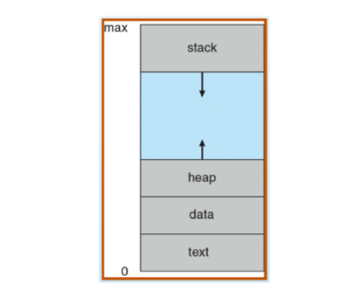
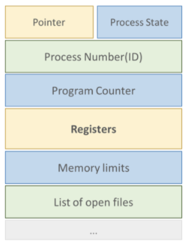

## 프로세스 개념
### 프로세스
1. 프로세스: 메모리에 적재 되어 `실행` 중인 프로그램 => `능동적`
    - 프로그램: 디스크에 저장되어 있는 명령어 리스트를 가진 파일(실행 파일이라고도 함) => `수동적`
2. 프로세스의 구조
    - 텍스트: 프로그램 코드
    - 스택: 함수 매개변수, 복귀 주소와 로컬 변수 같은 임시 자료
    - 데이터: 전역 변수
    - 힙: 실행 중에 동적으로 할당되는 메모리 (C의 malloc 같은) => 코드에서 동적으로 만들어지는 데이터

       

### 프로세스 상태(Process State)
프로세스는 실행되면서 상태가 변함

1. 새로운(new): 프로세스가 생성 중
2. 준비완료(ready): 프로세스가 메모리에 적재되고 Ready Queue에 들어와서 CPU 할당을 기다리는 중
3. 실행(running): CPU를 할당받아 명령어들이 실행 중     
    => CPU 스케줄러에 의해 Ready Queue에 있던 프로세스가 CPU 할당받음
4. 대기(waiting): 프로세스가 어떤 사건(입출력 완료 or 신호 수신 같은)이 일어나기를 기다림       
    => 직역하면 사건이 일어나기를 기다리는 상태이긴 한데 지금 수행되고 있는게 완료되기를 기다린다고 생각하면 됨
5. 종료(terminated): 프로세스 실행 종료     
- 단일 처리기에서는 하나의 프로세스만 실행될 수 있음      
- 많은 프로세스들이 준비완료 및 대기 상태에 있을 수 있음

### 프로세스 제어 블록(Process Control Block)
PCB는 운영체제가 프로세스를 표현한 것       
=> PCB에 프로세스에 대한 정보가 담겨있음
- PCB

    
- PCB에 포함된 프로세스 정보
1. 프로세스 상태: new, ready, running, waiting, terminated 등
2. 프로세스 번호: 프로세스의 고유 번호
3. 프로그램 카운터(Program Counter, PC): 프로세스가 다음에 실행할 명령어의 주소를 가리킴
4. CPU 레지스터들 (레지스터 정보): 컴퓨터의 구조에 따라 다양한 수와 타입을 가짐     
    => 레지스터는 누산기, 인덱스 레지스터, 스택 레지스터, 범용 레지스터들과 상태 코드 정보 포함
5. CPU 스케줄링 정보: 프로세스 우선순위, 스케줄 큐에 대한 포인터와 다른 스케줄 매개변수 등 포함
6. 메모리 관리 정보: 메모리 위치 정보, 메모리 보호를 위해 사용하는 경계 레지스터와 한계 레지스터의 값 포함
    - 경계 레지스터: 사용자 영역에 존재하는 프로그램이 운영체제 영역을 침범하지 못하도록 함
    - 한계 레지스터: 각 사용자 프로그램이 다른 프로그램의 영역을 침범하지 못하도록 함
7. 회계(accounting) 정보: CPU 사용량과 실제 실행 시간, 프로세스 사용 시간 제한, 계정 번호, 프로세스 번호 등을 포함
8. 입출력 상태 정보: 프로세스에게 할당된 입출력 장치들과 열린 파일의 목록 등을 포함
- 한 프로세스에서 다른 프로세스로 CPU 전환되는 과정(context switching)

    

## 프로세스 스케줄링
- 다중 프로그래밍: `항상` 프로세스가 실행되도록 하여 CPU 이용을 최대화함        
=> CPU 절대 못 쉬어, 노예처럼 일해라
- 시분할(Time-Sharing): 다중 프로그래밍을 논리적으로 확장한 개념, 프로세서가 다중 작업을 교대로 수행        
=> 각 프로그램에 일정한 프로세서 사용시간(Time Slice) 또는 Quantum을 할당해 사용자가 `주어진 시간` 동안 컴퓨터와 대화하는 형식으로 실행     
=> 프로세스들 사이에서 CPU를 빈번하게 교체      
=> 이를 위해 `프로세스 스케줄러`가 CPU에서 실행 가능한 프로세스들 중에서 하나를 선택
- 다중 프로그래밍과 시분할의 차이: 다중 프로그래밍은 CPU의 사용을 최대화하는 것이 목표, 시분할은 응답 시간을 최소화하는 것이 목표

### 스케줄링 큐(Scheduling Queues)
1. Job Queue: 시스템 내의 모든 프로세스들이 저장
2. Ready Queue: RAM에 적재되어 준비 완료(ready) 상태에 있는 프로세스들이 저장
3. Device Queue: 특정 입출력 장치(ex> 디스크)의 작업을 대기하는 프로세스들이 저장    
    - 각 장치는 자신의 Device Queue를 가짐
4. 프로세스 스케줄링 과정
    
    
   
    - 프로세스는 처음에 CPU를 할당받을(dispatch)때까지 Ready Queue에서 대기
    - 프로세스에 CPU 할당
    - CPU 할당받은 후 발생할 수 있는 일들
        1. 프로세스가 입출력 요청해서 입출력 큐(I/O Queue)에 들어감
        2. 프로세스에 할당된 시간이 초과됨
        3. 프로세스가 새로운 자식 프로세스 생성하고 자식 프로세스 종료 기다림
        4. 프로세스가 인터럽트에 의해 강제로 CPU 반환되고 Ready Queue에 놓일 수 있음

### 스케줄러
프로세스는 다양한 스케줄링 큐들 사이를 돌아다님     
운영체제는 큐에 있는 프로세스들 중 하나를 선택해야함        
=> 스케줄러란 어떤 프로세스에게 자원을 할당할지를 결정하는 운영체제 커널의 모듈
1. 장기 스케줄러(또는 잡 스케줄러)
    - 디스크와 같은 저장 장치에 저장된 프로세스들을 선택해서 실행하기 위해 메모리에 적재
    - 실행 빈도수가 적음
    - 다중 프로그래밍 정도(메모리에 있는 프로세스들의 수)를 제어
    - 실행할 프로세스를 신중하게 선택해야 함
    - 장기 스케줄러는 입출력 중심과 CPU 중심 프로세스를 적절히 섞어서 선택해야 함
        1. 입출력 중심 프로세스: 연산보다 입출력 실행에 많은 시간을 소요
        2. CPU 중심 프로세스: 입출력보다 연산에 많은 시간을 소요
2. 단기 스케줄러(또는 CPU 스케줄러)
    - Ready Queue에 있는 프로세스 중 하나를 선택해 CPU 할당
    - CPU를 위해 `자주` 새로운 프로세스를 선택해야 함       
        => 속도가 매우 빨라야 함
3. 중기 스케줄러   
    - 너무 많은 프로세스가 메모리에 올라가지 않도록 메모리에서 프로세스를 제거
    - 차후에 다시 프로세스를 메모리로 불러와 중단 시점부터 실행 재개함 (스와핑(Swapping) 기법)  
        => 중기 스케줄러는 프로세스를 메모리에서 swap-out 시켰다가 다시 메모리로 swap-in 시킴

### 문맥 교환(Context Switch)
1. 현재 CPU를 사용중인 프로세스의 CPU 제어권이 다른 프로세스에게 넘어가는 것
2. 문맥 교환 과정
    - 현재 실행중인 프로세스의 상태(`문맥`)를 PCB에 저장
    - 다음에 실행할 프로세스의 상태를 레지스터에 적재해 작업 수행
2. 문맥 교환이 일어나는 동안 CPU는 아무런 작업도 하지 못하기 때문에 효율을 위해서 실행 시간을 최소화해야함

