# CPU 스케줄링
- CPU 스케줄링은 다중 프로그램 운영체제의 기본
<pre><code>💡 스레드를 지원하는 운영체제에서는 실질적으로 운영체제는 프로세스가 아닌 커널 수준 스레드를 스케줄함</pre></code>

## CPU 스케줄링의 기본 개념
1. 다중 프로그래밍의 목적은 계속 프로세스에게 CPU를 할당시켜 CPU 이용률을 최대화하는 것
2. 실행중이던 프로세스가 입출력 완료 같은 사건을 기다릴 경우, 운영체제는 CPU를 회수해 메모리에 적재돼있던 다른 프로세스에게 CPU 할당시킴
3. CPU 스케줄링은 운영체제 설계의 `핵심`

## CPU-입출력 버스트 사이클(CPU-I/O Burst Cycle)
1. 프로세스 실행은 CPU 버스트와 입출력 버스트의 사이클로 구성됨         
    <pre><code>💡 CPU burst: 프로세스가 CPU를 사용하는 구간, 입출력 burst: 프로세스가 I/O 완료를 기다리는 구간</pre></code>
2. 프로세스들은 이들 두 상태 사이를 교대로 왔다갔다함
3. 마지막 CPU 버스트 후에 입출력 버스트가 발생하지만, 실행 종료 위한 시스템 요청과 함께 끝남
4. CPU 버스트들의 지속 시간을 측정한 결과, 유사한 빈도수 곡선을 갖는 것을 확인      
    - 이 곡선은 지수형, 초지수형으로 나뉨
    - 짧은 CPU 버스트가 많고, 긴 CPU 버스트는 적음
5. I/O 중심 프로그램은 짧은 CPU 버스트를 많이 가지고, CPU 중심 프로그램은 긴 CPU 버스트를 많이 가질 것      
    ➡ 이러한 특성은 CPU 스케줄링 알고리즘을 선택하는데 매우 중요한 요소

    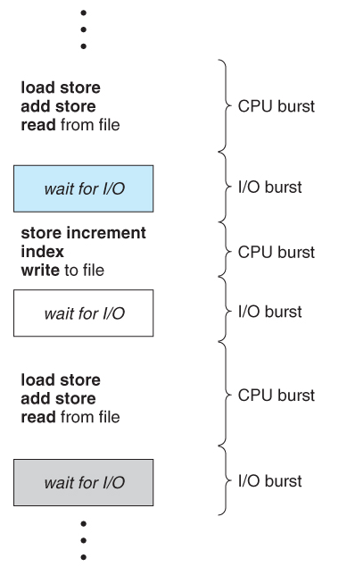     

    ➡ CPU와 입출력 버스트(burst)의 교차        

    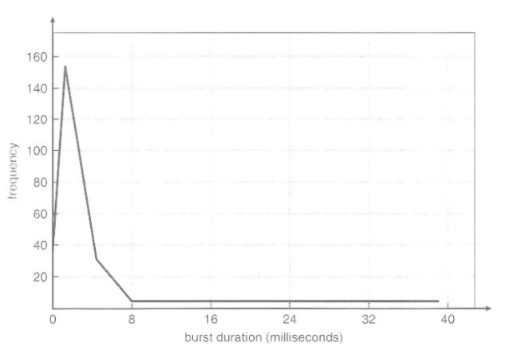       

    ➡ CPU 버스트 시간의 도표

### CPU 스케줄러(CPU Scheduler)
1. CPU 스케줄러(단기 스케줄러): Ready Queue에 적재된 프로세스들 중 하나를 선택해 CPU 할당
2. CPU가 쉴 때마다 CPU 스케줄러가 일함
3. Ready Queue는 반드시 큐(FIFO 방식)가 아니어도 됨     
    ➡ 선입선출 큐, 우선순위 큐, 트리, 연결 리스트로 구현될 수 있음
4. 큐에 있는 레코드들은 일반적으로 프로세스들의 PCB들임

    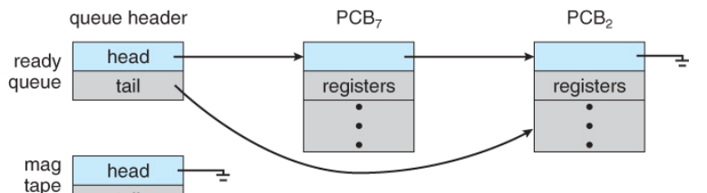       
    
    ➡ Ready Queue

### CPU 스케줄링 종류
1. CPU 스케줄링이 발생하는 상황
    - 프로세스가 실행 상태에서 대기 상태로 전환될 때 🛠`비선점`     
        ➡ I/O 요청이나 자식 프로세스 종료 기다리려고 wait() 호출할 때 
    - 프로세스가 실행 상태에서 준비 완료 상태로 전환될 때 🛠`선점`      
        ➡ 인터럽트 발생        
        <pre><code>💡 인터럽트: 프로그램을 실행하는 도중에 예기치 않은(CPU의 점유를 빼앗기는) 상황이 발생할 경우 작업을 즉시 중단하고, 발생된 상황을 우선 처리한 후 실행중이던 작업으로 복귀하여 처리하는 것</pre></code>
    - 프로세스가 대기 상태에서 준비 완료 상태로 전환될 때 🛠`선점`    
        ➡ 입출력 종료 시
    - 프로세스 종료할 때 🛠`비선점`
2. 비선점 스케줄링(Non-Preemptive Scheduling) or 협조적(Cooperative) 스케줄링
    - 이미 특정 프로세스에게 할당된 CPU를 다른 프로세스가 강제로 빼앗을 수 없음
    - CPU가 한 프로세스에게 할당되면, 프로세스가 종료하거나 대기 상태로 전환해 CPU를 반환할 때까지 CPU 점유     
        ➡ ❗인터럽트 허용되지 않음❗
    - 모든 프로세스에 대해 공정하게 처리할 수 있음
    - 일괄 처리 방식에 적합, 중요한 작업이 기다리는 경우가 발생할 수 있음
    - 수행기간이 긴 프로세스가 자원을 점유하게 되면 이후에 실행 될 프로세스들이 기아(starvation) 상태에 빠지게 됨
        <pre><code>💡 기아(starvation) 상태: 프로세스가 원하는 자원을 계속 할당받지 못하는 상태</pre></code>
 
3. 선점 스케줄링(Preemptive Scheduling)
    - 특정 프로세스에게 할당된 CPU를 다른 우선순위가 높은 프로세스가 강제로 빼앗을 수 있음
    - 프로세스는 한번 실행될 때 `제한된 시간을 할당`받고 시간이 지나면 CPU 반환       
        ➡ ❗인터럽트 허용됨❗
    - 우선순위가 높은 프로세스를 빠르게 처리할 수 있음
    - 빠른 응답시간을 요구하는 대화식 시분할 시스템에 이용
    - 선점으로 인한 많은 오버헤드 초래
    - 여러 프로세스가 자원을 공유할 경우 경쟁 조건을 초래할 수 있음
        <pre><code>💡 경쟁 조건(Race Condition): 다중 프로세스 환경에서 두개 이상의 프로세스가 동시에 수행될 때 발생되는 비정상적인 상태</pre></code>
4. 인터럽트에 의해 영향 받는 코드 부분은 동시 사용으로부터 보호돼야 함
    - 해당 부분은 여러 프로세스가 동시에 접근할 수 없도록 해야함 
    - 진입점에서 인터럽트 불능화하고 출구에서 가능화하도록 해야함       
        ➡ ❗인터럽트 불능화는 자주 발생해선 안됨, 아주 적은 수의 명령어들만 포함해야 함

### 디스패처(Dispatcher)
1. CPU 스케줄링 = 프로세스 선택(Scheduling) + 선택된 프로세스 CPU에 올림(Dispatch)
2. 디스패처: `CPU의 제어`를 CPU 스케줄러가 선택한 프로세스에게 주는 `모듈`
3. 디스패처가 하는 일
    - Context Switch
    - 사용자 모드로 전환
    - 프로그램을 다시 시작하기 위해 사용자 프로그램의 적절한 위치로 이동(jump)하는 일
4. 디스패처는 모든 프로세스의 Context Switch시 호출     
    ➡ 수행 시간이 짧아야 함
5. 디스패치 지연(Dispatch Latency): 디스패치가 하나의 프로세스를 정지하고 다른 프로세스의 수행을 시작하는 데까지 소요되는 시간

## 스케줄링 기준(Scheduling Criteria)
스케줄링 알고리즘을 평가하는 기준
1. CPU 이용률(Utilization)
    - CPU가 얼마나 많이 사용되고 있는지!
2. 처리량(Throughput)
    - 단위 시간당(주어진 시간동안) 수행 완료된 프로세스의 개수
3. 총처리 시간(Turnaround Time)
    - 프로세스를 실행하는데 소요된 시간 = 메모리에 들어가기 위해 기다린 시간 + Ready Queue에서 대기한 시간 + CPU에서 실행한 시간 + 입출력 시간
4. 대기 시간(Waiting Time)
    - Ready Queue에서 대기하며 보낸 시간
    - `다른 프로세스 때문`에 `대기`한 시간
    - 해당 프로세스의 실행 시간이나 입출력 시간 같은 것들은 포함하지 않음       
        ➡ 내가 요청하고 실행한거니까!
5. 응답 시간(Response Time)
    - 대화식 시스템에서 응답이 시작되는데 걸린 시간     
        <pre>🖥️ 응답 시간의 예시   
        1. 사용자가 아주 큰 파일 압축을 요청        
        2. 압축하는데 10초 정도 걸림        
        3. 그동안 시스템이 아무런 응답을 하지 않으면?! 사용자는 답답해 죽음     
        4. 그래서 시스템은 압축을 시작할 때 사용자에게 작업 중이라는 것을 알려줌</pre>
6. CPU 이용률과 처리량을 `최대화`하고 총처리 시간, 대기 시간, 응답 시간을 `최소화`하는 것이 바람직

## 스케줄링 알고리즘(Scheduling Algorithms)
### 선입 선처리 스케줄링(First-Come, First-Served Scheduling)
1. CPU를 `먼저` 요청하는 프로세스가 CPU를 할당받는 방식
2. 선입선출(FIFO) 큐를 이용해 쉽게 구현할 수 있음
    - 프로세스가 Ready Queue에 진입하면 해당 프로세스의 PCB를 큐의 끝(rear)에 연결
    - CPU가 쉬면, Ready Queue의 앞부분에 있는 프로세스에게 CPU 할당
    - 이후 해당 프로세스는 Ready Queue에서 제거됨
3. 평균 대기 시간이 굉장히 길어질 수 있음
    |프로세스|버스트 시간|
    |---|---|
    |P1|24|
    |P2|3|
    |P3|3|
    

    
Q. 프로세스가 P1, P2, P3 순으로 도착한다고 가정했을때 CPU를 할당받는 순서와 평균 대기시간은?
    

    <pre>    
    다음과 같은 순서로 실행됨     
    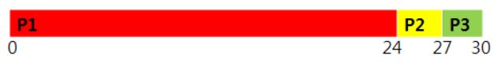       
    => Gantt 차트: 프로젝트 일정관리를 위한 바(bar)형태의 도구      
    프로세스 P1의 대기 시간: 0ms        
    프로세스 P2의 대기 시간: 24ms        
    프로세스 P3의 대기 시간: 27ms       
    평균 대기 시간: (0 + 24 + 27)/3 = 17ms
    

    

    
Q. 프로세스가 P2, P3, P1 순으로 도착한다고 가정했을때 CPU를 할당받는 순서와 평균 대기시간은?
    

    <pre>
    다음과 같은 순서로 실행됨    
    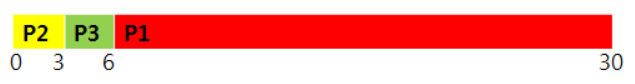     
    프로세스 P1의 대기 시간: 6ms        
    프로세스 P2의 대기 시간: 0ms        
    프로세스 P3의 대기 시간: 3ms       
    평균 대기 시간: (6 + 0 + 3)/3 = 3ms
    </pre>
    

    ➡ 프로세스의 도착 순서에 따라 평균 대기 시간이 크게 달라짐
4. 위의 첫번째 예시와 같이 `호위 효과(Convoy Effect)`가 발생할 수 있음      
    <pre>💡 호위 효과(Convoy Effect): 다른 프로세스들이 하나의 긴 프로세스가 CPU를 반환하기를 기다리는 것</pre>        
    ➡ CPU와 장치 이용률이 저하됨
5. `비선점형 방식`이라는 것을 명심!     
    ➡ 각 사용자가 규칙적인 간격으로 CPU를 할당받는 것이 중요한 `시분할 시스템`에서 특히 문제가 됨 

### 최단 작업 우선 스케줄링(Shortest-Job-First Scheduling)
1. `CPU 버스트 시간`이 가장 짧은 프로세스가 먼저 CPU 할당받음       
    ➡ CPU 버스트 시간에 의해 스케줄링 되서 `최단 다음 CPU 버스트(Shortest-Next-CPU-Burst)`라고도 불림
2. 만일, `CPU 버스트 시간`이 같은 프로세스들이 있다면 `FIFO 스케줄링` 적용       
    ➡ 먼저 들어온 놈한테 CPU 할당함
3. 선점형일 수도 있고 비선점형(최소 잔여 시간 우선(Shortest Remaining Time First))일 수도 있음
4. 비선점형 SJF의 동작 과정      
    |프로세스|버스트 시간|
    |---|---|
    |P1|6|
    |P2|8|
    |P3|7|
    |P4|3|
    

    
Q. 프로세스가 동시에 도착했다고 가정했을 때 CPU를 할당받는 순서와 평균 대기시간은?

    <pre>
    다음과 같은 순서로 실행됨
    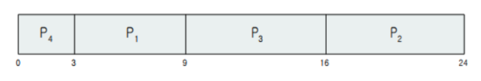
    프로세스 P1의 대기 시간: 3ms        
    프로세스 P2의 대기 시간: 16ms        
    프로세스 P3의 대기 시간: 9ms
    프로세스 P4의 대기 시간: 0ms       
    평균 대기 시간: (3 + 16 + 9 + 0)/4 = 7ms
    💡 FIFO 스케줄링을 사용했다면? 대기 시간은 10.25ms
    </pre>
    

5. 선점형 SJF의 동작 과정
    |프로세스|도착시간|버스트 시간|
    |---|---|---|
    |P1|0|8|
    |P2|1|4|
    |P3|2|9|
    |P4|3|5|
    

    
Q. 프로세스가 표에 제시된 순서대로 도착했을 때 CPU를 할당받는 순서와 평균 대기시간은?

    <pre>
    다음과 같은 순서로 실행됨
    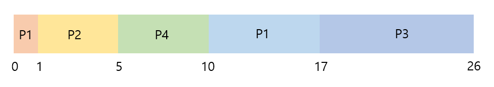
    프로세스 P1의 대기 시간: (0 + 9)ms
    * 프로세스 P1이 실행되는 도중에 P2 도착
      P1의 남은 CPU 버스트 시간: 7ms
      P2의 남은 CPU 버스트 시간: 4ms
      => P1은 선점되고 P2가 스케줄됨        
    프로세스 P2의 대기 시간: (1 - 1)ms        
    프로세스 P3의 대기 시간: (17 - 2)ms
    프로세스 P4의 대기 시간: (5 - 3)ms       
    평균 대기 시간: (9 + 0 + 15 + 2)/4 = 6.5ms
    💡 비선점형 SJF 스케줄링을 사용했다면? 대기 시간은 7.75ms
    </pre>
    

6. 최소 평균 대기 시간을 가질 수 있는 최적의 알고리즘
7. 다음 CPU 버스트 시간을 미리 파악하는 것이 어려움(보완하기)   
    ➡ 장기 스케줄링에서 자주 사용됨, 단기 스케줄링에서는 구현불가
    <pre>
    💡 일괄처리 시스템의 장기 스케줄링에서 자주 사용
    1. 사용자는 작업 제출할 때 지정된 처리 시간(CPU 버스트 시간)을 을 정확하게 예측할 수 있음
    2. 시간 제한이 짧을수록 응답은 빠르지만 너무 짧으면 시간 초과 오류가 발생해 사용자가 작업을 다시 제출하기 때문
    💡 단기 스케줄링에서도 CPU 버스트 시간을 예측할 수는 있음       
    1. 다음 CPU 버스트가 이전의 버스트 시간과 비슷할 것이라고 가정
    2. 다음 CPU 버스트 길이의 근사값을 계산해 가장 짧은 예상 CPU 버스트를 가진 프로세스를 선택      
        ➡ 시간을 예측해서 프로세스를 선택해 수행한다는 뜻 같음
    3. 다음 CPU 버스트 시간 = 이전 CPU 버스트 시간들의 지수 평균
    </pre>

### 우선순위 스케줄링(Priority Scheduling)
1. 우선순위가 높은 프로세스에게 먼저 CPU 할당 
2. 우선순위가 같은 프로세스들은 FCFS 순서로 스케줄
3. `SJF 알고리즘`은 우선순위 스케줄링에 `포함`된다고 할 수 있음     
    ➡ SJF에선 CPU 버스트 시간이 우선순위인 셈(다만, CPU 버스트 짧을수록 우선순위가 높은 것)
4. 시스템의 종류에 따라 `0`이 `최상위 우선순위`일 수도 있고 `최하위 우선순위`일 수도 있음       
    ➡ 우리는 낮은 수가 높은 우선순위를 나타낸다고 가정!!
5. 우선순위 스케줄링 예시
    |프로세스|버스트 시간|우선순위|
    |---|---|---|
    |P1|10|3|
    |P2|1|1|
    |P3|2|4|
    |P4|1|5|
    |P4|5|2|
    

    
Q. 프로세스가 CPU를 할당받는 순서와 평균 대기시간은?

    <pre>
    다음과 같은 순서로 실행됨
    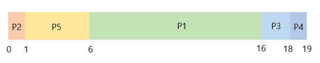
    프로세스 P1의 대기 시간: 0ms      
    프로세스 P2의 대기 시간: 1ms        
    프로세스 P3의 대기 시간: 6ms
    프로세스 P4의 대기 시간: 16ms
    프로세스 P4의 대기 시간: 18ms     
    평균 대기 시간: (0 + 1 + 6 + 16 + 18)/5 = 8.2ms
    </pre>
    

6. 우선순위는 `내부적` 또는 `외부적`으로 정의될 수 있음
    <pre>
    💡 내부적 우선순위
        시간 제한, 메모리 요구, 열린 파일의 수, 평균 입출력 버스트의 평균 CPU 버스트에 대한 비율 등이 우선순위 계산에 사용
        ➡ 운영체제 내부적 기준에 의해 결정
    💡 외부적 우선순위
        프로세스의 중요성, 컴퓨터 사용을 위해 지불되는 비용의 타입과 양, 그 작업을 후원하는 부서 그리고 정치적인 요인 등
        ➡ 운영체제 외부적 기준에 의해 결정
    </pre>
7. `선점형`이거나 `비선점형`이 될 수도 있음
    <pre>
    프로세스가 Ready Queue에 도착하면 해당 프로세스의 우선순위와 현재 실행중인 프로세스의 우선순위 비교
    💡 선점형 우선순위 스케줄링
        새로 도착한 프로세스의 우선순위가 높으면 CPU 선점함
    💡 비선점형 우선순위 스케줄링
        다음에 바로 실행될 수 있도록 Ready Queue 머리 부분에 새로운 프로세스 넣음
    </pre>
8. `무한 봉쇄(Infinite Blocking)`나 `기아(Starvation)`문제가 발생할 수 있음!!
    <pre>
    💡 무한 봉쇄(Infinite Blocking): 실행 준비는 되어 있으나 CPU를 사용하지 못하는 프로세스는 CPU를 기다리면서 봉쇄된 것으로 간주될 수 있음
    💡 기아(Starvation): 프로세스가 무한히 대기하는 현상
        우선순위가 낮은 프로세스들은 계속 CPU를 할당받지 못하는 경우가 발생할 수도 있음
        😵1973년 MIT에서 IBM 7094를 폐쇄할 당시, 1967년에 입력된 우선순위가 낮은 프로세스가 아직도 수행되지 못한 것을 발견한 사례도 있음
    </pre>
9. 위의 문제점은 `노화(Aging)`기법으로 해결!        
    ➡ 오랫동안 시스템에서 대기하는 프로세스들의 우선순위를 점진적으로 증가시키는 방법

### 라운드 로빈 스케줄링(Round-Robin Scheduling)
1. 각 프로세스에게 정의된 시간 만큼 돌아가면서 CPU 할당
2. `시분할 시스템`을 위해 설계된 알고리즘
3. FIFO 스케줄링과 유사하지만 `선점`이 추가됨
4. 시간 할당량(Time Quantum)또는 시간 조각(Time Slice)이라고 하는 작은 단위의 시간을 정의       
    ➡ 일반적으로 10 ~ 100ms
5. 라운드 로빈 스케줄링 과정
    <pre>
    🟣 Ready Queue는 Circular Queue로 동작
    ⚙️ CPU 스케줄러는 Ready Queue를 돌며 하나의 프로세스에게 한 번의 시간 할당량동안 CPU 할당
        1. 새로운 프로세스들은 Ready Queue의 꼬리에 추가
        2. CPU 스케줄러는 첫 번째 프로세스를 선택해 한 번의 시간 할당량 이후에 인터럽트 걸도록 타이머(Timer) 설정한 후, 프로세스에게 CPU 할당

        이때, 프로세스의 CPU 버스트 시간과 시간 할당량 정도에 따라 두 가지 경우가 발생할 수 있음
        1. 프로세스의 CPU 버스트 시간이 시간 할당량보다 작음
            - 프로세스가 자발적으로 CPU 반환
            - 스케줄러는 그 다음 프로세스에게 CPU 할당
        2. 프로세스의 CPU 버스트 시간이 시간 할당량보다 큼
            - 타이머가 끝나고 운영체제에게 인터럽트 발생
            - Context Switching이 일어나고 실행중이던 프로세스는 Ready Queue의 꼬리에 넣어짐
            - 스케줄러는 그 다음 프로세스에게 CPU 할당
    </pre>
6. 평균 대기 시간이 길 수 있음
    |프로세스|버스트 시간|
    |---|---|
    |P1|24|
    |P2|3|
    |P3|3|
    

    
Q. 시간할당량이 4ms일때, 프로세스가 CPU를 할당받는 순서와 평균 대기시간은?

    <pre>
    다음과 같은 순서로 실행됨
    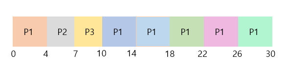
    프로세스 P1의 대기 시간: (0 + 6)ms      
    프로세스 P2의 대기 시간: 4ms        
    프로세스 P3의 대기 시간: 7ms 
    평균 대기 시간: (6 + 4 + 7)/3 = 5.66ms
    </pre>
    

7. 알다시피 RR스케줄링은 `선점형`
8. 시간 할당량의 크기에 따라 알고리즘의 성능이 좌우됨       
    - 시간 할당량이 너무 크면 FIFO와 같아짐
    - 시간 할당량이 너무 적으면 Context Swtiching이 자주 일어나 오버헤드 커짐
9. 총처리 시간도 시간 할당량의 크기에 좌우됨        
    ➡ 대부분의 프로세스들이 단일 시간 할당량 안에 실행을 끝내면 평균 총처리 시간은 개선됨
10. 전체에서 80%의 프로세스 CPU 버스트 시간이 시간 할당량보다 짧아야 효율적

### 다단계 큐 스케줄링(Multilevel Queue Scheduling)
1. Ready Queue를 다수의 별도의 큐로 분류, 각 큐에게 우선순위를 부여해 스케줄        
    ➡ 프로세스들은 메모리 크기, 프로세스의 우선순위 or 유형과 같은 특성에 따라 한 개의 큐에 `영구적으로` 할당
2. 각 Ready Queue마다 스케줄링 알고리즘이 다를 수 있음
3. 다단계 큐 스케줄링 예
    <pre>
    다음과 같은 우선순위를 갖는 큐들이 있음
    1. 시스템 프로세스
    2. 대화형 프로세스
    3. 대화형 편집 프로세스
    4. 일괄처리 프로세스
    5. 학생 프로세스
    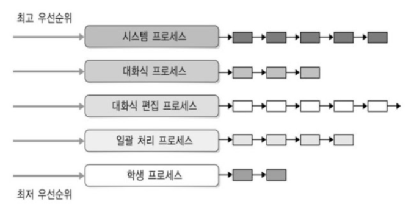
    1. 일괄처리 큐의 프로세스들은 시스템, 대화식, 대화식 편집 프로세스 큐가 모두 비어있을 경우에만 실행될 수 있음
    2. 만일, 일괄처리 프로세스가 실행되고 있는 중에 대화형 프로세스가 Ready Queue에 들어가게 되면 일괄처리 프로세스는 선점됨
    🔥 각 큐가 CPU 시간의 일정량을 받아서 실행하는 방법도 있음
        ➡ 시스템 프로세스 큐에는 CPU시간의 80%가 주어지고, 일괄처리 프로세스에겐 20%가 주어지는 식
    💣 (정확히 무슨 뜻인지 이해안됨..!! 인터넷 찾아봐도 시간 얘기를 하는 포스트는 없었음)
    </pre>
4. 우선순위가 높은 큐를 먼저 스케줄링하는 `선점형` 알고리즘
5. 큐들 간의 프로세스 이동이 불가하기 때문에 스케줄링 부담이 적지만 유연성이 떨어짐
6. `기아`현상 발생할 수도 있음

### 다단계 피드백 큐 스케줄링(MultiLevel Feedback Queue Scheduling)
1. 다단계 큐 스케줄링에 프로세스가 큐들 사이를 이동할 수 있도록 한 알고리즘
2. 프로세스들을 CPU 버스트 성격에 따라 구분     
    ➡ CPU를 많이 사용하는 프로세스는 낮은 우선순위 큐로 이동됨
3. 입출력 중심 프로세스와 대화형 프로세스들은 높은 우선순위 큐에 넣음       
    ➡ 해당 프로세스들은 CPU를 많이 사용하지 않기 때문에
4. `aging기법` 사용해서 `기아` 상태 예방       
    ➡ 낮은 우선순위 큐에서 오래 대기한 프로세스는 높은 우선순위 큐로 이동
5. 다단계 피드백 큐 스케줄링의 동작 과정
    <pre>
    다음과 같은 다단계 피드백 큐 스케줄러가 있음
    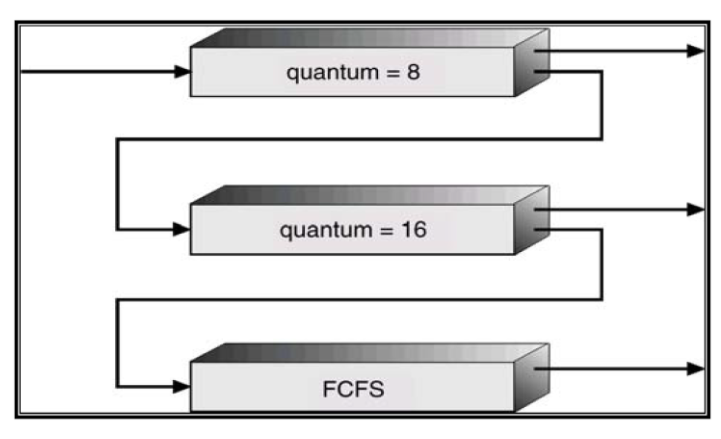
    (위에서부터 큐 1, 2, 3이라 하겠음)
    - 우선순위대로 큐 내의 프로세스들이 실행됨
    - 우선순위가 낮은 큐 프로세스가 실행되고 있는데 우선순위 높은 큐로 프로세스가 새로 들어온다?
        ➡ 바로 선점됨
    1. Ready Queue로 들어오는 프로세스는 큐 0에 들어감
    2. 해당 프로세스는 8ms동안 실행됨
    3. 8ms안에 끝나지 않는다면 큐 1의 꼬리로 이동
    4. 큐 0 비어있으면 큐 1 머리에 있는 프로세스에게 16ms 시간 할당됨
    5. 해당 프로세스도 완료되지 않으면 큐 2 꼬리로 들어감
    6. 큐 2는 큐 0, 1이 비어 있을 때 FIFO방식으로 프로세스 실행
    </pre>
6. 해당 방식을 사용하면 실행시간이 긴 프로세스는 자동적으로 우선순위가 낮은 큐에 들어가게 됨
7. 이 스케줄러는 다음의 매개변수에 의해 정의됨
    - 큐의 개수
    - 각 큐를 위한 스케줄링 알고리즘
    - 한 프로세스를 높은 우선순위 큐로 올려주는 시기를 결정하는 방법
    - 한 프로세스를 낮은 우선순위 큐로 강등시키는 시기를 결정하는 방법
    - 프로세스가 서비스를 필요로 할 때 프로세스가 들어갈 큐를 결정하는 방법
8. 가장 `일반적`인 CPU 스케줄링 알고리즘이면서 가장 `복잡`하다