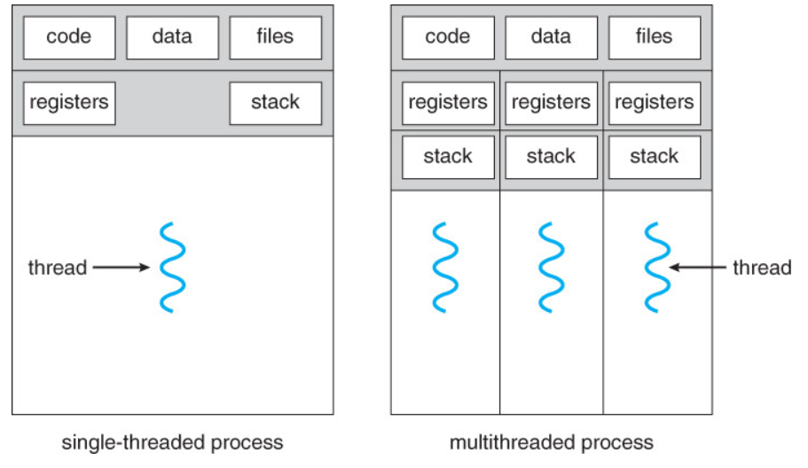
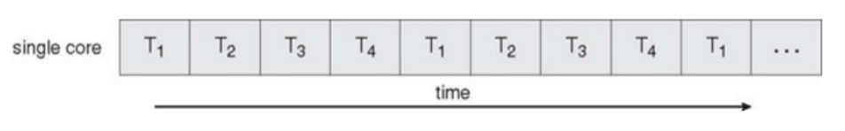
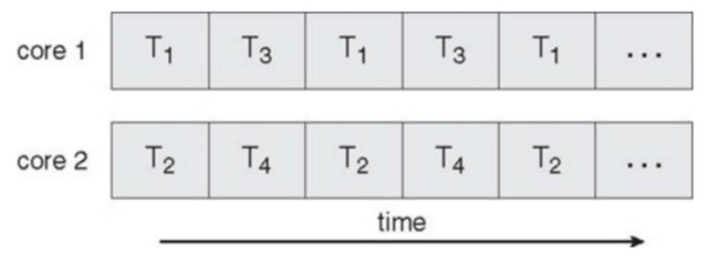

## 개요
1. 스레드: `CPU 이용의 기본 단위`, 프로세스 내에서 실행되는 `작업의 흐름`
2. 스레드 ID, 프로그램 카운터, 레지스터 집합, 스택으로 구성
3. 프로세스 내에서 스택을 제외한 힙, 데이터, 텍스트 영역을 다른 스레드와 공유
4. 프로세스가 제어 스레드를 여러개 가지게 되면, 동시에 여러 작업을 수행할 수 있음

         
    
    => 단일 및 다중 스레드 프로세스

### 다중 스레드 서버 구조
1. 웹 서버가 단일 스레드 프로세스로 작동하면, 한번에 하나의 클라이언트만 서비스할 수 있음       
    => 클라이언트는 서비스를 받기까지 오래 기다려야됨
2. 해결방법
    - 서버가 서비스 요청 들어올때마다 해당 요청 수행할 프로세스 생성
        1. 스레드가 대중화되기 전에는 이 방법이 보편적이었음
        2. 하지만, 프로세스 생성 작업은 매우 복잡함
        3. 새 프로세스가 해야 할 일이 기존 프로세스가 하는 일과 동일하다면 새로 만드는게 매우 비효율적
    - 서버는 서비스 요청 들어올때마다 해당 요청 수행할 스레드를 생성
        1. 프로세스 생성 방법보다 효율적
3. 다중 스레드 프로세스를 사용함으로써 여러 요청을 병행하게 처리할 수 있음

### 다중 스레드 프로그래밍의 장점
1. 응답성(Responsiveness): 프로그램의 일부분(스레드)이 중단되거나 긴 작업을 수행하더라도 프로그램 수행이 게속 되어 사용자에 대한 응답성 증가
2. 자원 공유(Resource Sharing): 스레드는 프로세스 내의 자원들과 메모리를 공유       
    => 프로세스 생성에 비해 시스템 호출이 줄어 자원 효율적으로 관리
3. 경제성(Economy): 스레드는 프로세스의 자원들을 공유하기 때문에, 스레드를 생성하고 context switching하는게 프로세스 생성하는 것보다 경제적
4. 규모 적응성(Scalability, 확장성): 다중 처리기 구조에서 각각의 스레드가 다른 처리기에서 병렬로 수행될 수 있음     
    - 단일 스레드 프로세스는 처리기가 아무리 많아도 한 처리기에서만 실행됨

## 다중 코어 프로그래밍
1. 다중코어(or 다중 처리) 시스템: 코어가 여러 CPU칩 형태를 띠거나 칩 안에 여러개의 CPU가 존재하는 시스템
2. 다중 스레드 프로그래밍은 다중 계산 코어를 더 효율적으로 사용할 수 있게 해줌
3. 병행성(Concurrency)과 병렬성(Parallelism)
    - 병행성: 프로세서가 여러 개의 스레드를 번갈아가며 수행해 `동시에 실행되는 것처럼 보이게 함`, 단일 코어 시스템에서 사용되는 방식
    - 병렬성: 여러 개의 코어가 각 스레드를 `동시에 수행`함, 다중코어 시스템에서 사용되는 방식
    
           
        
    => 단일 코어 시스템에서의 병행 실행
    
         
        
    => 다중코어 시스템에서의 병렬 실행
