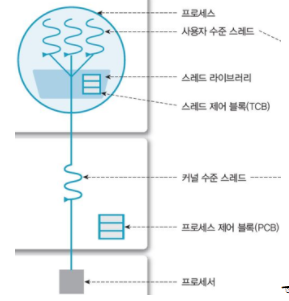
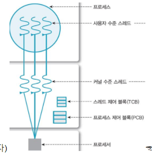
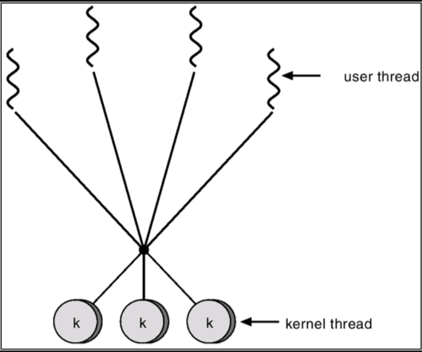
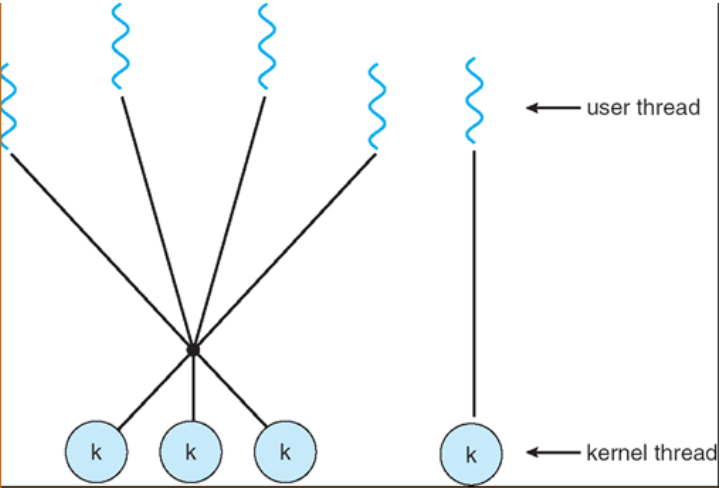
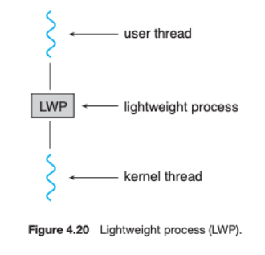
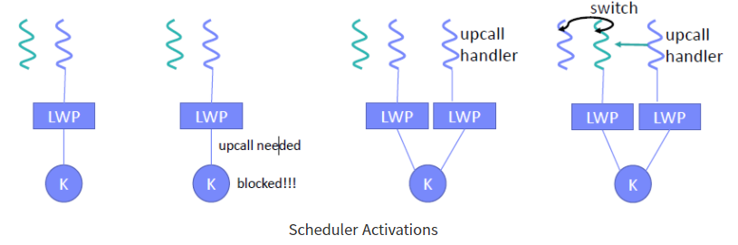

# 스레드
## 개요
1. 스레드: `CPU 이용의 기본 단위`, 프로세스 내에서 실행되는 `작업의 흐름`
2. 스레드 ID, 프로그램 카운터, 레지스터 집합, 스택으로 구성
3. 프로세스 내에서 스택을 제외한 힙, 데이터, 텍스트 영역을 다른 스레드와 공유
4. 프로세스가 제어 스레드를 여러개 가지게 되면, 동시에 여러 작업을 수행할 수 있음

         
    
    => 단일 및 다중 스레드 프로세스

### 다중 스레드 서버 구조
1. 웹 서버가 단일 스레드 프로세스로 작동하면, 한번에 하나의 클라이언트만 서비스할 수 있음       
    => 클라이언트는 서비스를 받기까지 오래 기다려야됨
2. 해결방법
    - 서버가 서비스 요청 들어올때마다 해당 요청 수행할 프로세스 생성
        1. 스레드가 대중화되기 전에는 이 방법이 보편적이었음
        2. 하지만, 프로세스 생성 작업은 매우 복잡함
        3. 새 프로세스가 해야 할 일이 기존 프로세스가 하는 일과 동일하다면 새로 만드는게 매우 비효율적
    - 서버는 서비스 요청 들어올때마다 해당 요청 수행할 스레드를 생성
        1. 프로세스 생성 방법보다 효율적
3. 다중 스레드 프로세스를 사용함으로써 여러 요청을 병행하게 처리할 수 있음

### 다중 스레드 프로그래밍의 장점
1. 응답성(Responsiveness): 프로그램의 일부분(스레드)이 중단되거나 긴 작업을 수행하더라도 프로그램 수행이 게속 되어 사용자에 대한 응답성 증가
2. 자원 공유(Resource Sharing): 스레드는 프로세스 내의 자원들과 메모리를 공유       
    => 프로세스 생성에 비해 시스템 호출이 줄어 자원 효율적으로 관리
3. 경제성(Economy): 스레드는 프로세스의 자원들을 공유하기 때문에, 스레드를 생성하고 context switching하는게 프로세스 생성하는 것보다 경제적
4. 규모 적응성(Scalability, 확장성): 다중 처리기 구조에서 각각의 스레드가 다른 처리기에서 병렬로 수행될 수 있음     
    - 단일 스레드 프로세스는 처리기가 아무리 많아도 한 처리기에서만 실행됨

## 다중 코어 프로그래밍
1. 다중코어(or 다중 처리) 시스템: 코어가 여러 CPU칩 형태를 띠거나 칩 안에 여러개의 CPU가 존재하는 시스템
2. 다중 스레드 프로그래밍은 다중 계산 코어를 더 효율적으로 사용할 수 있게 해줌
3. 병행성(Concurrency)과 병렬성(Parallelism)
    - 병행성: 프로세서가 여러 개의 스레드를 번갈아가며 수행해 `동시에 실행되는 것처럼 보이게 함`, 단일 코어 시스템에서 사용되는 방식
    - 병렬성: 여러 개의 코어가 각 스레드를 `동시에 수행`함, 다중코어 시스템에서 사용되는 방식
    
           
        
    => 단일 코어 시스템에서의 병행 실행

     
        
    => 다중코어 시스템에서의 병렬 실행

## 다중 스레드 모델(Multithreading Models)
1. 커널 수준 스레드
    - 커널: 운영체제의 핵심 부분 => 보안, `자원관리`, 추상화 역할 수행
        - 자원관리: 컴퓨터 자원을 효율적으로 관리하기 위해 CPU 스케줄링, 메모리관리, 입출력관리, 파일시스템 관리 등의 업무 수행
    - `커널` 레벨에서 생성되는 스레드  
    - 운영체제 시스템 내에서 동작, 커널이 직접 관리
2. 사용자 수준 스레드
    - 스레드를 관리하는 라이브러리로 인해 `사용자 단`에서 생성 및 관리되는 스레드       
    - 커널이 관리하지 않음, 커널은 스레드의 존재도 모름
    - 프로세스 내 커널과 관련 없는 기능을 수행
- 사용자 모드: 사용자가 접근할 수 있는 영역을 제한적으로 두고, 프로그램의 자원에 함부로 침범하지 못하는 모드        
    => 해당 모드에서 사용자는 코드 작성, 프로세스 실행 등을 할 수 있음
- 커널 모드: 모든 자원(드라이버, 메모리, CPU 등)에 접근, 명령 할 수 있는 모드

### 다대일 모델(Many-to-One Model)
1. `사용자 수준 스레드 모델`의 형태
2. 여러 사용자 수준 스레드가 하나의 커널 스레드와 매핑
3. 스레드 관리는 사용자 공간의 스레드 라이브러리가 함
4. 스레드 스케줄링이나 동기화를 위해 시스템 콜(커널 호출)하지 않으므로, 커널모드로의 전환이 필요 없어 효율적
5. 한번에 하나의 스레드만 커널에 접근할 수 있기 때문에 한 스레드가 Blocking System Call을 할 경우, 나머지 스레드들은 모두 `대기`        
    => Blocking System Call: call이 완전히 수행될 때까지 반환(return)되지 않음
6. 프로세스 단위로 CPU가 할당되므로, 다중 CPU환경에서 한 프로세스 내 스레드들을 동시에 실행할 수 없음       
    => 하나의 커널 스레드에 하나의 CPU 할당, 커널은 프로세스 내에 스레드가 여러개 있다는 것도 모름!!        
    => 다중 처리 코어의 이점을 살릴 수 없기 때문에 현재는 `거의 사용되지 않음`
7. 커널이 스레드를 관리하지 않아 프로세스에서 스레드 간 보호를 해줘야 함

           
        
    => 다대일 모델

### 일대일 모델(One-to-One Model)
1. `커널 수준 스레드 모델`의 형태
2. 각 사용자 수준 스레드와 커널 수준 스레드가 1:1로 매핑됨
3. 커널 스레드를 스케줄해 매핑된 사용자 스레드를 동작시킴
4. 하나의 스레드가 Blocking System Call을 해도 `다른 스레드가 실행`될 수 있음     
5. 커널 스레드 단위로 CPU 할당, 다중 CPU환경에서 한 프로세스 내 스레드들을 동시에 실행할 수 있음
6. 사용자 수준 스레드 생성할 때 마다 커널 스레드도 생성됨 => 오버헤드 발생
7. 커널이 직접 스케줄링하고 실행하기에 시스템콜 필요 => 오버헤드 발생
8. 커널 스레드는 한정된 자원이기 때문에 무한정으로 생성할 수 없다

           

    => 일대일 모델

### 다대다 모델(Many-to-Many Model)
1. 여러 개의 사용자 수준 스레드를 그보다 작은 or 같은 수의 커널 스레드로 `멀티플렉스`한 형태
2. 병렬 실행 못 하는 일대일 모델과 커널 생성의 한계가 있는 다대일 모델의 단점을 모두 보완
3. 개발자는 필요한 만큼 사용자 수준 스레드를 생성할 수 있고 그에 매핑되는 커널 스레드가 다중 처리기에서 병렬로 수행될 수 있음
4. 한 스레드가 Blocking System Call을 해도 커널이 다른 스레드의 수행을 스케줄 할 수 있음
5. 다대다 모델과 하나의 사용자 스레드가 하나의 커널 스레드에 매핑되는 것을 합친 `두 수준 모델(Two-Level Model)`도 있음

           
    
    => 다대다 모델

           

    => 두수준 모델

## 스레드 라이브러리(Threads Library)
1. 스레드 라이브러리는 프로그래머에게 스레드를 생성하고 관리하기 위한 API를 제공
2. 스레드 라이브러리 구현 방법
    - 커널의 지원 없이 완전히 사용자 공간에서만 라이브러리를 제공
        1. 라이브러리의 모든 코드와 자료 구조는 사용자 공간에 존재
        2. 라이브러리의 함수를 호출하는 것은 시스템 호출이 아니라 사용자 공간의 지역 함수를 호출한다는 것을 의미
    - 운영체제에 의해 지원되는 커널 수준 라이브러리 구현
        1. 라이브러리의 코드와 자료 구조는 커널 공간에 존재
        2. 라이브러리는 API를 통해 커널의 시스템콜을 요청

## 암묵적 스레딩
1. 스레딩의 생성과 관리 책임을 응용 개발자로부터 컴파일러와 실행시간 라이브러리에게 넘겨주는 것
2. 다중 스레드 응용의 설계를 돕기 위해 고안된 방법
3. 개발자는 병렬로 실행할 수 있는 스레드가 아닌 작업만 식별하면 됨, 라이브러리는 스레드 생성 및 관리에 대한 세부 사항을 결정
4. 암묵적 스레딩을 이용해 다중 스레드 프로그램을 설계하는데 3가지 접근법이 존재

### 스레드 풀
1. 다중 스레드 프로세스의 문제점을 해결하기 위한 방법
    - 서비스 요청 들어올때마다 스레드를 생성하는 시간 소요
    - 시스템에서 동시에 실행할 수 있는 최대 스레드 수를 정해놔야 함     
        => 그렇지 않으면 언젠가 CPU 시간, 메모리 공간 등의 자원이 고갈됨
2. 프로세스를 시작할 때 일정한 수의 스레드를 미리 만들어서 메모리에 담아놓음    
3. 해당 스레드들은 평소에는 아무런 작업도 수행하지 않고 서비스 요청 기다림
4. 요청이 들어오면 풀에 있던 한 스레드에게 할당
5. 요청을 완료하면 스레드는 다시 풀로 돌아가 다음 작업 기다림
6. 풀에 남아있는 스레드가 없으면 프로세스는 가용(free) 스레드가 생길 때까지 기다림
7. 스레드 풀에 있는 스레드의 개수는 CPU 수, 물리 메모리 용량, 동시 요청 클라이언트 최대 개수 등을 고려해 정해짐
8. 풀의 활용도를 보며 동적으로 풀의 크기를 바꿀 수도 있음
9. 장점
    - 스레드를 새로 생성하는 것보다 기존 스레드로 서비스하는게 더 빠름
    - 이전 스레드를 재사용하기 때문에 시스템자원을 줄일 수 있음
    - 스레드 개수를 미리 제한할 수 있음       
10. 단점
    - 스레드를 너무 많이 생성해놓으면 메모리 낭비가 생길 수 있음

           

    => 스레드 풀       

### OpenMP
1. C, C++로 작성된 API와 컴파일러 디렉티브(지시문)의 집합
2. 공유 메모리 환경에서 병렬 프로그래밍을 할 수 있도록 도움 줌
3. 병렬로 실행될 수 있는 블록을 찾아 병렬 영역(Parallel Regions)이라 부름
4. 어플리케이션 개발자는 자신들의 코드 중 병렬 영역에 컴파일러 디렉티브를 삽입
5. 컴파일러 디렉티브를 만나게 되면 시스템의 코어 개수만큼 스레드 생성
6. 개발자가 병렬화 수준을 선택할 수 있게 해줌(필요한 스레드 개수 지정 및 데이터 공유 여부 등)

### Grand Central Dispatch
1. macOS 및 iOS 운영체제를 위해 개발자가 병렬로 실행될 코드 섹션(태스크)을 식별할 수 있도록 하는 런타임 라이브러리, API 및 언어 확장의 조합
2. 실행시간 수행을 위해 태스크를 디스패치 큐(Dispatch Queue)에 넣어서 스케줄        
    => 디스패치 큐: 스레드의 개념과 비슷 -> 클로저로 구성된 태스크를 디스패치 큐에 등록하면 별도의 스레드에서 이 작업을 뽑아 태스크를 구동하도록 함
3. 큐에서 태스크를 제거할 때 관리하는 스레드 풀에서 가용 스레드를 선택해 태스크를 할당

## 스레드와 관련된 문제들
### Fork() 및 Exec() 시스템 호출
1. 한 스레드가 fork()를 호출할 경우 프로세스의 행동
    - 모든 스레드를 복제
    - fork()를 호출한 스레드만 복제     
2. exec() 호출 시점에 따라 다르게 행동      
    - fork() 호출 후 바로 exec()를 부르면 fork() 호출한 스레드만 복제
    - 반대의 경우에는 모든 스레드 복제

### 신호 처리(Signal Handling)
1. 신호는 UNIX에서 프로세스에 어떤 이벤트가 일어났음을 알리기 위해 사용
2. 알려줄 사건의 근원지나 이유에 따라 비동기식 또는 동기식으로 전달
3. 신호의 특징
    - 신호는 특정 사건이 일어나야 생성
    - 생성된 신호가 프로세스에게 전달
    - 신호가 전달되면 `반드시` 처리돼야 함
4. 모든 신호는 둘 중 하나의 처리기에 의해 처리
    - 디폴트 신호 처리기
    - 사용자 정의 신호 처리기
5. 다중 스레드 프로세스일 경우
    - 동기식 신호는 그 신호를 만든 스레드에게만 전달돼야 함
    - 비동기 신호는 프로세스 내 모든 스레드에게 전달

### 취소(Cancellation)
1. 스레드 취소(Thread Cancellation): 스레드가 끝나기 전에 강제 종료시키는 작업
    - 여러 스레드가 DB를 병렬로 검색하다 한 스레드가 결과를 찾는다면 나머지 스레드들 취소
    - 웹 브라우저에서 사용자가 웹 페이지 적재를 중지하기 위해 STOP 버튼 클릭
2. 목적 스레드(Target Thread): 취소 되어야 하는 스레드
3. 목적 스레드들에게 할당된 자원 때문에 스레드를 취소하는 것이 어려움      
4. 목적 스레드 취소 방식
    - 비동기식 취소(Asynchronous Cancellation): 한 스레드가 `즉시` 목적 스레드 강제 종료시킴        
        => 다른 스레드와 공유하는 자료구조를 갱신하는 도중에 비동기식으로 취소되면 아주 문제가 심각
    - 지연 취소(Deferred Cancellation): 목적 스레드가 주기적으로 자신이 강제 종료돼야 할지 점검     
        - 한 스레드가 목적 스레드 취소해야 한다고 표시 -> 목적 스레드가 취소 여부를 결정하기 위한 플래그를 검사한 후에 실제로 취소됨        
            => 목적 스레드는 자신이 취소돼도 안전하다고 판단할 때 취소 여부 검사
        - 질서 정연하게 강제 종료 가능

### 스레드 국지 저장소(Thread-Local Storage, TLS)
1. 스레드 국지 저장소: 각 스레드가 자기만 액세스할 수 있는 데이터
2. 지역 변수와는 전혀 다른 개념     
    => 지역 변수는 하나의 함수를 호출할 때만 보이지만 TLS는 전체 함수 호출에 걸쳐 보임
3. 정적 데이터와 유사하지만 TLS 데이터는 각 스레드의 고유한 정보를 저장

### 스케줄러 액티베이션(Scheduler Activations)
1. 다대다 및 두 수준 모델에는 스레드 라이브러리와 커널 사이의 통신 문제가 있음
2. 해당 모델에서 사용자 스레드는 `경량 프로세스(Lightweight Process, LWP)`에 의해 커널 스레드와 매핑됨
    => LWP: PCB에 의해 관리되는 하나의 프로세스, 커널 자료 구조
    => 스레드: 운영체제에 따라 LWP이거나 별도의 TCB에 의해 관리되는 객체일 수 있음
3. 사용자 스레드 라이브러리 입장에서 LWP 방식은 사용자 스레드를 스케줄하는 가상 처리기(virtual processor)처럼 보임      
    => LWP는 커널 스레드에서 어떤 사용자 스레드와 연결할지 결정
4. 각 LWP는 하나의 커널 스레드에 `부속`되며 처리기에서 스케줄 하는 대상은 `커널 스레드` 
5. 만약 입출력 완료 기다리는 동안 커널 스레드 block되면 LWP, 사용자 스레드 모두 block
6. 모든 커널 스레드가 LWP와 연결되는건 아님, 독자적으로 사용될 수도 있음
7. 스케줄러 액티베이션: 사용자 스레드 라이브러리와 커널 스레드가 통신하는 방법
8. 스케줄러 액티베이션 동작 과정
    - 커널은 응용 프로그램에게 LWP의 집합 제공
    - 프로그램은 사용자 스레드를 가용한 가상 처리기(LWP)로 스케줄
    - 커널은 응용 프로그램에게 특정 사건에 대해 알려줘야 함     
        => 해당 프로시저를 upcall이라 함        
        => 프로시저: 어떤 행동을 수행하기 위한 일련의 작업 순서
    - 커널 스레드가 block될 때 upcall 발생
    - 커널은 스레드가 blcok된다는 사실과 해당 스레드의 식별자를 알려주는 upcall을 함
    - 커널은 새로운 LWP를 응용 프로그램에 할당
    - 프로그램은 새로운 LWP에서 upcall 처리기 수행
    - 해당 처리기는 block된 스레드 상태 저장, 해당 스레드가 실행 중이던 LWP 반환
    - upcall 처리기로 사용된 LWP는 실행 가능한 다른 스레드를 스케줄
    - block된 스레드가 기다리던 사건이 발생하면 커널은 이전에 block했던 스레드가 실행 가능하단 사실을 알려주는 또 다른 upcall을 스레드 라이브러리에게 함
    - 이 사건을 처리하는 upcall 처리기도 LWP가 필요하고 커널은 새로운 LWP를 할당하거나 사용자 스레드 하나를 선점해 해당 LWP에서 upcall처리기 실행 
    - block이 풀린 스레드를 실행 가능 상태로 표시한 후에 프로그램은 가용한 LWP에서 다른 실행 가능한 스레드를 실행

           

    => 경량 프로세스(Lightweight Process, LWP)     

           

     => 스케줄러 액티베이션(Scheduler Activations)
     

    

